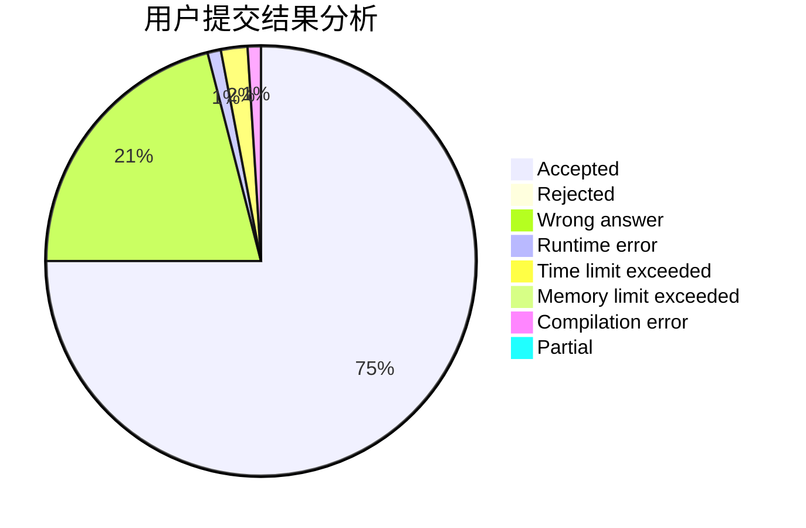
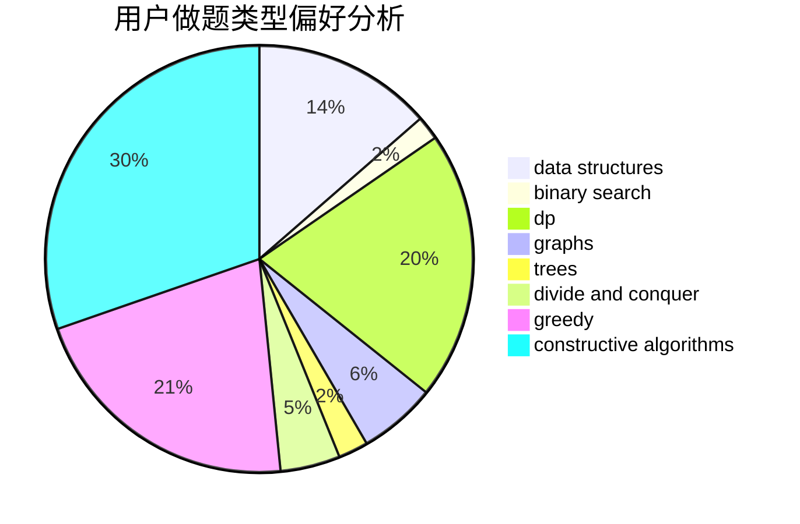
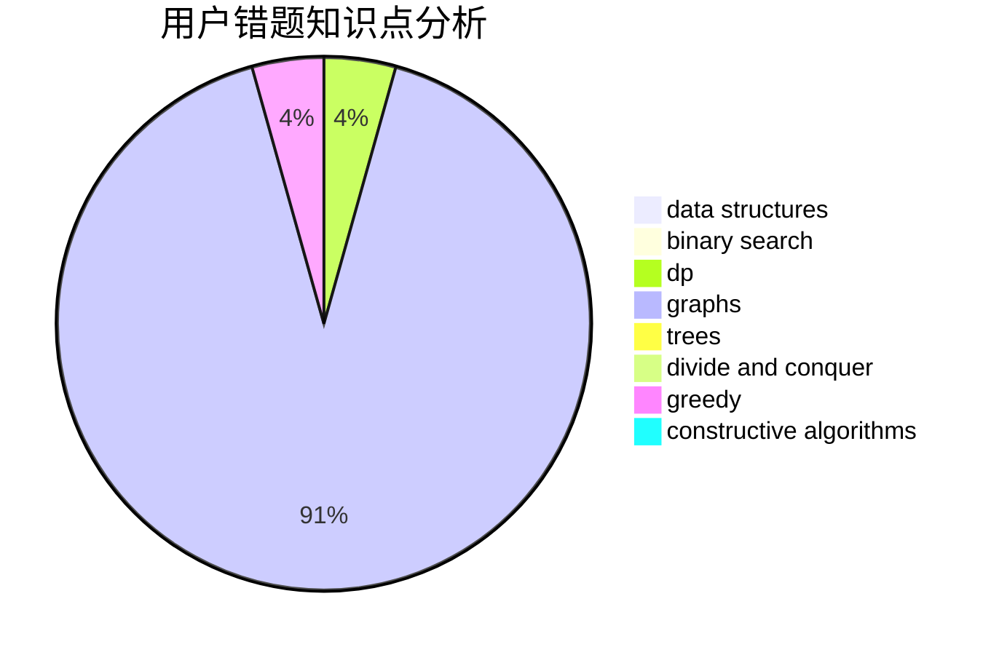

# jzp

<!-- tabs:start -->

#### **用户提交结果分析**

#### **用户做题类型偏好分析**

#### **用户错题知识点分析**

<!-- tabs:end -->
# 推荐题目
[1215A](https://codeforces.com/contest/1215/problem/A)		greedy,
                        implementation,
                        math		  
[911C](https://codeforces.com/contest/911/problem/C)		brute force,
                        constructive algorithms		  
[1061B](https://codeforces.com/contest/1061/problem/B)		greedy,
                        implementation,
                        sortings		  
[1379E](https://codeforces.com/contest/1379/problem/E)		constructive algorithms,
                        divide and conquer,
                        dp,
                        math,
                        trees		  
[479C](https://codeforces.com/contest/479/problem/C)		greedy,
                        sortings		  
[22C](https://codeforces.com/contest/22/problem/C)		graphs		  
[213C](https://codeforces.com/contest/213/problem/C)		dp		  
[266B](https://codeforces.com/contest/266/problem/B)		constructive algorithms,
                        graph matchings,
                        implementation,
                        shortest paths		  
[952B](https://codeforces.com/contest/952/problem/B)		brute force,
                        interactive		  
[505E](https://codeforces.com/contest/505/problem/E)		binary search,
                        greedy		  
