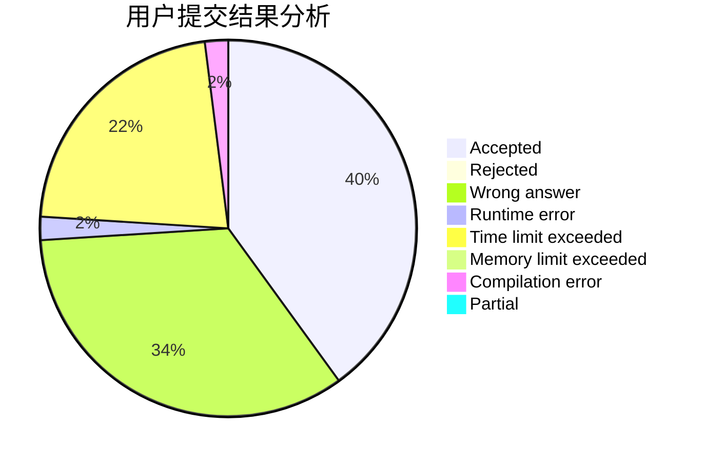
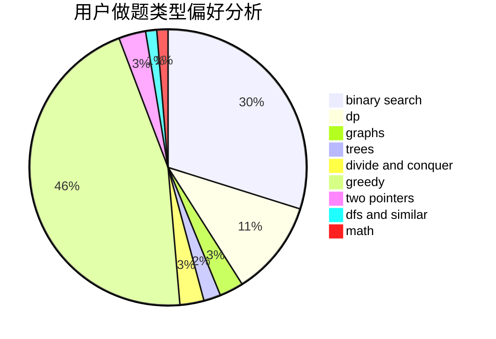

# jzqjzq

<!-- tabs:start -->

#### **用户提交结果分析**

#### **用户做题类型偏好分析**

<!-- tabs:end -->
# 推荐题目
[1039B](https://codeforces.com/contest/1039/problem/B)
[1207B](https://codeforces.com/contest/1207/problem/B)
[1065B](https://codeforces.com/contest/1065/problem/B)
[286D](https://codeforces.com/contest/286/problem/D)
[1225A](https://codeforces.com/contest/1225/problem/A)
[703A](https://codeforces.com/contest/703/problem/A)
[803B](https://codeforces.com/contest/803/problem/B)
[225D](https://codeforces.com/contest/225/problem/D)
[871A](https://codeforces.com/contest/871/problem/A)
[443D](https://codeforces.com/contest/443/problem/D)
