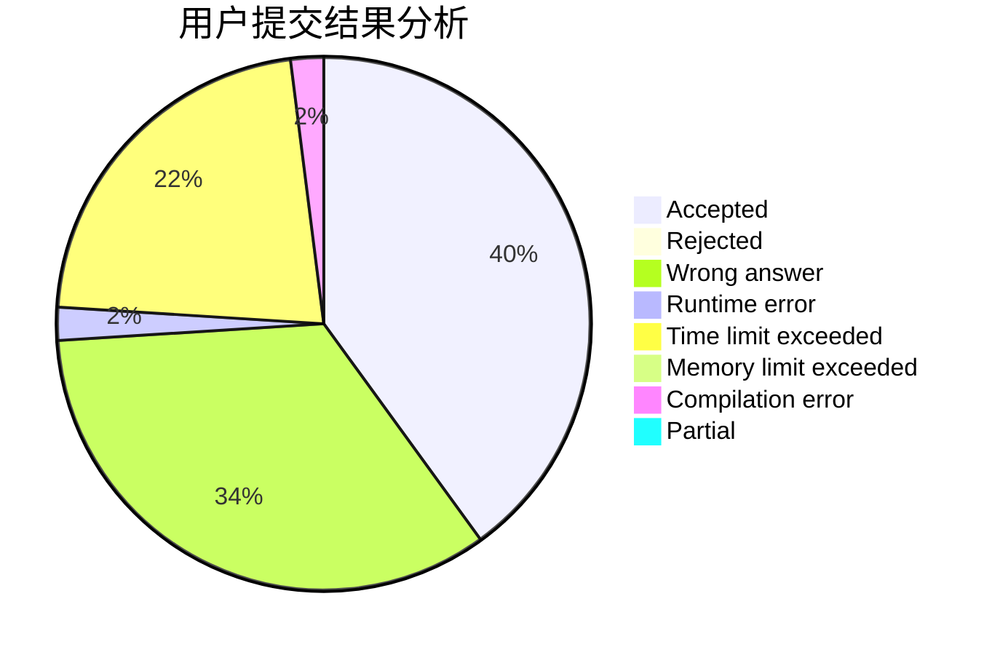
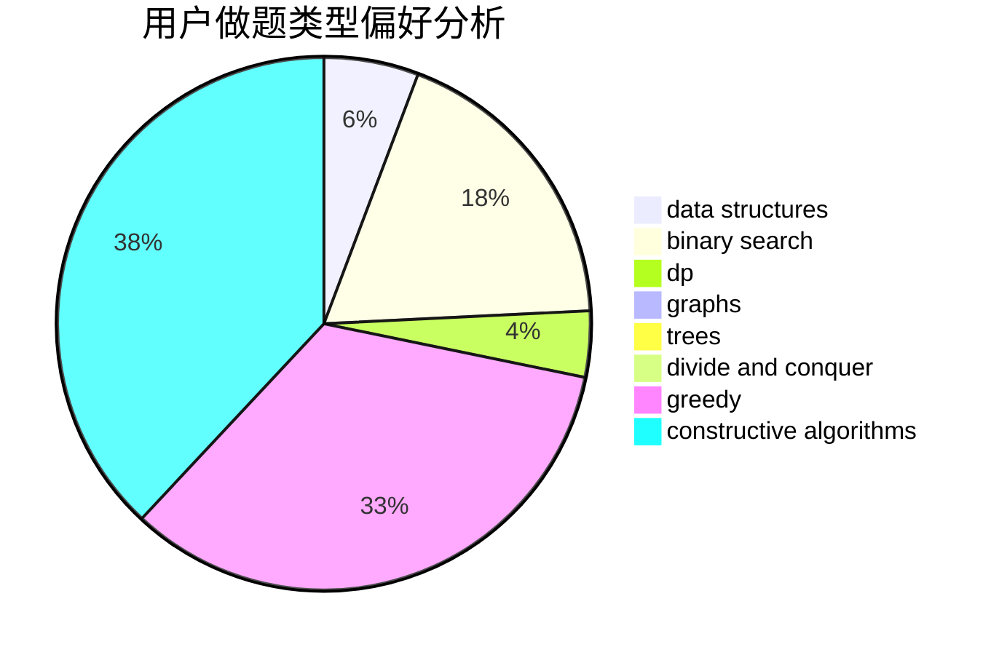

# jzqjzq

<!-- tabs:start -->

#### **用户提交结果分析**

#### **用户做题类型偏好分析**

#### **用户错题知识点分析**

<!-- tabs:end -->
# 推荐题目
[1039B](https://codeforces.com/contest/1039/problem/B)		binary search,
                        interactive,
                        probabilities		  
[1207B](https://codeforces.com/contest/1207/problem/B)		constructive algorithms,
                        greedy,
                        implementation		  
[1065B](https://codeforces.com/contest/1065/problem/B)		constructive algorithms,
                        graphs		  
[286D](https://codeforces.com/contest/286/problem/D)		data structures,
                        sortings		  
[1225A](https://codeforces.com/contest/1225/problem/A)		math		  
[703A](https://codeforces.com/contest/703/problem/A)		implementation		  
[803B](https://codeforces.com/contest/803/problem/B)		constructive algorithms		  
[225D](https://codeforces.com/contest/225/problem/D)		bitmasks,
                        dfs and similar,
                        graphs,
                        implementation		  
[871A](https://codeforces.com/contest/871/problem/A)		dsu,graphs,sortings,trees		  
[443D](https://codeforces.com/contest/443/problem/D)		dsu,graphs,sortings,trees		  
