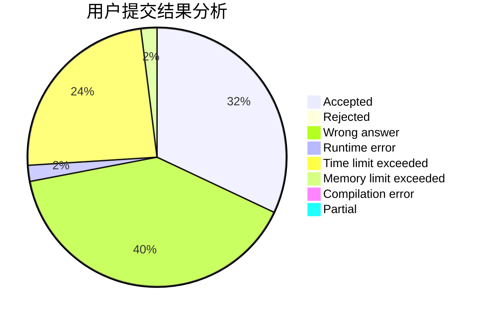
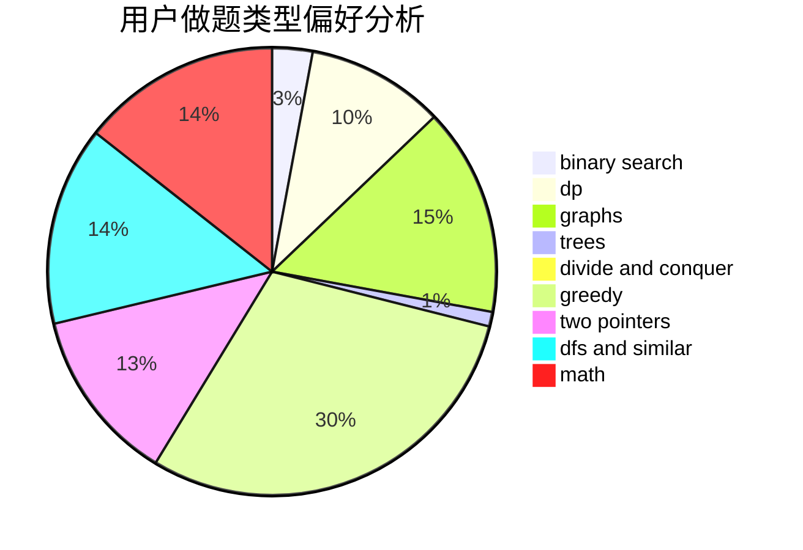

# kagura_kanami

<!-- tabs:start -->

#### **用户提交结果分析**

#### **用户做题类型偏好分析**

<!-- tabs:end -->
# 推荐题目
[913G](https://codeforces.com/contest/913/problem/G)
[870C](https://codeforces.com/contest/870/problem/C)
[1083B](https://codeforces.com/contest/1083/problem/B)
[47B](https://codeforces.com/contest/47/problem/B)
[1483F](https://codeforces.com/contest/1483/problem/F)
[699D](https://codeforces.com/contest/699/problem/D)
[1252L](https://codeforces.com/contest/1252/problem/L)
[388E](https://codeforces.com/contest/388/problem/E)
[498A](https://codeforces.com/contest/498/problem/A)
[106B](https://codeforces.com/contest/106/problem/B)
