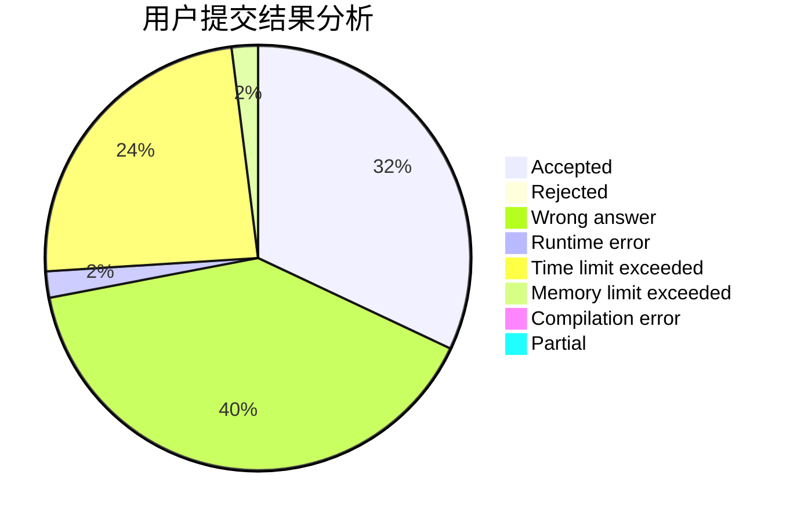
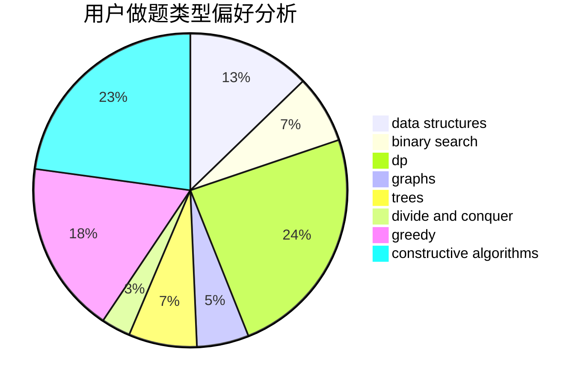
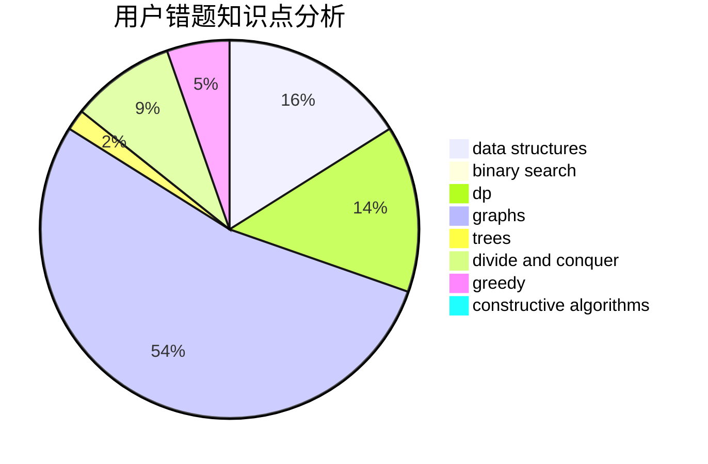

# kagura_kanami

<!-- tabs:start -->

#### **用户提交结果分析**

#### **用户做题类型偏好分析**

#### **用户错题知识点分析**

<!-- tabs:end -->
# 推荐题目
[913G](https://codeforces.com/contest/913/problem/G)		math,
                        number theory		  
[870C](https://codeforces.com/contest/870/problem/C)		dp,
                        greedy,
                        math,
                        number theory		  
[1083B](https://codeforces.com/contest/1083/problem/B)		greedy,
                        strings		  
[47B](https://codeforces.com/contest/47/problem/B)		implementation		  
[1483F](https://codeforces.com/contest/1483/problem/F)		dsu,graphs,sortings,trees		  
[699D](https://codeforces.com/contest/699/problem/D)		dsu,graphs,sortings,trees		  
[1252L](https://codeforces.com/contest/1252/problem/L)		flows,
                        graphs		  
[388E](https://codeforces.com/contest/388/problem/E)		geometry		  
[498A](https://codeforces.com/contest/498/problem/A)		geometry		  
[106B](https://codeforces.com/contest/106/problem/B)		brute force,
                        implementation		  
