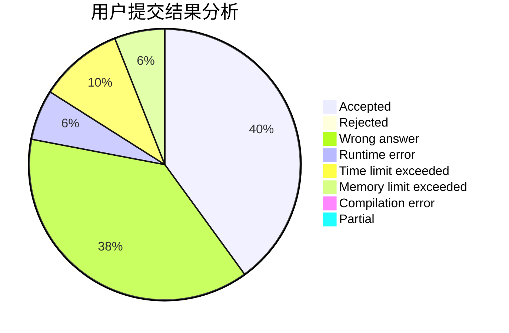
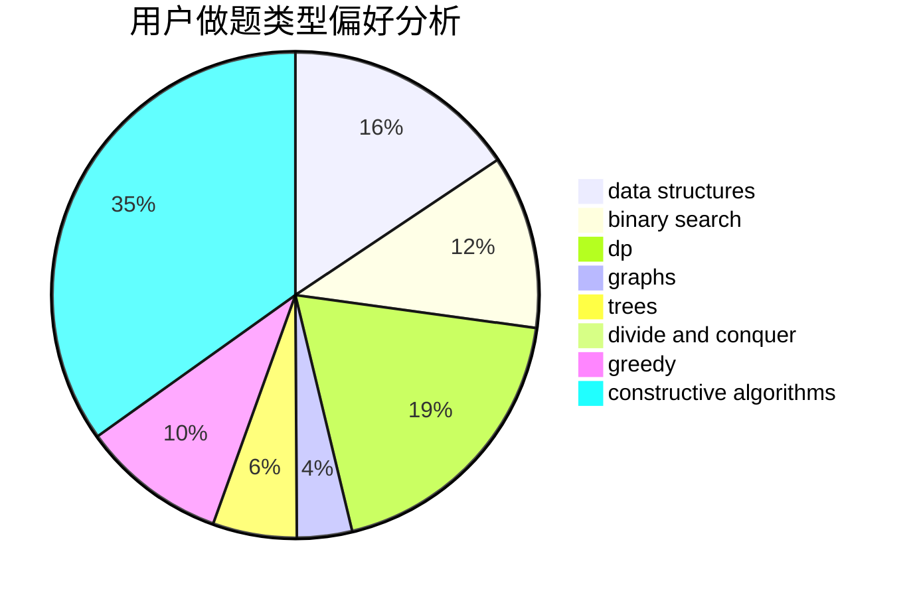
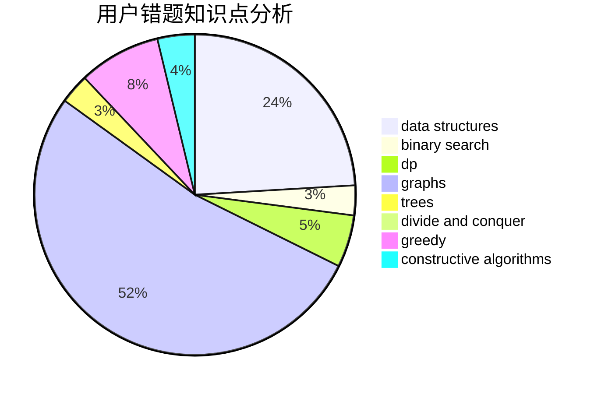

# kcn666

<!-- tabs:start -->

#### **用户提交结果分析**

#### **用户做题类型偏好分析**

#### **用户错题知识点分析**

<!-- tabs:end -->
# 推荐题目
[1359F](https://codeforces.com/contest/1359/problem/F)		binary search,
                        brute force,
                        data structures,
                        geometry,
                        math		  
[729E](https://codeforces.com/contest/729/problem/E)		constructive algorithms,
                        data structures,
                        graphs,
                        greedy,
                        sortings		  
[1164P](https://codeforces.com/contest/1164/problem/P)		dsu,graphs,sortings,trees		  
[680C](https://codeforces.com/contest/680/problem/C)		dsu,graphs,sortings,trees		  
[781C](https://codeforces.com/contest/781/problem/C)		dsu,graphs,sortings,trees		  
[436B](https://codeforces.com/contest/436/problem/B)		implementation,
                        math		  
[645G](https://codeforces.com/contest/645/problem/G)		binary search,
                        geometry		  
[875A](https://codeforces.com/contest/875/problem/A)		brute force,
                        math		  
[838E](https://codeforces.com/contest/838/problem/E)		dp		  
[1244D](https://codeforces.com/contest/1244/problem/D)		brute force,
                        constructive algorithms,
                        dp,
                        graphs,
                        implementation,
                        trees		  
