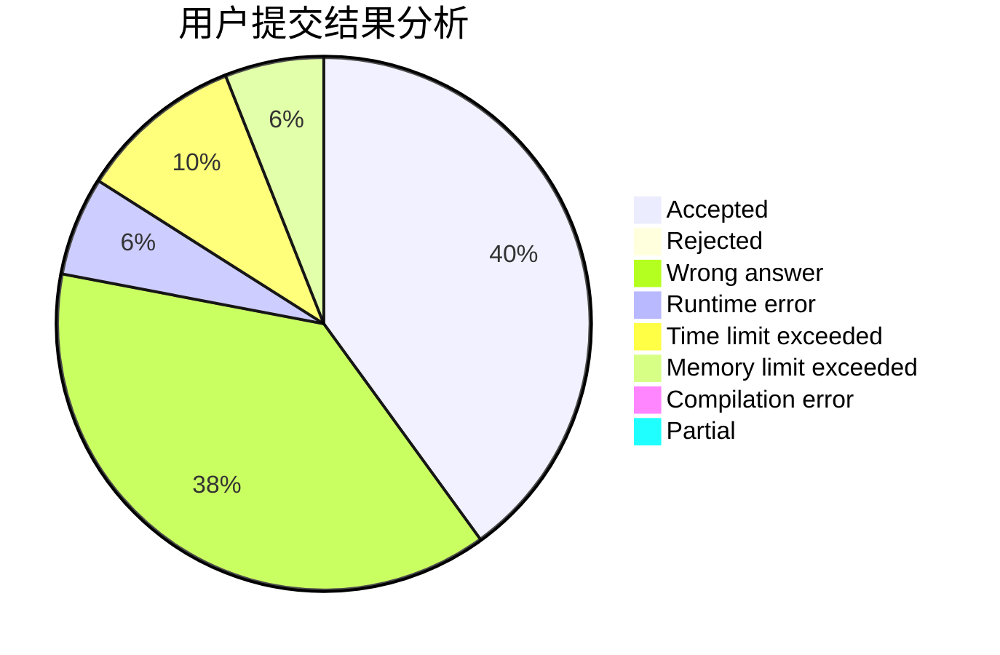
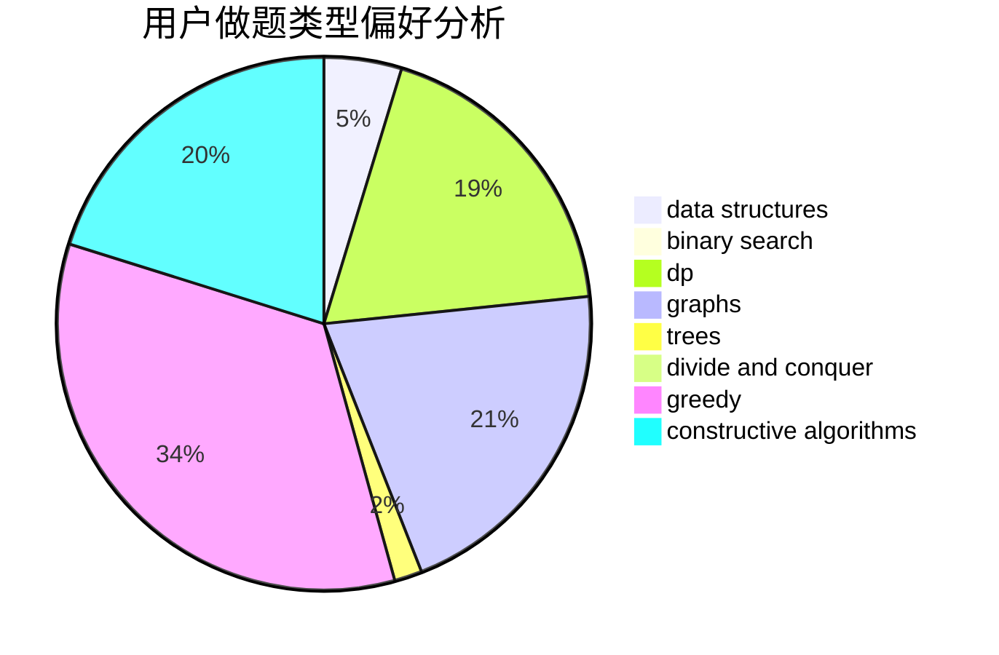
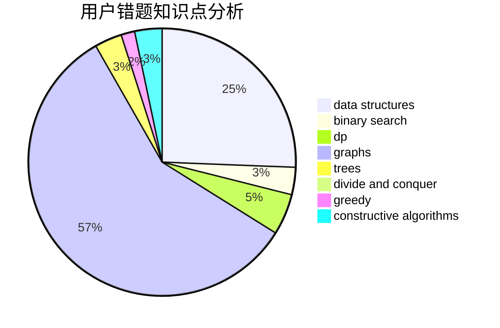

# kcn666

<!-- tabs:start -->

#### **用户提交结果分析**

#### **用户做题类型偏好分析**

#### **用户错题知识点分析**

<!-- tabs:end -->
# 推荐题目
[1367E](https://codeforces.com/contest/1367/problem/E)		brute force,
                        dfs and similar,
                        dp,
                        graphs,
                        greedy,
                        number theory		  
[746E](https://codeforces.com/contest/746/problem/E)		greedy,
                        implementation,
                        math		  
[1166F](https://codeforces.com/contest/1166/problem/F)		data structures,
                        dsu,
                        graphs,
                        hashing		  
[704D](https://codeforces.com/contest/704/problem/D)		flows,
                        greedy		  
[7A](https://codeforces.com/contest/7/problem/A)		brute force,
                        constructive algorithms		  
[456B](https://codeforces.com/contest/456/problem/B)		math,
                        number theory		  
[672C](https://codeforces.com/contest/672/problem/C)		dsu,graphs,sortings,trees		  
[894E](https://codeforces.com/contest/894/problem/E)		dp,
                        graphs		  
[856E](https://codeforces.com/contest/856/problem/E)		nan		  
[1249F](https://codeforces.com/contest/1249/problem/F)		dp,
                        trees		  
