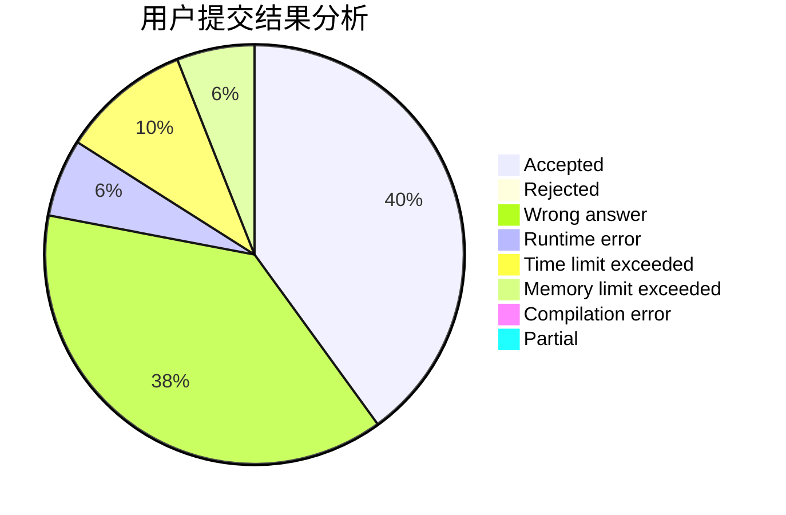
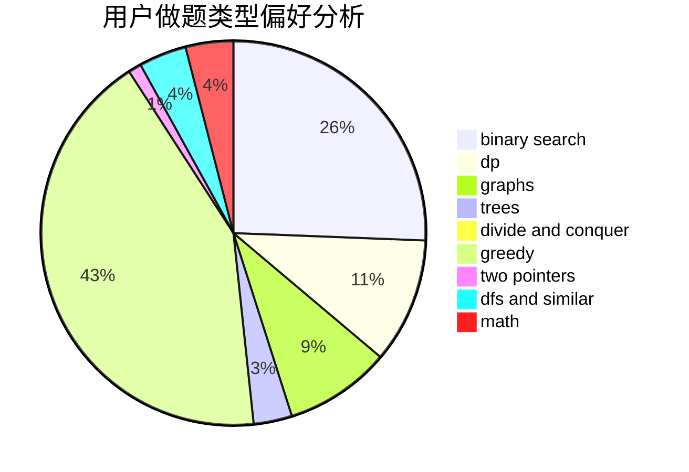

# kcn666

<!-- tabs:start -->

#### **用户提交结果分析**

#### **用户做题类型偏好分析**

<!-- tabs:end -->
# 推荐题目
[1367E](https://codeforces.com/contest/1367/problem/E)
[746E](https://codeforces.com/contest/746/problem/E)
[1166F](https://codeforces.com/contest/1166/problem/F)
[704D](https://codeforces.com/contest/704/problem/D)
[7A](https://codeforces.com/contest/7/problem/A)
[456B](https://codeforces.com/contest/456/problem/B)
[672C](https://codeforces.com/contest/672/problem/C)
[894E](https://codeforces.com/contest/894/problem/E)
[856E](https://codeforces.com/contest/856/problem/E)
[1249F](https://codeforces.com/contest/1249/problem/F)
