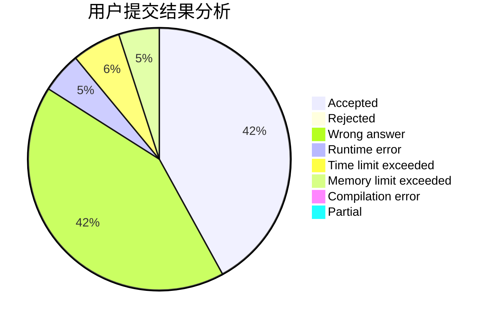
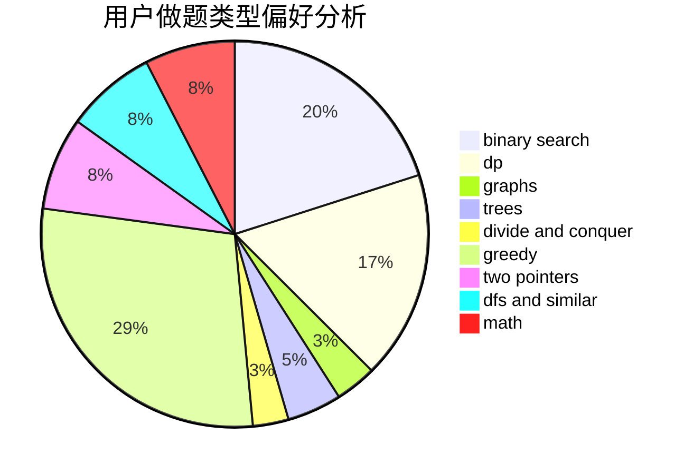

# kcn999

<!-- tabs:start -->

#### **用户提交结果分析**

#### **用户做题类型偏好分析**

<!-- tabs:end -->
# 推荐题目
[1393D](https://codeforces.com/contest/1393/problem/D)
[573C](https://codeforces.com/contest/573/problem/C)
[878E](https://codeforces.com/contest/878/problem/E)
[1255A](https://codeforces.com/contest/1255/problem/A)
[494B](https://codeforces.com/contest/494/problem/B)
[1439E](https://codeforces.com/contest/1439/problem/E)
[317A](https://codeforces.com/contest/317/problem/A)
[637B](https://codeforces.com/contest/637/problem/B)
[514B](https://codeforces.com/contest/514/problem/B)
[1030A](https://codeforces.com/contest/1030/problem/A)
