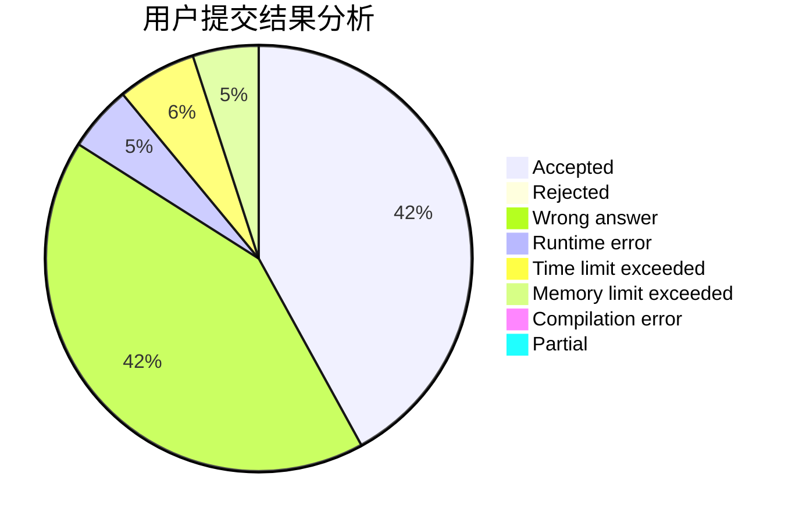
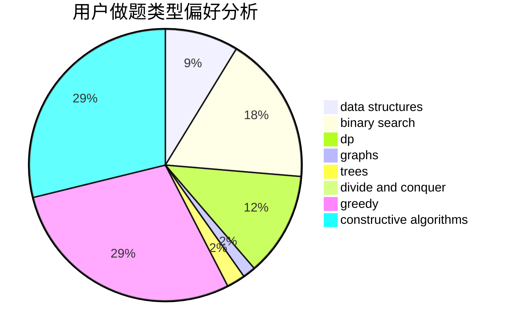
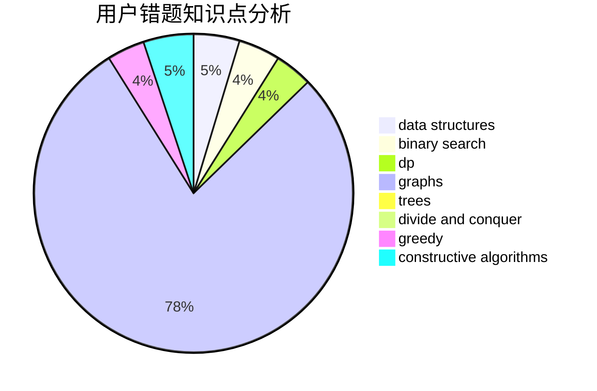

# kcn999

<!-- tabs:start -->

#### **用户提交结果分析**

#### **用户做题类型偏好分析**

#### **用户错题知识点分析**

<!-- tabs:end -->
# 推荐题目
[1393D](https://codeforces.com/contest/1393/problem/D)		dfs and similar,
                        dp,
                        implementation,
                        shortest paths		  
[573C](https://codeforces.com/contest/573/problem/C)		constructive algorithms,
                        dfs and similar,
                        trees		  
[878E](https://codeforces.com/contest/878/problem/E)		combinatorics,
                        dp		  
[1255A](https://codeforces.com/contest/1255/problem/A)		math		  
[494B](https://codeforces.com/contest/494/problem/B)		dp,
                        strings		  
[1439E](https://codeforces.com/contest/1439/problem/E)		bitmasks,
                        data structures,
                        games,
                        trees		  
[317A](https://codeforces.com/contest/317/problem/A)		brute force		  
[637B](https://codeforces.com/contest/637/problem/B)		*special problem,
                        binary search,
                        constructive algorithms,
                        data structures,
                        sortings		  
[514B](https://codeforces.com/contest/514/problem/B)		brute force,
                        data structures,
                        geometry,
                        implementation,
                        math		  
[1030A](https://codeforces.com/contest/1030/problem/A)		implementation		  
