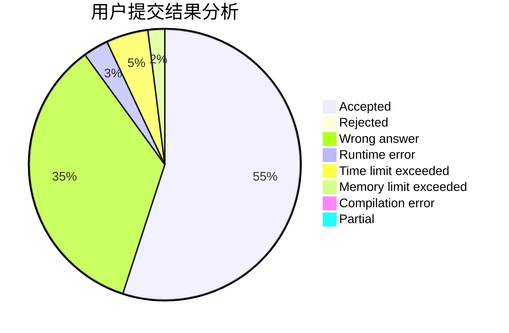
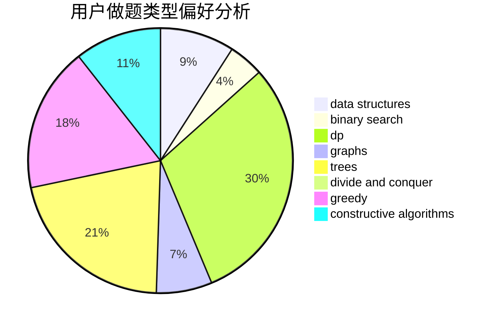
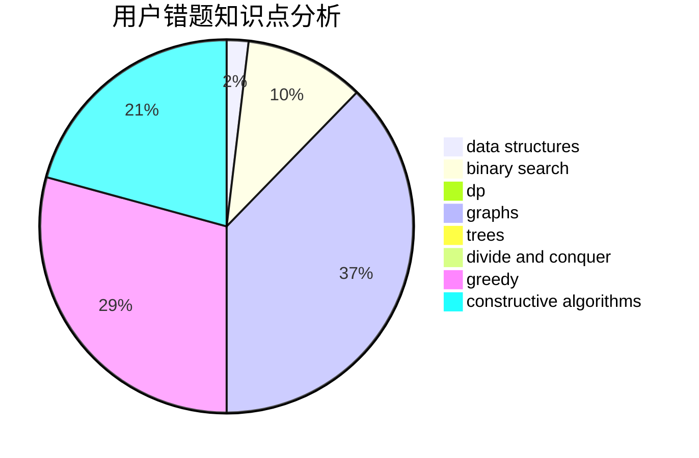

# kczno1

<!-- tabs:start -->

#### **用户提交结果分析**

#### **用户做题类型偏好分析**

#### **用户错题知识点分析**

<!-- tabs:end -->
# 推荐题目
[584B](https://codeforces.com/contest/584/problem/B)		combinatorics		  
[877C](https://codeforces.com/contest/877/problem/C)		constructive algorithms		  
[44C](https://codeforces.com/contest/44/problem/C)		implementation		  
[501C](https://codeforces.com/contest/501/problem/C)		constructive algorithms,
                        data structures,
                        greedy,
                        sortings,
                        trees		  
[1328C](https://codeforces.com/contest/1328/problem/C)		greedy,
                        implementation		  
[29E](https://codeforces.com/contest/29/problem/E)		graphs,
                        shortest paths		  
[965B](https://codeforces.com/contest/965/problem/B)		implementation		  
[586F](https://codeforces.com/contest/586/problem/F)		dsu,graphs,sortings,trees		  
[1109D](https://codeforces.com/contest/1109/problem/D)		brute force,
                        combinatorics,
                        dp,
                        math,
                        trees		  
[822A](https://codeforces.com/contest/822/problem/A)		implementation,
                        math,
                        number theory		  
