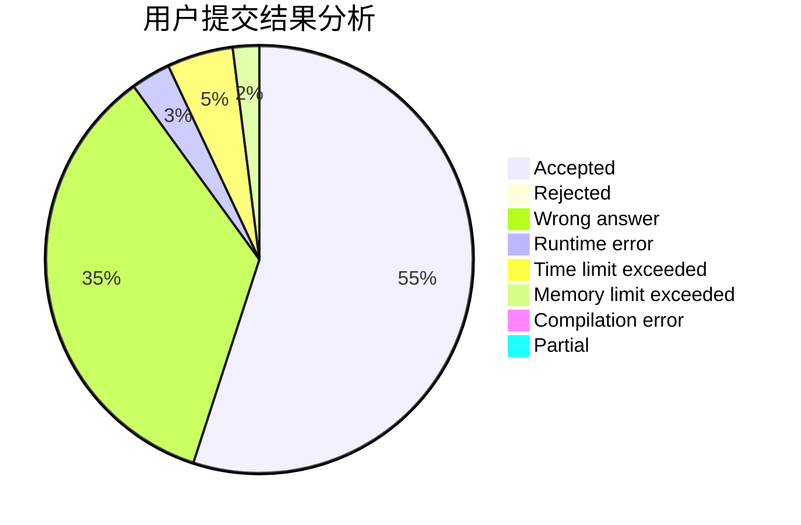
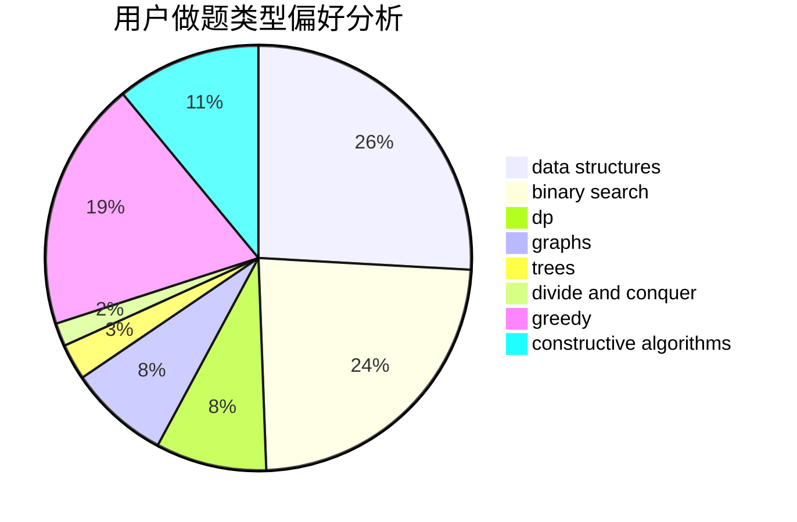
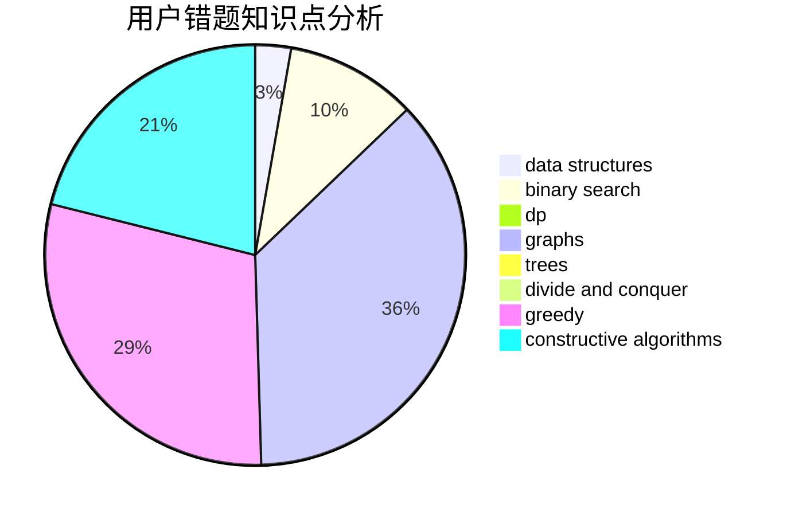

# kczno1
<!-- tabs:start -->
#### **用户提交结果分析**

#### **用户做题类型偏好分析**

#### **用户错题知识点分析**

<!-- tabs:end -->
# 推荐题目
[Navigation System](https://codeforces.com/contest/1321/problem/D)		dfs and similar,
                        graphs,
                        shortest paths		  
[Moving Points](http://codeforces.com/problemset/problem/1311/F)		data structures,
                        divide and conquer,
                        implementation,
                        sortings		  
[IT Restaurants](http://codeforces.com/problemset/problem/212/E)		dfs and similar,
                        dp,
                        trees		  
[Function Height](http://codeforces.com/problemset/problem/1036/A)		math		  
[Protect Sheep](http://codeforces.com/problemset/problem/948/A)		brute force,
                        dfs and similar,
                        graphs,
                        implementation		  
[Beautiful numbers](http://codeforces.com/problemset/problem/55/D)		dp,
                        number theory		  
[Berland National Library](http://codeforces.com/problemset/problem/567/B)		implementation		  
[Ordering T-Shirts](http://codeforces.com/problemset/problem/859/F)		greedy		  
[Vasya's Function](http://codeforces.com/problemset/problem/837/E)		binary search,
                        implementation,
                        math		  
[Functions On The Segments](http://codeforces.com/problemset/problem/837/G)		data structures		  
<!-- tabs:start -->
#### **data structures**
[Navigation System](http://codeforces.com/problemset/problem/1311/F)		data structures,
                        divide and conquer,
                        implementation,
                        sortings		  
[Moving Points](http://codeforces.com/problemset/problem/837/G)		data structures		  
[IT Restaurants](http://codeforces.com/problemset/problem/727/E)		data structures,
                        hashing,
                        string suffix structures,
                        strings		  
[Function Height](http://codeforces.com/problemset/problem/1023/D)		constructive algorithms,
                        data structures		  
[Protect Sheep](https://codeforces.com/contest/719/problem/E)		data structures,
                        math,
                        matrices		  
[Beautiful numbers](http://codeforces.com/problemset/problem/316/E1)		brute force,
                        data structures		  
[Berland National Library](http://codeforces.com/problemset/problem/1427/F)		data structures,
                        greedy,
                        trees		  
[Ordering T-Shirts](https://codeforces.com/contest/1248/problem/E)		data structures,
                        greedy,
                        implementation		  
[Vasya's Function](http://codeforces.com/problemset/problem/283/E)		combinatorics,
                        data structures,
                        math		  
[Functions On The Segments](http://codeforces.com/problemset/problem/138/C)		binary search,
                        data structures,
                        probabilities,
                        sortings		  
#### **binary search**
[Navigation System](http://codeforces.com/problemset/problem/837/E)		binary search,
                        implementation,
                        math		  
[Moving Points](http://codeforces.com/problemset/problem/138/C)		binary search,
                        data structures,
                        probabilities,
                        sortings		  
[IT Restaurants](http://codeforces.com/problemset/problem/1108/F)		binary search,
                        dsu,
                        graphs,
                        greedy		  
[Function Height](http://codeforces.com/problemset/problem/1129/E)		binary search,
                        interactive,
                        trees		  
[Protect Sheep](http://codeforces.com/problemset/problem/1492/C)		binary search,
                        data structures,
                        dp,
                        greedy,
                        two pointers		  
[Beautiful numbers](http://codeforces.com/problemset/problem/1463/D)		binary search,
                        constructive algorithms,
                        greedy,
                        two pointers		  
[Berland National Library](http://codeforces.com/problemset/problem/1490/G)		binary search,
                        data structures,
                        math		  
[Ordering T-Shirts](http://codeforces.com/problemset/problem/1479/D)		binary search,
                        bitmasks,
                        brute force,
                        data structures,
                        probabilities,
                        trees		  
[Vasya's Function](http://codeforces.com/problemset/problem/1436/E)		binary search,
                        data structures,
                        two pointers		  
[Functions On The Segments](http://codeforces.com/problemset/problem/1461/D)		binary search,
                        brute force,
                        data structures,
                        divide and conquer,
                        implementation,
                        sortings		  
#### **dp**
[Navigation System](http://codeforces.com/problemset/problem/212/E)		dfs and similar,
                        dp,
                        trees		  
[Moving Points](http://codeforces.com/problemset/problem/55/D)		dp,
                        number theory		  
[IT Restaurants](http://codeforces.com/problemset/problem/482/D)		combinatorics,
                        dp,
                        trees		  
[Function Height](http://codeforces.com/problemset/problem/101/D)		dp,
                        greedy,
                        probabilities,
                        sortings,
                        trees		  
[Protect Sheep](http://codeforces.com/problemset/problem/1042/E)		dp,
                        math,
                        probabilities		  
[Beautiful numbers](http://codeforces.com/problemset/problem/427/D)		dp,
                        string suffix structures,
                        strings		  
[Berland National Library](http://codeforces.com/problemset/problem/1198/D)		dp		  
[Ordering T-Shirts](http://codeforces.com/problemset/problem/772/D)		bitmasks,
                        dp		  
[Vasya's Function](http://codeforces.com/problemset/problem/1475/G)		dp,
                        math,
                        number theory,
                        sortings		  
[Functions On The Segments](http://codeforces.com/problemset/problem/1492/C)		binary search,
                        data structures,
                        dp,
                        greedy,
                        two pointers		  
#### **graph**
[Navigation System](https://codeforces.com/contest/1321/problem/D)		dfs and similar,
                        graphs,
                        shortest paths		  
[Moving Points](http://codeforces.com/problemset/problem/948/A)		brute force,
                        dfs and similar,
                        graphs,
                        implementation		  
[IT Restaurants](http://codeforces.com/problemset/problem/1198/E)		flows,
                        graph matchings,
                        graphs		  
[Function Height](http://codeforces.com/problemset/problem/1108/F)		binary search,
                        dsu,
                        graphs,
                        greedy		  
[Protect Sheep](http://codeforces.com/problemset/problem/1487/C)		brute force,
                        constructive algorithms,
                        dfs and similar,
                        graphs,
                        greedy,
                        implementation,
                        math		  
[Beautiful numbers](http://codeforces.com/problemset/problem/1437/C)		dp,
                        flows,
                        graph matchings,
                        greedy,
                        math,
                        sortings		  
[Berland National Library](http://codeforces.com/problemset/problem/1470/D)		constructive algorithms,
                        dfs and similar,
                        graph matchings,
                        graphs,
                        greedy		  
[Ordering T-Shirts](http://codeforces.com/problemset/problem/1476/C)		dp,
                        graphs,
                        greedy		  
[Vasya's Function](http://codeforces.com/problemset/problem/1304/D)		constructive algorithms,
                        graphs,
                        greedy,
                        two pointers		  
[Functions On The Segments](http://codeforces.com/problemset/problem/1475/C)		combinatorics,
                        graphs,
                        math		  
#### **trees**
[Navigation System](http://codeforces.com/problemset/problem/212/E)		dfs and similar,
                        dp,
                        trees		  
[Moving Points](http://codeforces.com/problemset/problem/482/D)		combinatorics,
                        dp,
                        trees		  
[IT Restaurants](http://codeforces.com/problemset/problem/101/D)		dp,
                        greedy,
                        probabilities,
                        sortings,
                        trees		  
[Function Height](http://codeforces.com/problemset/problem/1427/F)		data structures,
                        greedy,
                        trees		  
[Protect Sheep](http://codeforces.com/problemset/problem/1129/E)		binary search,
                        interactive,
                        trees		  
[Beautiful numbers](http://codeforces.com/problemset/problem/1438/F)		interactive,
                        probabilities,
                        trees		  
[Berland National Library](http://codeforces.com/problemset/problem/1479/D)		binary search,
                        bitmasks,
                        brute force,
                        data structures,
                        probabilities,
                        trees		  
[Ordering T-Shirts](http://codeforces.com/problemset/problem/1511/C)		brute force,
                        data structures,
                        implementation,
                        trees		  
[Vasya's Function](http://codeforces.com/problemset/problem/1499/F)		combinatorics,
                        dfs and similar,
                        dp,
                        trees		  
[Functions On The Segments](http://codeforces.com/problemset/problem/1491/E)		brute force,
                        dfs and similar,
                        divide and conquer,
                        number theory,
                        trees		  
#### **divide and conquer**
[Navigation System](http://codeforces.com/problemset/problem/1311/F)		data structures,
                        divide and conquer,
                        implementation,
                        sortings		  
[Moving Points](http://codeforces.com/problemset/problem/1461/D)		binary search,
                        brute force,
                        data structures,
                        divide and conquer,
                        implementation,
                        sortings		  
[IT Restaurants](http://codeforces.com/problemset/problem/1466/G)		combinatorics,
                        divide and conquer,
                        hashing,
                        math,
                        string suffix structures,
                        strings		  
[Function Height](http://codeforces.com/problemset/problem/1490/D)		dfs and similar,
                        divide and conquer,
                        implementation		  
[Protect Sheep](https://codeforces.com/contest/1483/problem/C)		data structures,
                        divide and conquer,
                        dp		  
[Beautiful numbers](http://codeforces.com/problemset/problem/1491/E)		brute force,
                        dfs and similar,
                        divide and conquer,
                        number theory,
                        trees		  
[Berland National Library](http://codeforces.com/problemset/problem/1303/G)		data structures,
                        divide and conquer,
                        geometry,
                        trees		  
[Ordering T-Shirts](http://codeforces.com/problemset/problem/1494/D)		constructive algorithms,
                        data structures,
                        dfs and similar,
                        divide and conquer,
                        dsu,
                        greedy,
                        sortings,
                        trees		  
[Vasya's Function](http://codeforces.com/problemset/problem/1482/E)		data structures,
                        divide and conquer,
                        dp		  
[Functions On The Segments](http://codeforces.com/problemset/problem/566/C)		dfs and similar,
                        divide and conquer,
                        trees		  
#### **greedy**
[Navigation System](http://codeforces.com/problemset/problem/859/F)		greedy		  
[Moving Points](http://codeforces.com/problemset/problem/845/B)		brute force,
                        greedy,
                        implementation		  
[IT Restaurants](https://codeforces.com/contest/606/problem/C)		constructive algorithms,
                        greedy		  
[Function Height](https://codeforces.com/contest/805/problem/D)		combinatorics,
                        greedy,
                        implementation,
                        math		  
[Protect Sheep](http://codeforces.com/problemset/problem/101/D)		dp,
                        greedy,
                        probabilities,
                        sortings,
                        trees		  
[Beautiful numbers](http://codeforces.com/problemset/problem/1178/C)		combinatorics,
                        greedy,
                        math		  
[Berland National Library](http://codeforces.com/problemset/problem/1427/F)		data structures,
                        greedy,
                        trees		  
[Ordering T-Shirts](https://codeforces.com/contest/1248/problem/E)		data structures,
                        greedy,
                        implementation		  
[Vasya's Function](http://codeforces.com/problemset/problem/1108/F)		binary search,
                        dsu,
                        graphs,
                        greedy		  
[Functions On The Segments](http://codeforces.com/problemset/problem/1236/A)		brute force,
                        greedy,
                        math		  
#### **constructive algorithms**
[Navigation System](https://codeforces.com/contest/606/problem/C)		constructive algorithms,
                        greedy		  
[Moving Points](http://codeforces.com/problemset/problem/1023/D)		constructive algorithms,
                        data structures		  
[IT Restaurants](http://codeforces.com/problemset/problem/1479/C)		bitmasks,
                        constructive algorithms		  
[Function Height](http://codeforces.com/problemset/problem/1365/C)		constructive algorithms,
                        data structures,
                        greedy,
                        implementation		  
[Protect Sheep](http://codeforces.com/problemset/problem/1493/A)		constructive algorithms,
                        greedy		  
[Beautiful numbers](http://codeforces.com/problemset/problem/1463/D)		binary search,
                        constructive algorithms,
                        greedy,
                        two pointers		  
[Berland National Library](https://codeforces.com/contest/1456/problem/B)		bitmasks,
                        brute force,
                        constructive algorithms		  
[Ordering T-Shirts](http://codeforces.com/problemset/problem/1492/D)		bitmasks,
                        constructive algorithms,
                        greedy,
                        math		  
[Vasya's Function](https://codeforces.com/contest/1504/problem/D)		constructive algorithms,
                        games,
                        interactive		  
[Functions On The Segments](https://codeforces.com/contest/1483/problem/A)		brute force,
                        constructive algorithms,
                        greedy,
                        implementation		  
#### **sortings**
[Navigation System](http://codeforces.com/problemset/problem/1311/F)		data structures,
                        divide and conquer,
                        implementation,
                        sortings		  
[Moving Points](http://codeforces.com/problemset/problem/1294/B)		implementation,
                        sortings		  
[IT Restaurants](http://codeforces.com/problemset/problem/101/D)		dp,
                        greedy,
                        probabilities,
                        sortings,
                        trees		  
[Function Height](http://codeforces.com/problemset/problem/138/C)		binary search,
                        data structures,
                        probabilities,
                        sortings		  
[Protect Sheep](http://codeforces.com/problemset/problem/1475/G)		dp,
                        math,
                        number theory,
                        sortings		  
[Beautiful numbers](https://codeforces.com/contest/1496/problem/C)		geometry,
                        greedy,
                        math,
                        sortings		  
[Berland National Library](http://codeforces.com/problemset/problem/1495/A)		geometry,
                        greedy,
                        math,
                        sortings		  
[Ordering T-Shirts](http://codeforces.com/problemset/problem/1497/A)		brute force,
                        data structures,
                        greedy,
                        sortings		  
[Vasya's Function](http://codeforces.com/problemset/problem/1427/A)		math,
                        sortings		  
[Functions On The Segments](http://codeforces.com/problemset/problem/1461/D)		binary search,
                        brute force,
                        data structures,
                        divide and conquer,
                        implementation,
                        sortings		  
<!-- tabs:end -->
