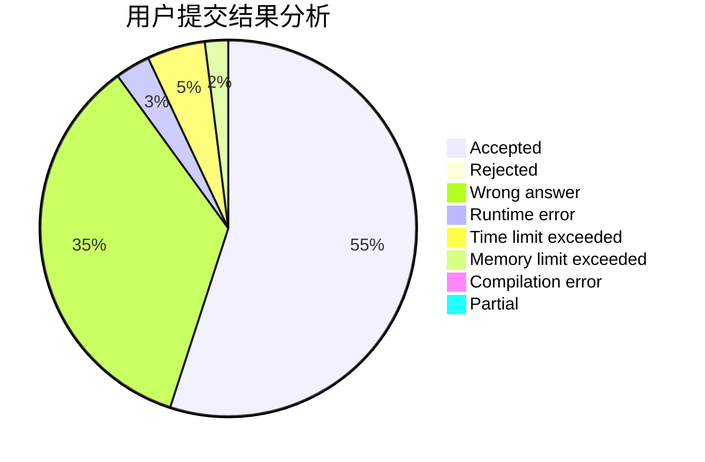
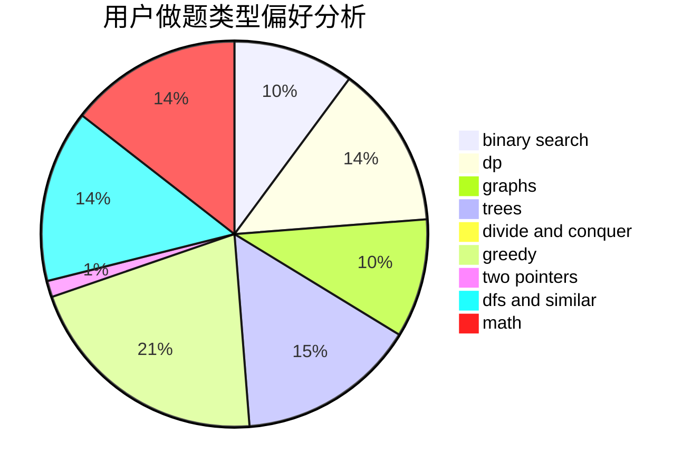

# kczno1

<!-- tabs:start -->

#### **用户提交结果分析**

#### **用户做题类型偏好分析**

<!-- tabs:end -->
# 推荐题目
[584B](https://codeforces.com/contest/584/problem/B)
[877C](https://codeforces.com/contest/877/problem/C)
[44C](https://codeforces.com/contest/44/problem/C)
[501C](https://codeforces.com/contest/501/problem/C)
[1328C](https://codeforces.com/contest/1328/problem/C)
[29E](https://codeforces.com/contest/29/problem/E)
[965B](https://codeforces.com/contest/965/problem/B)
[586F](https://codeforces.com/contest/586/problem/F)
[1109D](https://codeforces.com/contest/1109/problem/D)
[822A](https://codeforces.com/contest/822/problem/A)
