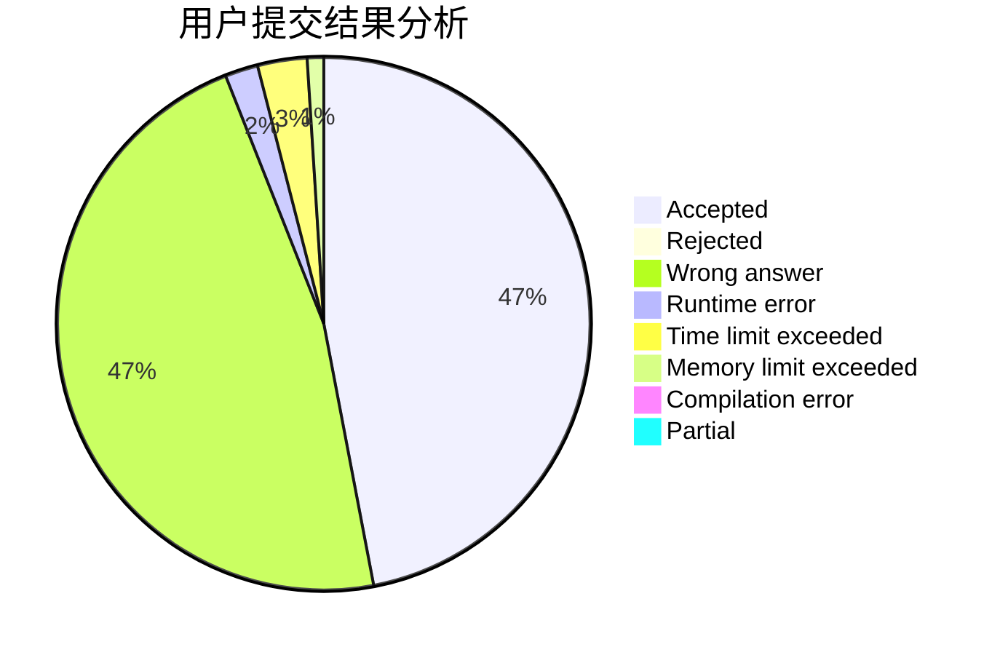
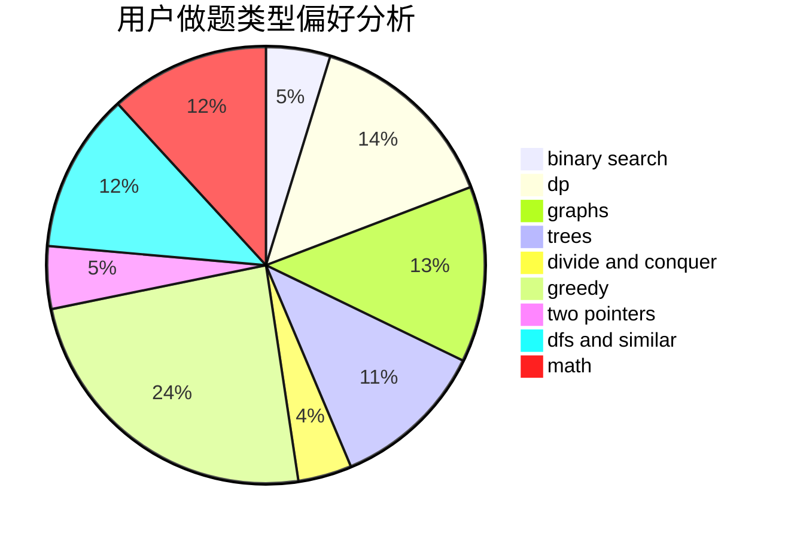

# kdypr

<!-- tabs:start -->

#### **用户提交结果分析**

#### **用户做题类型偏好分析**

<!-- tabs:end -->
# 推荐题目
[1423C](https://codeforces.com/contest/1423/problem/C)
[1207B](https://codeforces.com/contest/1207/problem/B)
[551B](https://codeforces.com/contest/551/problem/B)
[1263C](https://codeforces.com/contest/1263/problem/C)
[713E](https://codeforces.com/contest/713/problem/E)
[1081F](https://codeforces.com/contest/1081/problem/F)
[1009C](https://codeforces.com/contest/1009/problem/C)
[866D](https://codeforces.com/contest/866/problem/D)
[1046C](https://codeforces.com/contest/1046/problem/C)
[462E](https://codeforces.com/contest/462/problem/E)
