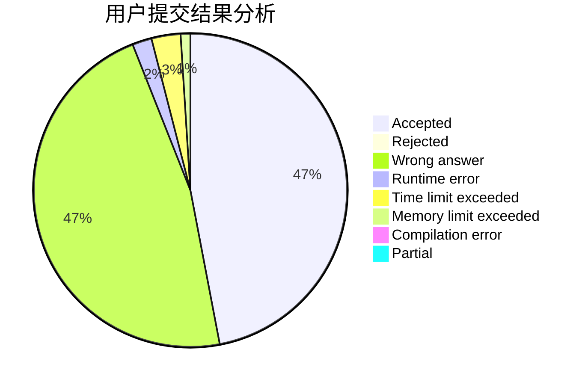
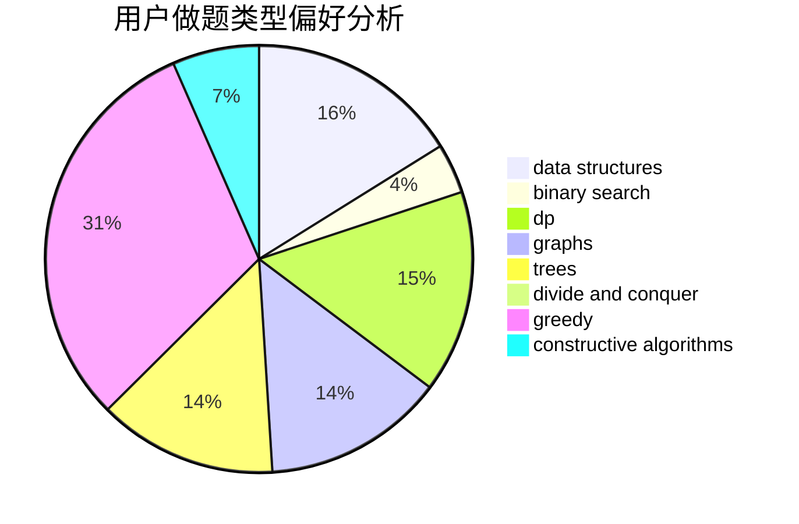

# kdypr

<!-- tabs:start -->

#### **用户提交结果分析**

#### **用户做题类型偏好分析**

#### **用户错题知识点分析**

<!-- tabs:end -->
# 推荐题目
[1423C](https://codeforces.com/contest/1423/problem/C)		divide and conquer,
                        graphs,
                        trees		  
[1207B](https://codeforces.com/contest/1207/problem/B)		constructive algorithms,
                        greedy,
                        implementation		  
[551B](https://codeforces.com/contest/551/problem/B)		brute force,
                        constructive algorithms,
                        implementation,
                        strings		  
[1263C](https://codeforces.com/contest/1263/problem/C)		binary search,
                        math,
                        meet-in-the-middle,
                        number theory		  
[713E](https://codeforces.com/contest/713/problem/E)		binary search,
                        dp		  
[1081F](https://codeforces.com/contest/1081/problem/F)		constructive algorithms,
                        implementation,
                        interactive		  
[1009C](https://codeforces.com/contest/1009/problem/C)		greedy,
                        math		  
[866D](https://codeforces.com/contest/866/problem/D)		dsu,graphs,sortings,trees		  
[1046C](https://codeforces.com/contest/1046/problem/C)		greedy		  
[462E](https://codeforces.com/contest/462/problem/E)		dsu,graphs,sortings,trees		  
