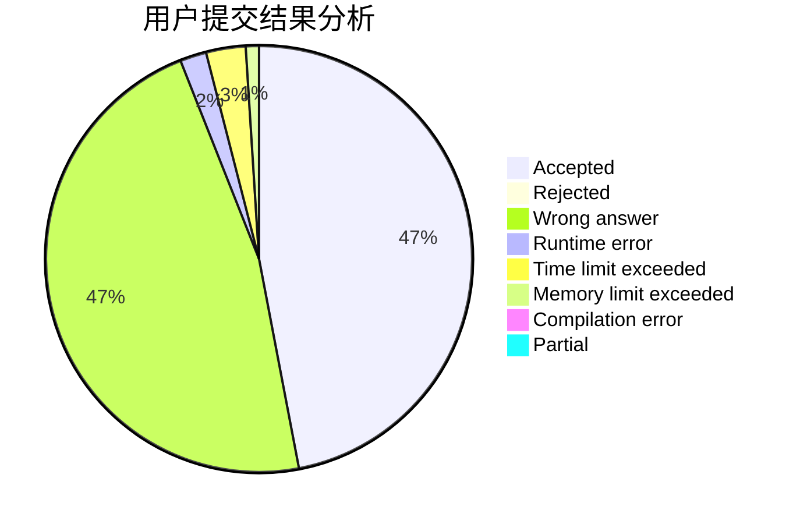
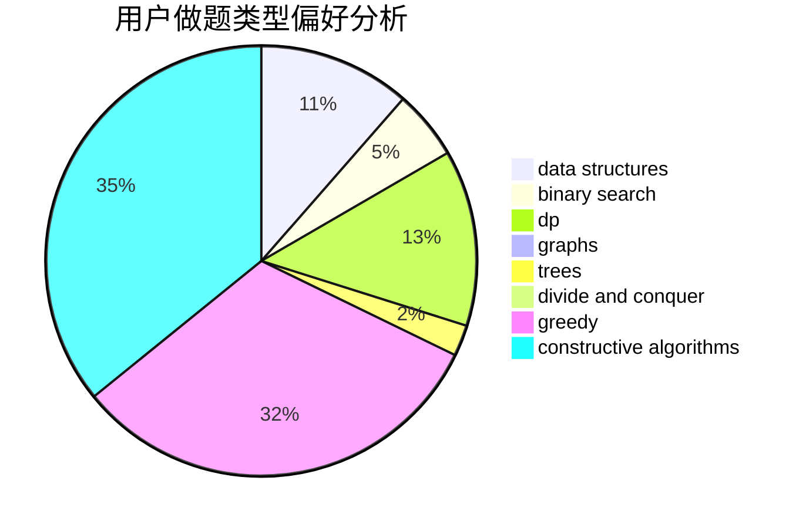

# kdypr

<!-- tabs:start -->

#### **用户提交结果分析**

#### **用户做题类型偏好分析**

#### **用户错题知识点分析**

<!-- tabs:end -->
# 推荐题目
[1413F](https://codeforces.com/contest/1413/problem/F)		data structures,
                        trees		  
[1202D](https://codeforces.com/contest/1202/problem/D)		combinatorics,
                        constructive algorithms,
                        math,
                        strings		  
[527B](https://codeforces.com/contest/527/problem/B)		greedy		  
[1256A](https://codeforces.com/contest/1256/problem/A)		math		  
[697B](https://codeforces.com/contest/697/problem/B)		brute force,
                        implementation,
                        math,
                        strings		  
[1081C](https://codeforces.com/contest/1081/problem/C)		combinatorics,
                        dp,
                        math		  
[1008E](https://codeforces.com/contest/1008/problem/E)		dsu,graphs,sortings,trees		  
[848A](https://codeforces.com/contest/848/problem/A)		constructive algorithms		  
[1045H](https://codeforces.com/contest/1045/problem/H)		math		  
[442B](https://codeforces.com/contest/442/problem/B)		greedy,
                        math,
                        probabilities		  
