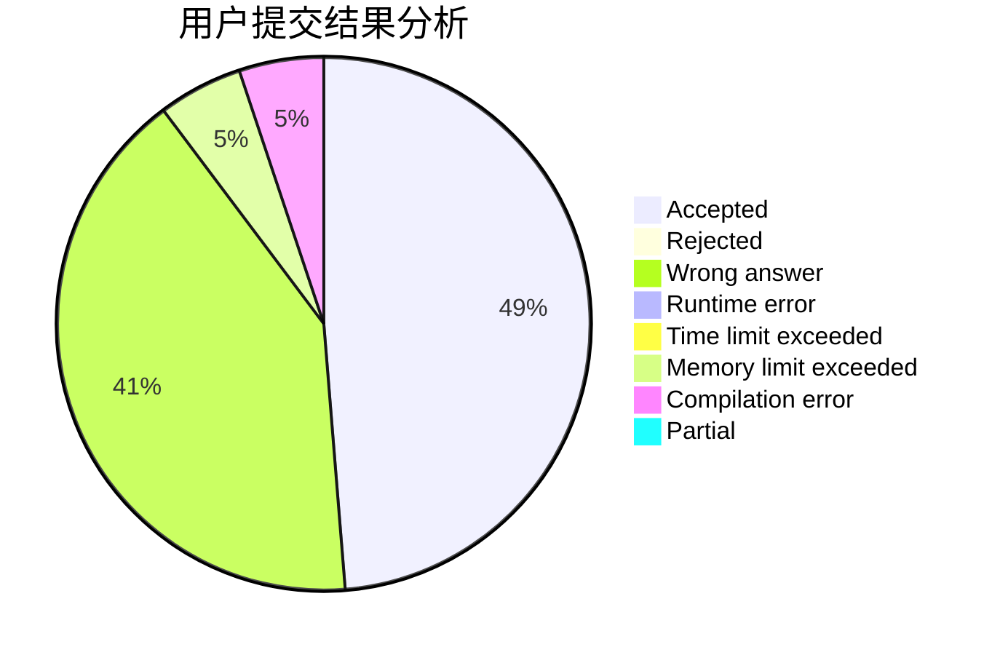
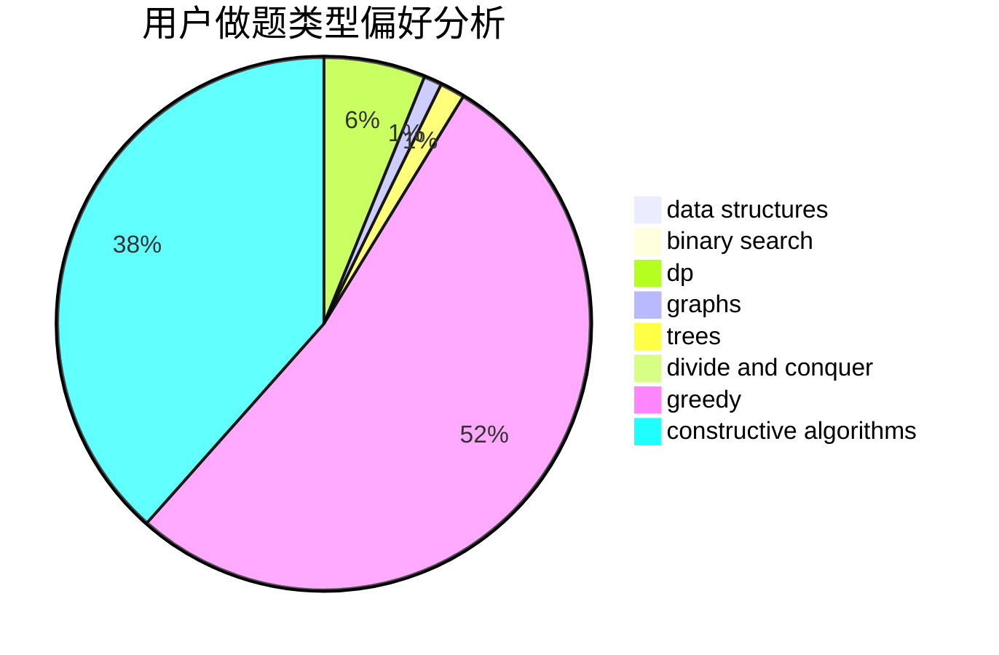
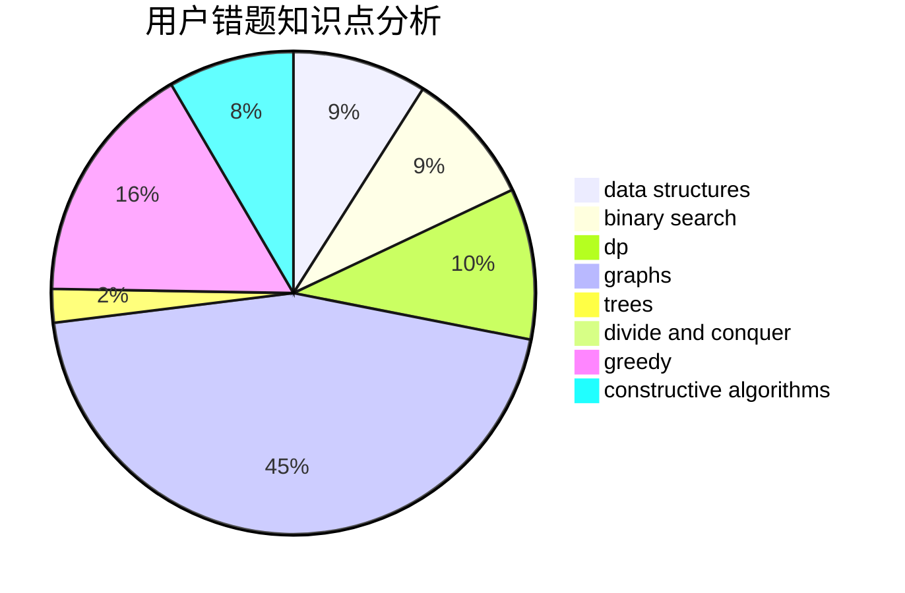

# kejunyu

<!-- tabs:start -->

#### **用户提交结果分析**

#### **用户做题类型偏好分析**

#### **用户错题知识点分析**

<!-- tabs:end -->
# 推荐题目
[519D](https://codeforces.com/contest/519/problem/D)		data structures,
                        dp,
                        two pointers		  
[962A](https://codeforces.com/contest/962/problem/A)		implementation		  
[975E](https://codeforces.com/contest/975/problem/E)		geometry		  
[550A](https://codeforces.com/contest/550/problem/A)		brute force,
                        dp,
                        greedy,
                        implementation,
                        strings		  
[768E](https://codeforces.com/contest/768/problem/E)		bitmasks,
                        dp,
                        games		  
[990D](https://codeforces.com/contest/990/problem/D)		constructive algorithms,
                        graphs,
                        implementation		  
[1242D](https://codeforces.com/contest/1242/problem/D)		math		  
[33A](https://codeforces.com/contest/33/problem/A)		greedy,
                        implementation		  
[669D](https://codeforces.com/contest/669/problem/D)		dsu,graphs,sortings,trees		  
[731B](https://codeforces.com/contest/731/problem/B)		constructive algorithms,
                        greedy		  
