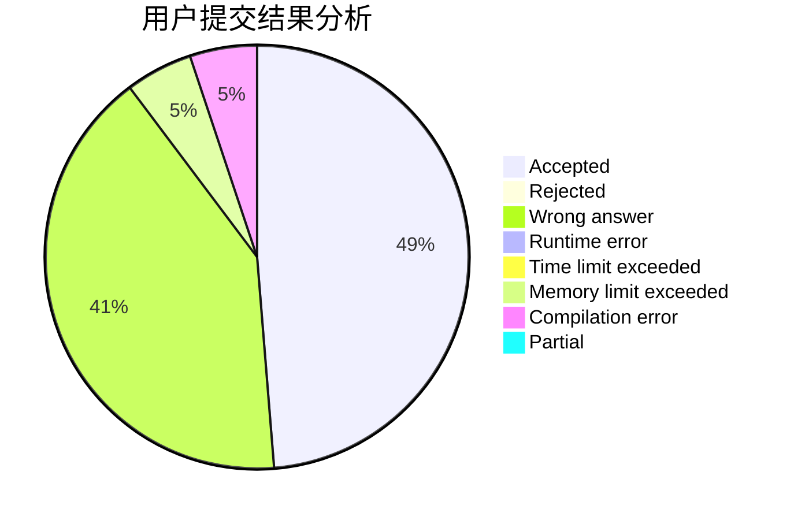
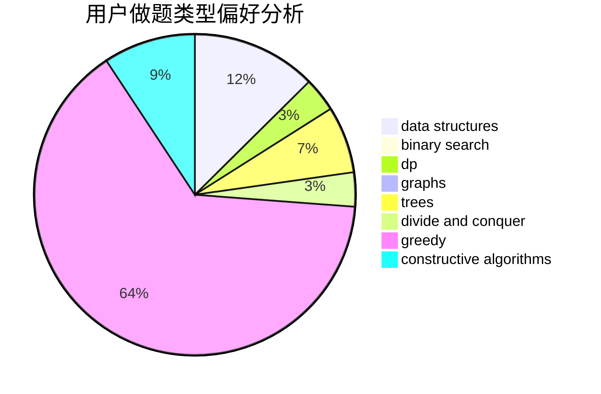
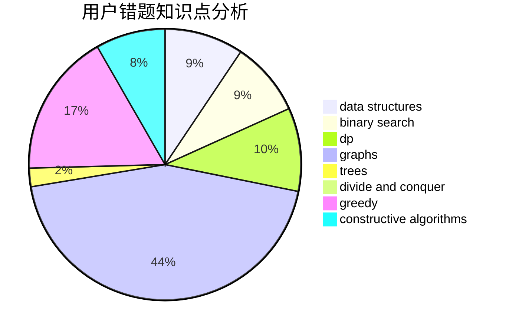

# kejunyu

<!-- tabs:start -->

#### **用户提交结果分析**

#### **用户做题类型偏好分析**

#### **用户错题知识点分析**

<!-- tabs:end -->
# 推荐题目
[498D](https://codeforces.com/contest/498/problem/D)		data structures,
                        dp,
                        number theory		  
[940D](https://codeforces.com/contest/940/problem/D)		binary search,
                        implementation		  
[952F](https://codeforces.com/contest/952/problem/F)		nan		  
[526A](https://codeforces.com/contest/526/problem/A)		brute force,
                        implementation		  
[749E](https://codeforces.com/contest/749/problem/E)		data structures,
                        probabilities		  
[976E](https://codeforces.com/contest/976/problem/E)		greedy,
                        sortings		  
[1237F](https://codeforces.com/contest/1237/problem/F)		combinatorics,
                        dp		  
[316A2](https://codeforces.com/contest/316A/problem/2)		math		  
[639F](https://codeforces.com/contest/639/problem/F)		data structures,
                        dfs and similar,
                        graphs,
                        trees		  
[711B](https://codeforces.com/contest/711/problem/B)		constructive algorithms,
                        implementation		  
