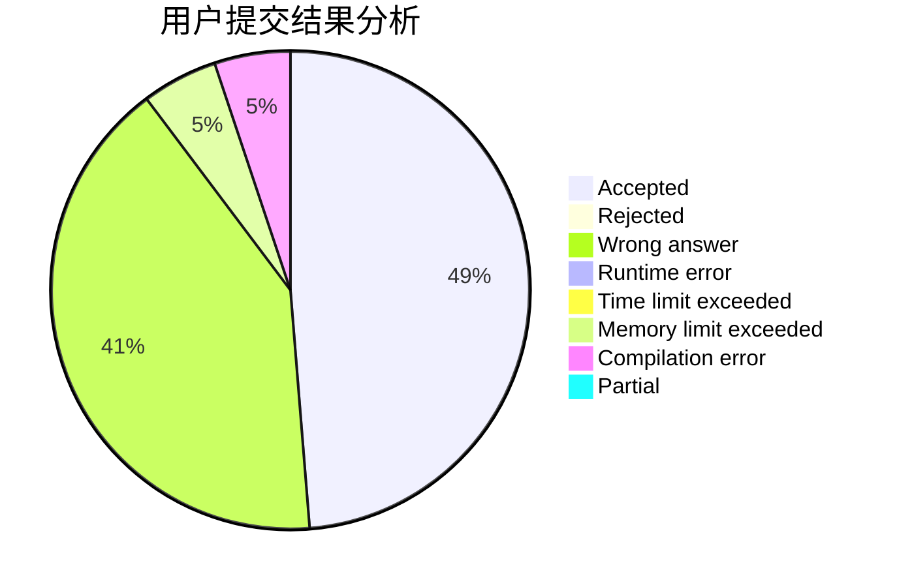
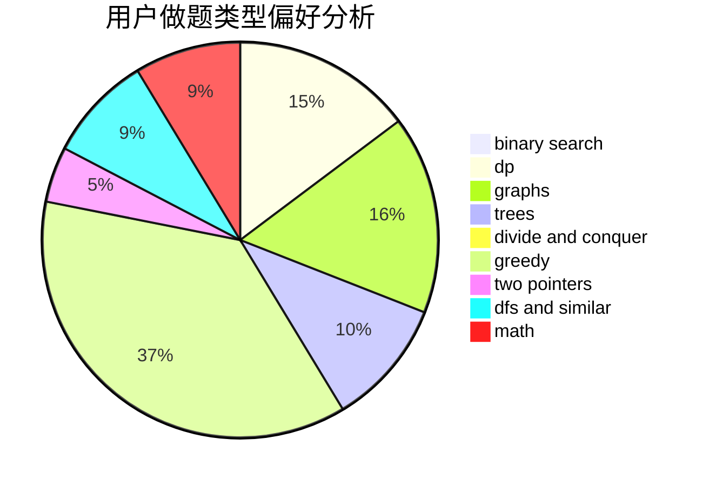

# kejunyu

<!-- tabs:start -->

#### **用户提交结果分析**

#### **用户做题类型偏好分析**

<!-- tabs:end -->
# 推荐题目
[519D](https://codeforces.com/contest/519/problem/D)
[962A](https://codeforces.com/contest/962/problem/A)
[975E](https://codeforces.com/contest/975/problem/E)
[550A](https://codeforces.com/contest/550/problem/A)
[768E](https://codeforces.com/contest/768/problem/E)
[990D](https://codeforces.com/contest/990/problem/D)
[1242D](https://codeforces.com/contest/1242/problem/D)
[33A](https://codeforces.com/contest/33/problem/A)
[669D](https://codeforces.com/contest/669/problem/D)
[731B](https://codeforces.com/contest/731/problem/B)
