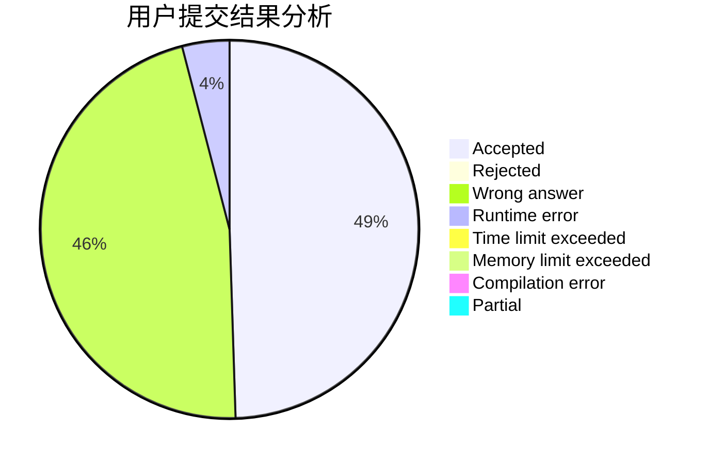
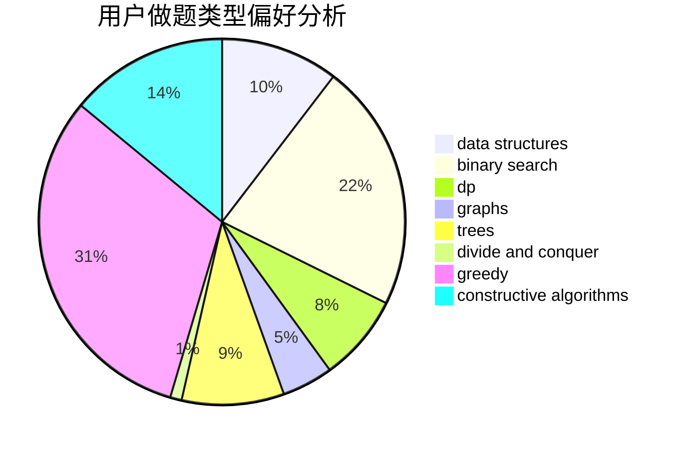
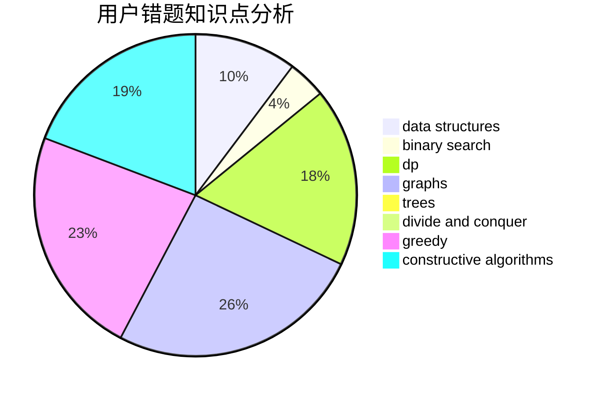

# kekxy

<!-- tabs:start -->

#### **用户提交结果分析**

#### **用户做题类型偏好分析**

#### **用户错题知识点分析**

<!-- tabs:end -->
# 推荐题目
[1294F](https://codeforces.com/contest/1294/problem/F)		dfs and similar,
                        dp,
                        greedy,
                        trees		  
[88A](https://codeforces.com/contest/88/problem/A)		brute force,
                        implementation		  
[848A](https://codeforces.com/contest/848/problem/A)		constructive algorithms		  
[1155A](https://codeforces.com/contest/1155/problem/A)		implementation,
                        sortings,
                        strings		  
[1086E](https://codeforces.com/contest/1086/problem/E)		dsu,graphs,sortings,trees		  
[1077B](https://codeforces.com/contest/1077/problem/B)		greedy		  
[286A](https://codeforces.com/contest/286/problem/A)		constructive algorithms,
                        math		  
[325D](https://codeforces.com/contest/325/problem/D)		dsu		  
[543D](https://codeforces.com/contest/543/problem/D)		dp,
                        trees		  
[950B](https://codeforces.com/contest/950/problem/B)		greedy,
                        implementation		  
