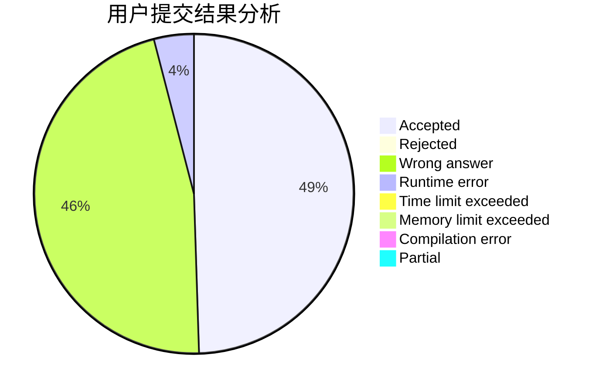
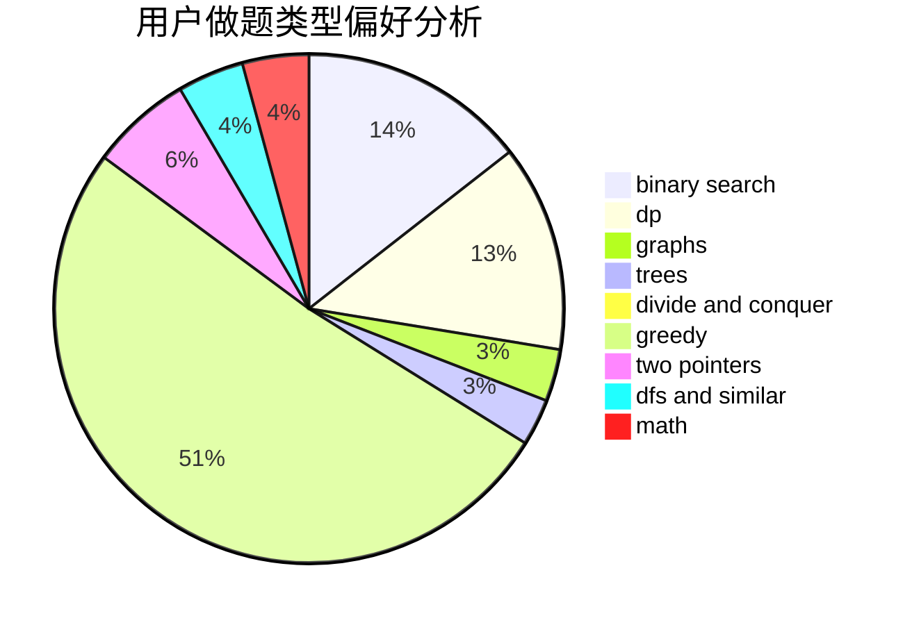

# kekxy

<!-- tabs:start -->

#### **用户提交结果分析**

#### **用户做题类型偏好分析**

<!-- tabs:end -->
# 推荐题目
[1301C](https://codeforces.com/contest/1301/problem/C)
[909A](https://codeforces.com/contest/909/problem/A)
[866D](https://codeforces.com/contest/866/problem/D)
[11571](https://codeforces.com/contest/1157/problem/1)
[1087C](https://codeforces.com/contest/1087/problem/C)
[1077C](https://codeforces.com/contest/1077/problem/C)
[300B](https://codeforces.com/contest/300/problem/B)
[354E](https://codeforces.com/contest/354/problem/E)
[567F](https://codeforces.com/contest/567/problem/F)
[967D](https://codeforces.com/contest/967/problem/D)
