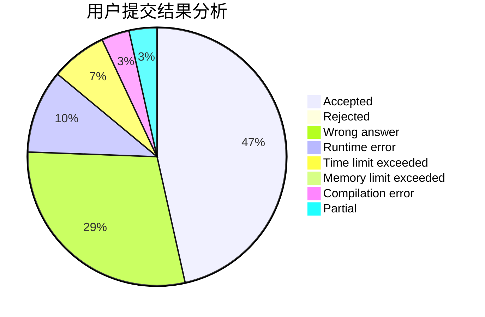
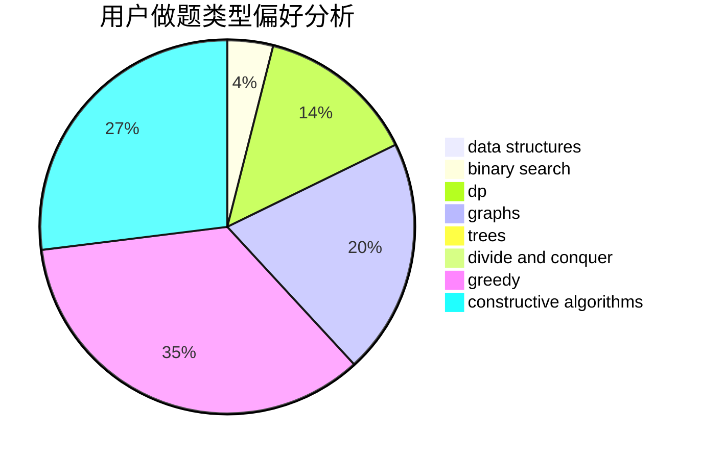
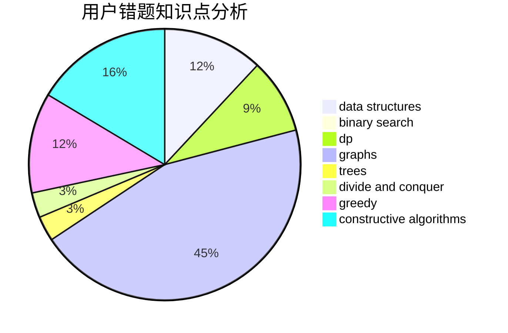

# kele_

<!-- tabs:start -->

#### **用户提交结果分析**

#### **用户做题类型偏好分析**

#### **用户错题知识点分析**

<!-- tabs:end -->
# 推荐题目
[1374C](https://codeforces.com/contest/1374/problem/C)		greedy,
                        strings		  
[359B](https://codeforces.com/contest/359/problem/B)		constructive algorithms,
                        dp,
                        math		  
[109A](https://codeforces.com/contest/109/problem/A)		brute force,
                        implementation		  
[343A](https://codeforces.com/contest/343/problem/A)		math,
                        number theory		  
[358D](https://codeforces.com/contest/358/problem/D)		dp,
                        greedy		  
[725D](https://codeforces.com/contest/725/problem/D)		data structures,
                        greedy		  
[461B](https://codeforces.com/contest/461/problem/B)		dfs and similar,
                        dp,
                        trees		  
[886F](https://codeforces.com/contest/886/problem/F)		geometry		  
[1042C](https://codeforces.com/contest/1042/problem/C)		constructive algorithms,
                        greedy,
                        math		  
[1480D1](https://codeforces.com/contest/1480D/problem/1)		dsu,graphs,sortings,trees		  
