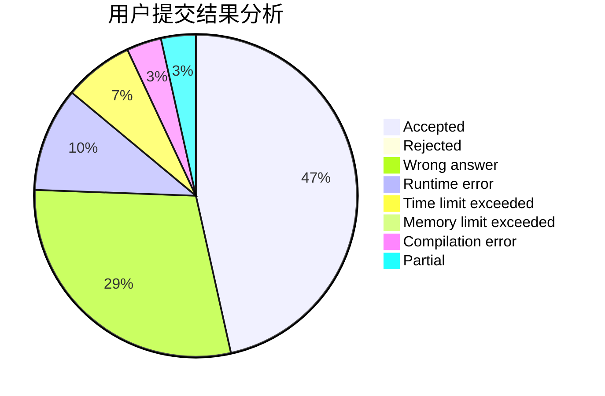
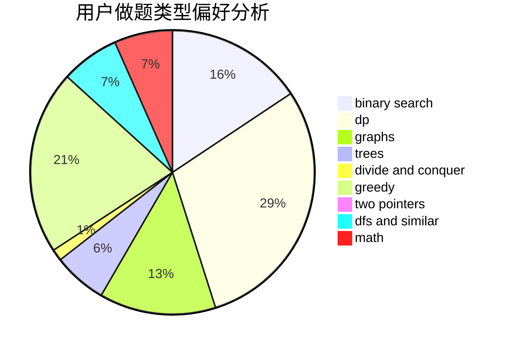

# kele_

<!-- tabs:start -->

#### **用户提交结果分析**

#### **用户做题类型偏好分析**

<!-- tabs:end -->
# 推荐题目
[1383B](https://codeforces.com/contest/1383/problem/B)
[385E](https://codeforces.com/contest/385/problem/E)
[10C](https://codeforces.com/contest/10/problem/C)
[36B](https://codeforces.com/contest/36/problem/B)
[383E](https://codeforces.com/contest/383/problem/E)
[743D](https://codeforces.com/contest/743/problem/D)
[480B](https://codeforces.com/contest/480/problem/B)
[906A](https://codeforces.com/contest/906/problem/A)
[1042F](https://codeforces.com/contest/1042/problem/F)
[1488H](https://codeforces.com/contest/1488/problem/H)
