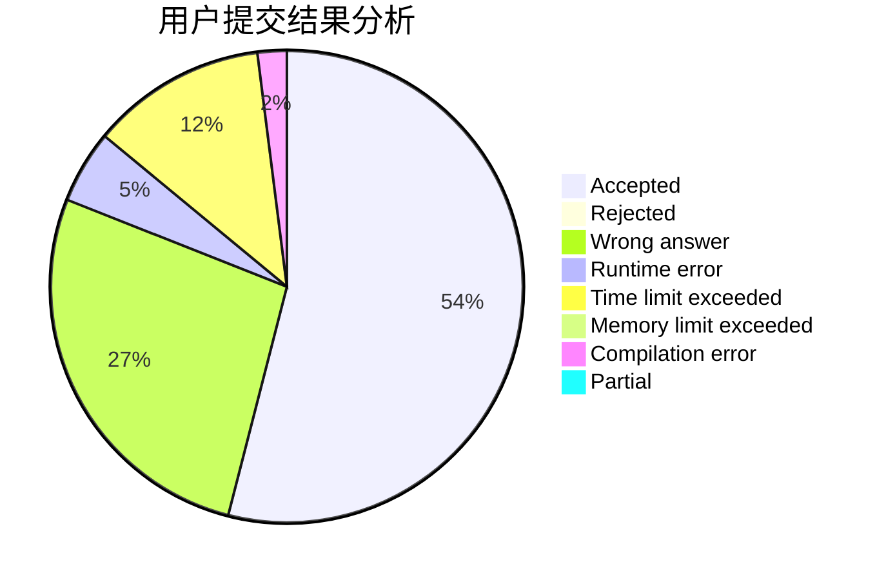
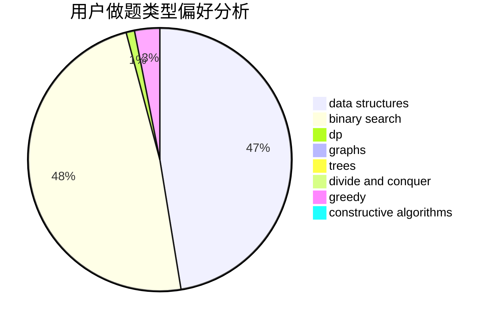
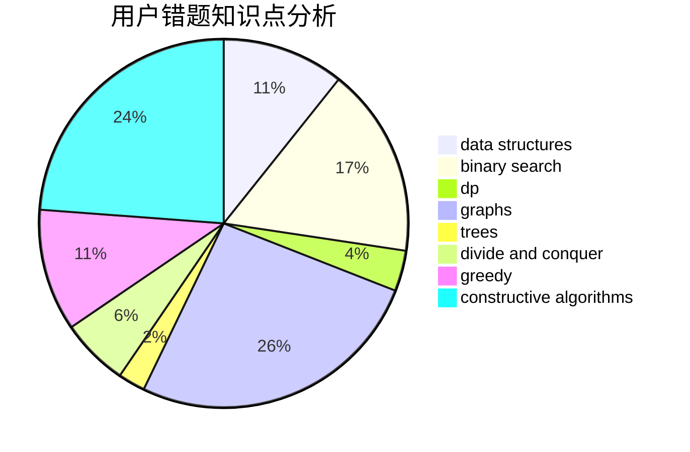

# Bennettz

<!-- tabs:start -->

#### **用户提交结果分析**

#### **用户做题类型偏好分析**

#### **用户错题知识点分析**

<!-- tabs:end -->
# 推荐题目
[521B](https://codeforces.com/contest/521/problem/B)		dsu,graphs,sortings,trees		  
[1164Q](https://codeforces.com/contest/1164/problem/Q)		dsu,graphs,sortings,trees		  
[1256C](https://codeforces.com/contest/1256/problem/C)		greedy		  
[521C](https://codeforces.com/contest/521/problem/C)		dsu,graphs,sortings,trees		  
[1088A](https://codeforces.com/contest/1088/problem/A)		brute force,
                        constructive algorithms		  
[1344E](https://codeforces.com/contest/1344/problem/E)		data structures,
                        trees		  
[1482E](https://codeforces.com/contest/1482/problem/E)		data structures,
                        divide and conquer,
                        dp		  
[1489D](https://codeforces.com/contest/1489/problem/D)		dsu,graphs,sortings,trees		  
[1483E](https://codeforces.com/contest/1483/problem/E)		dsu,graphs,sortings,trees		  
[1475F](https://codeforces.com/contest/1475/problem/F)		2-sat,
                        brute force,
                        constructive algorithms		  
