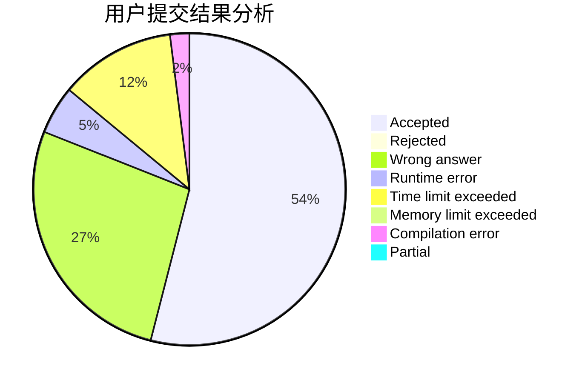
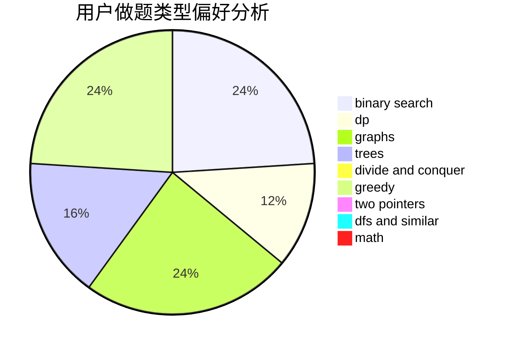

# Bennettz

<!-- tabs:start -->

#### **用户提交结果分析**

#### **用户做题类型偏好分析**

<!-- tabs:end -->
# 推荐题目
[547A](https://codeforces.com/contest/547/problem/A)
[1167A](https://codeforces.com/contest/1167/problem/A)
[1263E](https://codeforces.com/contest/1263/problem/E)
[547B](https://codeforces.com/contest/547/problem/B)
[1088D](https://codeforces.com/contest/1088/problem/D)
[1352A](https://codeforces.com/contest/1352/problem/A)
[1490C](https://codeforces.com/contest/1490/problem/C)
[1497B](https://codeforces.com/contest/1497/problem/B)
[1491C](https://codeforces.com/contest/1491/problem/C)
[1484C](https://codeforces.com/contest/1484/problem/C)
