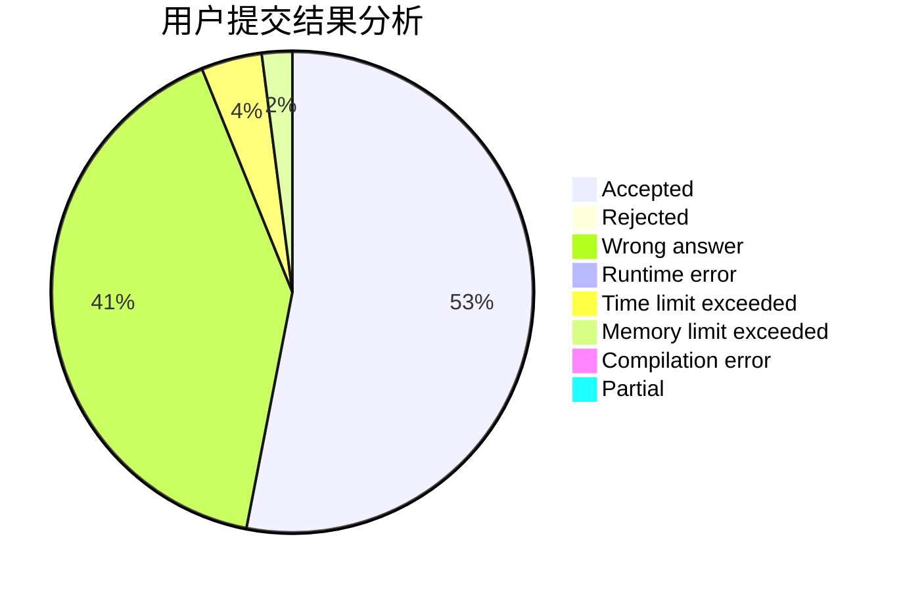
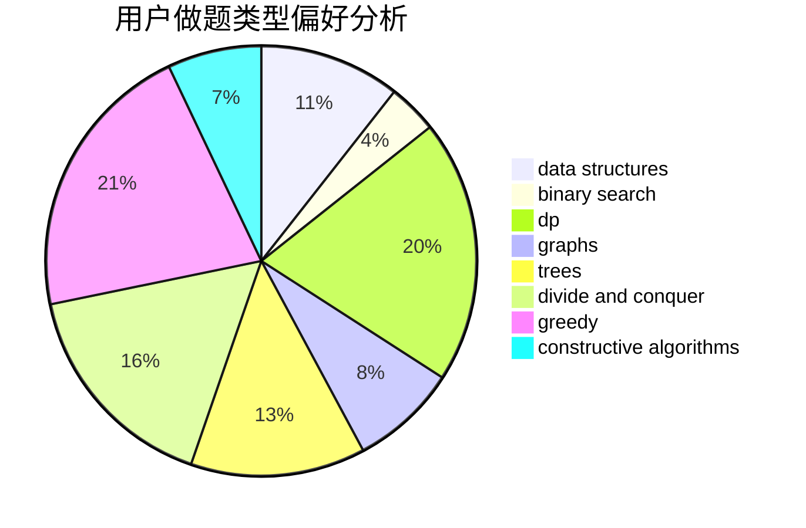

# kelian

<!-- tabs:start -->

#### **用户提交结果分析**

#### **用户做题类型偏好分析**

#### **用户错题知识点分析**

<!-- tabs:end -->
# 推荐题目
[579A](https://codeforces.com/contest/579/problem/A)		bitmasks		  
[825E](https://codeforces.com/contest/825/problem/E)		data structures,
                        dfs and similar,
                        graphs,
                        greedy		  
[750F](https://codeforces.com/contest/750/problem/F)		constructive algorithms,
                        implementation,
                        interactive,
                        trees		  
[1351A](https://codeforces.com/contest/1351/problem/A)		implementation		  
[496B](https://codeforces.com/contest/496/problem/B)		brute force,
                        constructive algorithms,
                        implementation		  
[1360A](https://codeforces.com/contest/1360/problem/A)		greedy,
                        math		  
[919B](https://codeforces.com/contest/919/problem/B)		binary search,
                        brute force,
                        dp,
                        implementation,
                        number theory		  
[521B](https://codeforces.com/contest/521/problem/B)		dsu,graphs,sortings,trees		  
[638C](https://codeforces.com/contest/638/problem/C)		*special problem,
                        dfs and similar,
                        graphs,
                        greedy,
                        trees		  
[796A](https://codeforces.com/contest/796/problem/A)		brute force,
                        implementation		  
