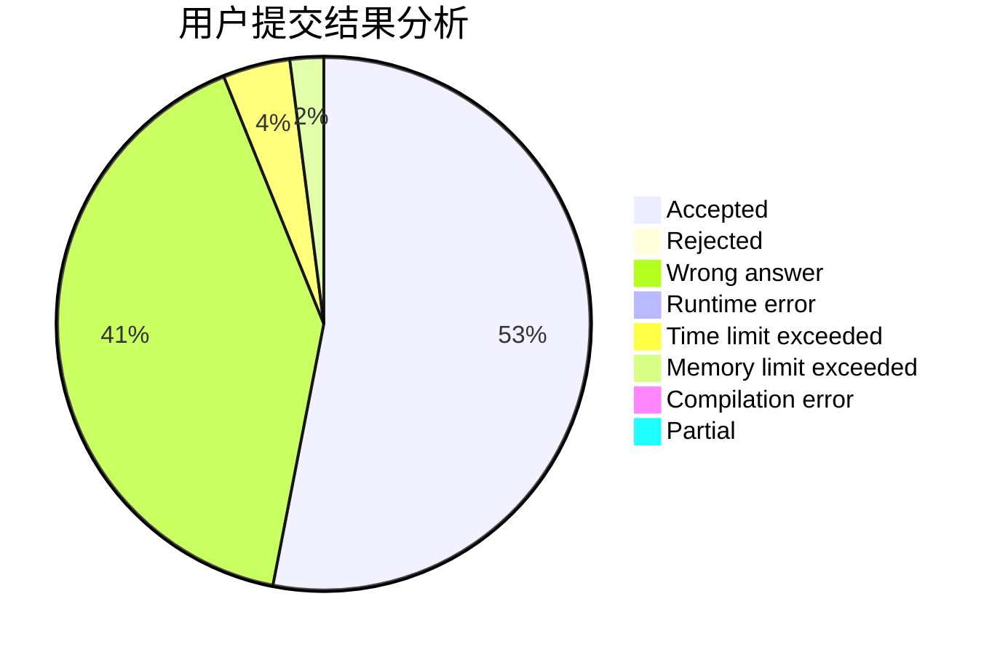
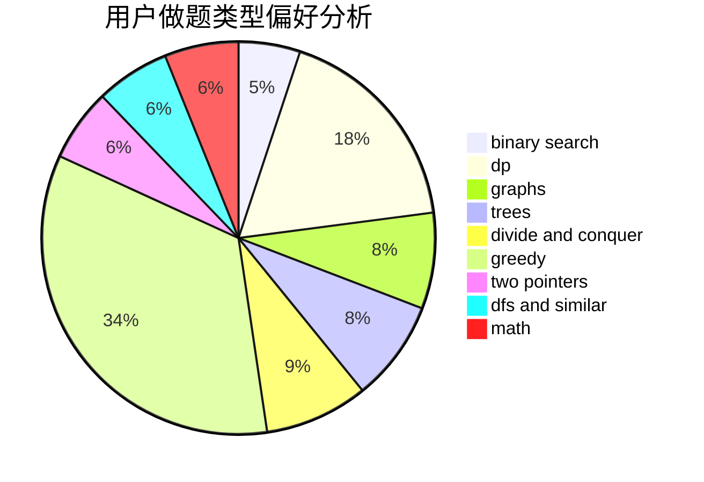

# kelian

<!-- tabs:start -->

#### **用户提交结果分析**

#### **用户做题类型偏好分析**

<!-- tabs:end -->
# 推荐题目
[579A](https://codeforces.com/contest/579/problem/A)
[825E](https://codeforces.com/contest/825/problem/E)
[750F](https://codeforces.com/contest/750/problem/F)
[1351A](https://codeforces.com/contest/1351/problem/A)
[496B](https://codeforces.com/contest/496/problem/B)
[1360A](https://codeforces.com/contest/1360/problem/A)
[919B](https://codeforces.com/contest/919/problem/B)
[521B](https://codeforces.com/contest/521/problem/B)
[638C](https://codeforces.com/contest/638/problem/C)
[796A](https://codeforces.com/contest/796/problem/A)
