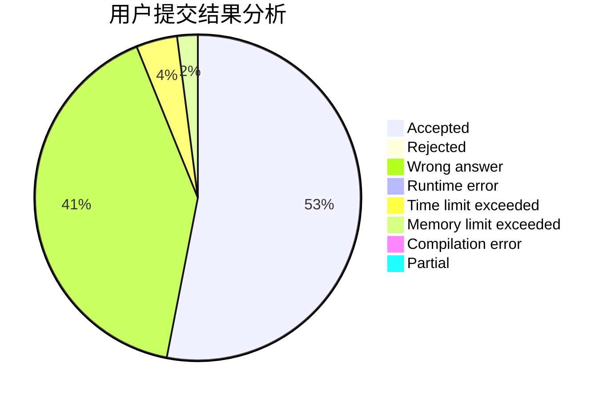
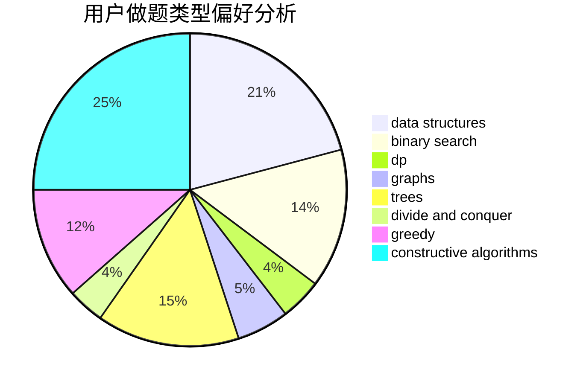

# kelian

<!-- tabs:start -->

#### **用户提交结果分析**

#### **用户做题类型偏好分析**

#### **用户错题知识点分析**

<!-- tabs:end -->
# 推荐题目
[553E](https://codeforces.com/contest/553/problem/E)		dp,
                        fft,
                        graphs,
                        math,
                        probabilities		  
[808F](https://codeforces.com/contest/808/problem/F)		binary search,
                        flows,
                        graphs		  
[733A](https://codeforces.com/contest/733/problem/A)		implementation		  
[1344B](https://codeforces.com/contest/1344/problem/B)		constructive algorithms,
                        dfs and similar,
                        dsu,
                        graphs		  
[476D](https://codeforces.com/contest/476/problem/D)		constructive algorithms,
                        greedy,
                        math		  
[1353C](https://codeforces.com/contest/1353/problem/C)		math		  
[903A](https://codeforces.com/contest/903/problem/A)		greedy,
                        implementation		  
[500B](https://codeforces.com/contest/500/problem/B)		dfs and similar,
                        dsu,
                        graphs,
                        greedy,
                        math,
                        sortings		  
[618C](https://codeforces.com/contest/618/problem/C)		geometry,
                        implementation		  
[777D](https://codeforces.com/contest/777/problem/D)		binary search,
                        greedy,
                        implementation,
                        strings		  
