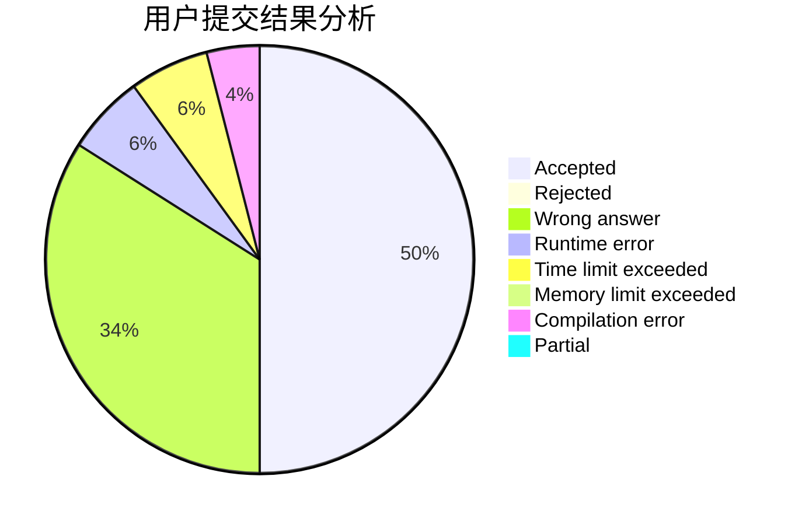
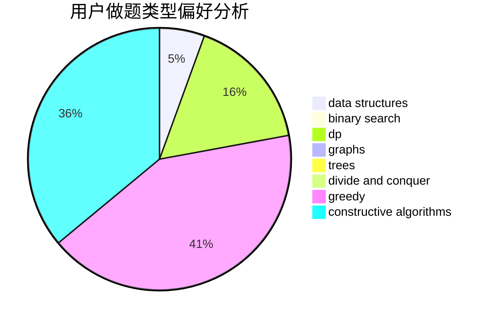
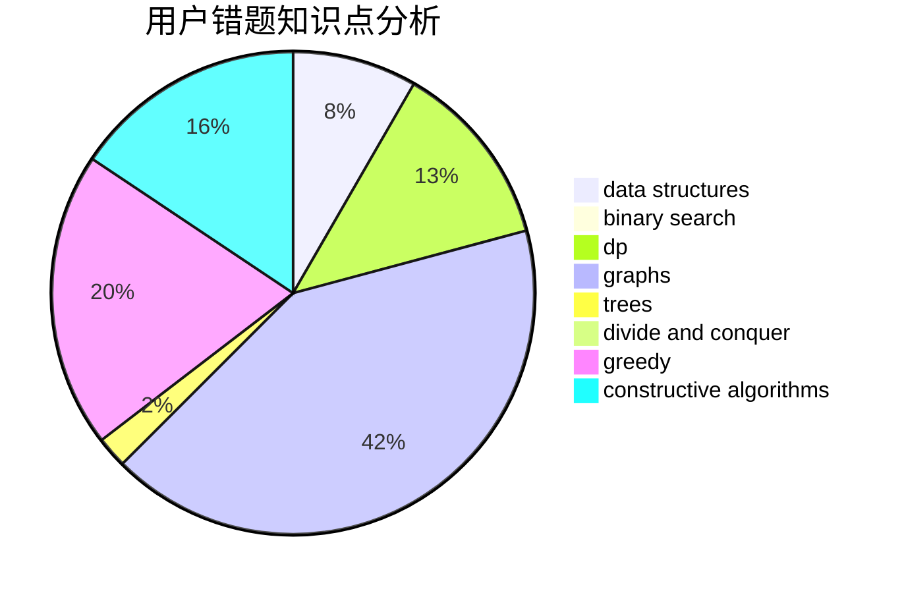

# kernel.bin

<!-- tabs:start -->

#### **用户提交结果分析**

#### **用户做题类型偏好分析**

#### **用户错题知识点分析**

<!-- tabs:end -->
# 推荐题目
[548A](https://codeforces.com/contest/548/problem/A)		brute force,
                        implementation,
                        strings		  
[1501A](https://codeforces.com/contest/1501/problem/A)		implementation		  
[9581](https://codeforces.com/contest/958/problem/1)		dsu,graphs,sortings,trees		  
[464E](https://codeforces.com/contest/464/problem/E)		data structures,
                        graphs,
                        shortest paths		  
[396C](https://codeforces.com/contest/396/problem/C)		data structures,
                        graphs,
                        trees		  
[605C](https://codeforces.com/contest/605/problem/C)		geometry		  
[939E](https://codeforces.com/contest/939/problem/E)		binary search,
                        greedy,
                        ternary search,
                        two pointers		  
[849A](https://codeforces.com/contest/849/problem/A)		implementation		  
[13562](https://codeforces.com/contest/1356/problem/2)		dsu,graphs,sortings,trees		  
[922D](https://codeforces.com/contest/922/problem/D)		greedy,
                        sortings		  
