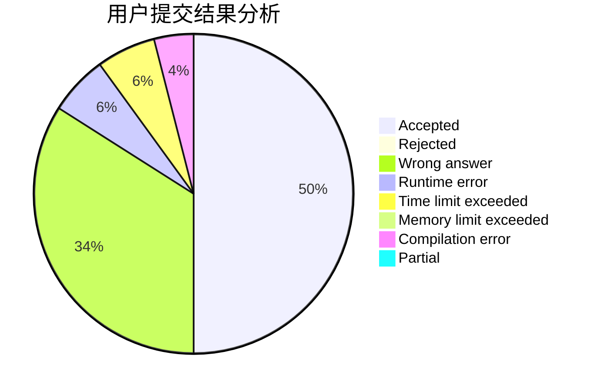
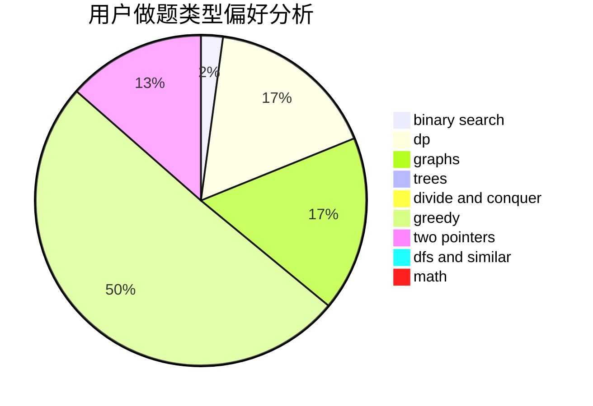

# kernel.bin

<!-- tabs:start -->

#### **用户提交结果分析**

#### **用户做题类型偏好分析**

<!-- tabs:end -->
# 推荐题目
[548A](https://codeforces.com/contest/548/problem/A)
[1501A](https://codeforces.com/contest/1501/problem/A)
[9581](https://codeforces.com/contest/958/problem/1)
[464E](https://codeforces.com/contest/464/problem/E)
[396C](https://codeforces.com/contest/396/problem/C)
[605C](https://codeforces.com/contest/605/problem/C)
[939E](https://codeforces.com/contest/939/problem/E)
[849A](https://codeforces.com/contest/849/problem/A)
[13562](https://codeforces.com/contest/1356/problem/2)
[922D](https://codeforces.com/contest/922/problem/D)
