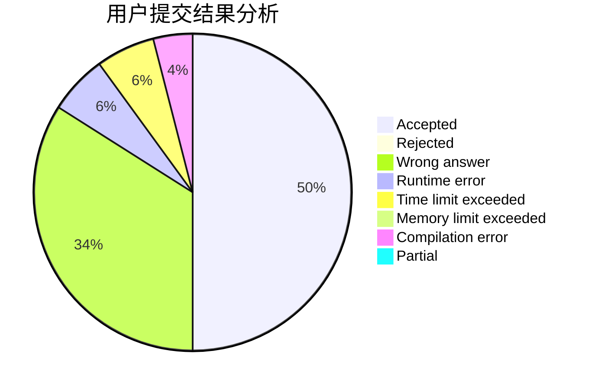
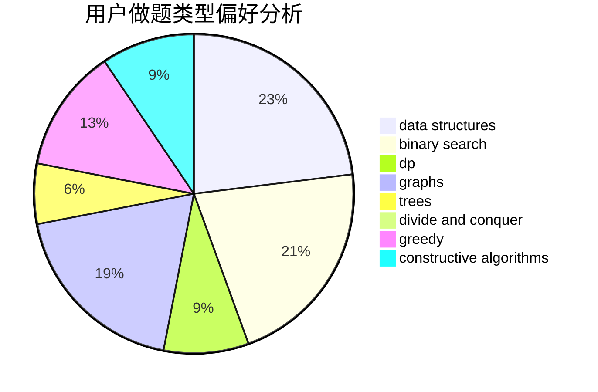
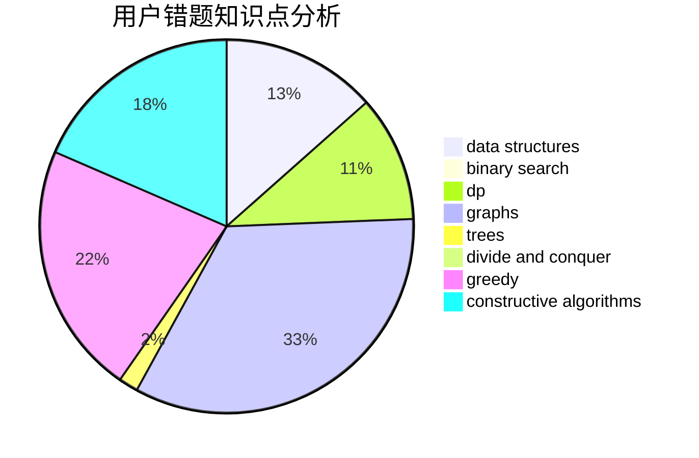

# kernel.bin

<!-- tabs:start -->

#### **用户提交结果分析**

#### **用户做题类型偏好分析**

#### **用户错题知识点分析**

<!-- tabs:end -->
# 推荐题目
[522D](https://codeforces.com/contest/522/problem/D)		*special problem,
                        data structures		  
[1493A](https://codeforces.com/contest/1493/problem/A)		constructive algorithms,
                        greedy		  
[936A](https://codeforces.com/contest/936/problem/A)		binary search,
                        implementation,
                        math		  
[445A](https://codeforces.com/contest/445/problem/A)		dfs and similar,
                        implementation		  
[366D](https://codeforces.com/contest/366/problem/D)		binary search,
                        data structures,
                        dfs and similar,
                        dsu,
                        shortest paths,
                        two pointers		  
[585B](https://codeforces.com/contest/585/problem/B)		dfs and similar,
                        graphs,
                        shortest paths		  
[919D](https://codeforces.com/contest/919/problem/D)		dfs and similar,
                        dp,
                        graphs		  
[831A](https://codeforces.com/contest/831/problem/A)		implementation		  
[1349D](https://codeforces.com/contest/1349/problem/D)		math,
                        probabilities		  
[908C](https://codeforces.com/contest/908/problem/C)		brute force,
                        geometry,
                        implementation,
                        math		  
