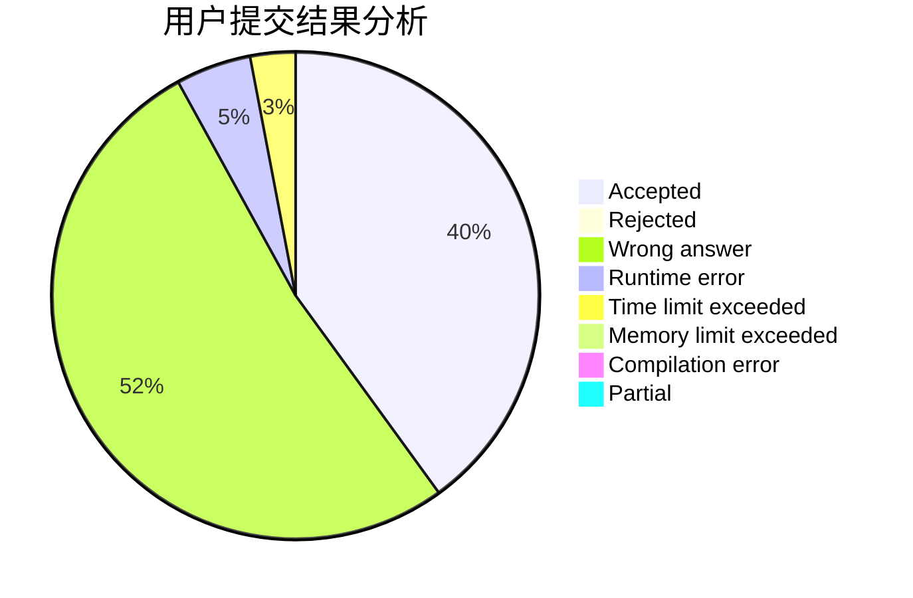
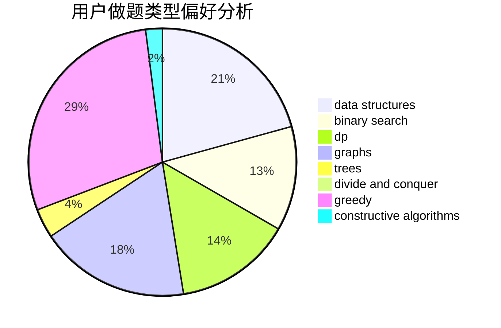
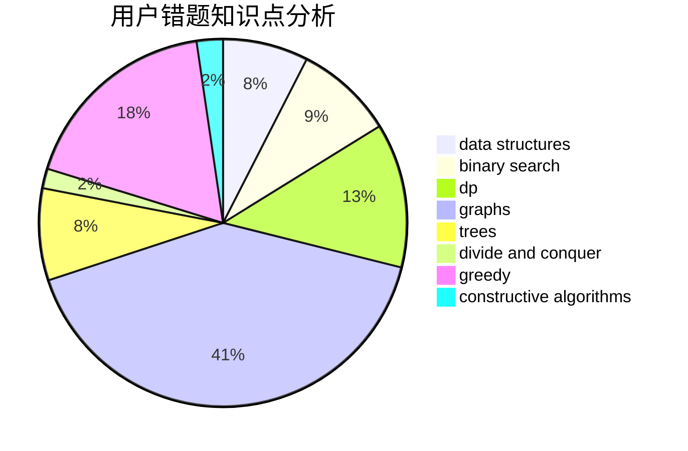

# keroker0

<!-- tabs:start -->

#### **用户提交结果分析**

#### **用户做题类型偏好分析**

#### **用户错题知识点分析**

<!-- tabs:end -->
# 推荐题目
[860C](https://codeforces.com/contest/860/problem/C)		dsu,graphs,sortings,trees		  
[913D](https://codeforces.com/contest/913/problem/D)		binary search,
                        brute force,
                        data structures,
                        greedy,
                        sortings		  
[180C](https://codeforces.com/contest/180/problem/C)		dp		  
[839E](https://codeforces.com/contest/839/problem/E)		brute force,
                        graphs,
                        math,
                        meet-in-the-middle		  
[865B](https://codeforces.com/contest/865/problem/B)		binary search,
                        sortings,
                        ternary search		  
[1011E](https://codeforces.com/contest/1011/problem/E)		dsu,graphs,sortings,trees		  
[835C](https://codeforces.com/contest/835/problem/C)		dp,
                        implementation		  
[838A](https://codeforces.com/contest/838/problem/A)		brute force		  
[788E](https://codeforces.com/contest/788/problem/E)		data structures		  
[41E](https://codeforces.com/contest/41/problem/E)		constructive algorithms,
                        graphs,
                        greedy		  
