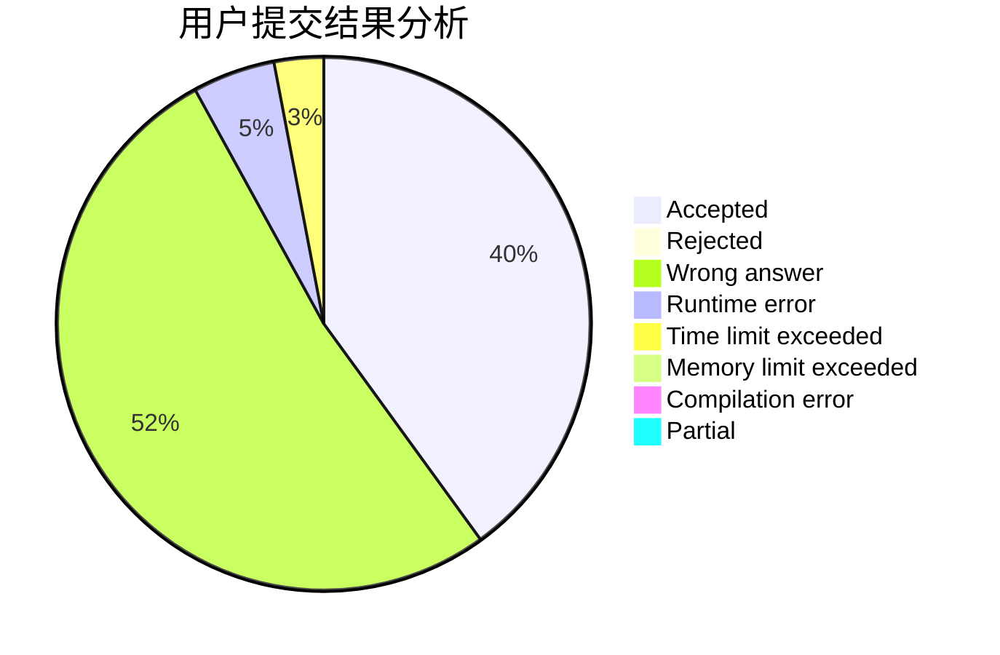
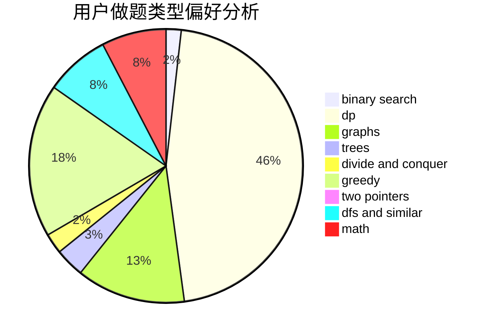

# keroker0

<!-- tabs:start -->

#### **用户提交结果分析**

#### **用户做题类型偏好分析**

<!-- tabs:end -->
# 推荐题目
[878C](https://codeforces.com/contest/878/problem/C)
[932B](https://codeforces.com/contest/932/problem/B)
[205D](https://codeforces.com/contest/205/problem/D)
[859B](https://codeforces.com/contest/859/problem/B)
[884F](https://codeforces.com/contest/884/problem/F)
[1012B](https://codeforces.com/contest/1012/problem/B)
[853A](https://codeforces.com/contest/853/problem/A)
[855F](https://codeforces.com/contest/855/problem/F)
[804B](https://codeforces.com/contest/804/problem/B)
[445C](https://codeforces.com/contest/445/problem/C)
