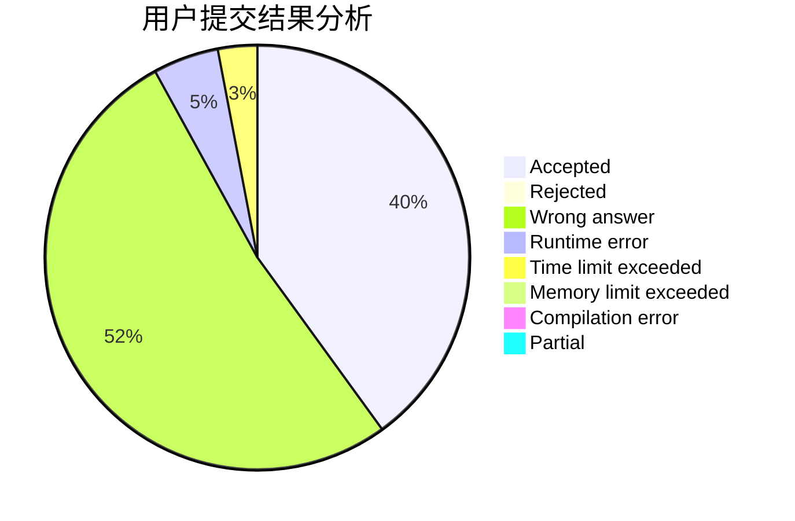
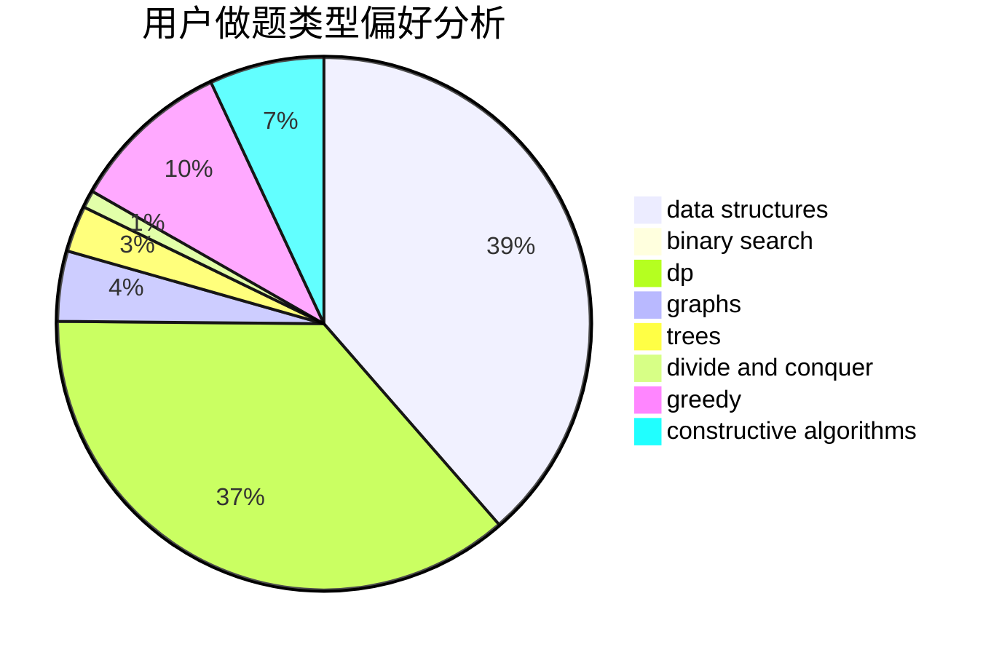
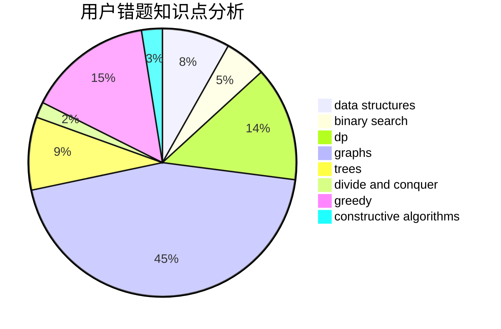

# keroker0

<!-- tabs:start -->

#### **用户提交结果分析**

#### **用户做题类型偏好分析**

#### **用户错题知识点分析**

<!-- tabs:end -->
# 推荐题目
[878C](https://codeforces.com/contest/878/problem/C)		data structures,
                        graphs		  
[932B](https://codeforces.com/contest/932/problem/B)		binary search,
                        data structures,
                        dfs and similar		  
[205D](https://codeforces.com/contest/205/problem/D)		dsu,graphs,sortings,trees		  
[859B](https://codeforces.com/contest/859/problem/B)		brute force,
                        geometry,
                        math		  
[884F](https://codeforces.com/contest/884/problem/F)		flows,
                        graphs,
                        greedy		  
[1012B](https://codeforces.com/contest/1012/problem/B)		constructive algorithms,
                        dfs and similar,
                        dsu,
                        graphs,
                        matrices		  
[853A](https://codeforces.com/contest/853/problem/A)		greedy		  
[855F](https://codeforces.com/contest/855/problem/F)		binary search,
                        data structures		  
[804B](https://codeforces.com/contest/804/problem/B)		combinatorics,
                        greedy,
                        implementation,
                        math		  
[445C](https://codeforces.com/contest/445/problem/C)		dsu,graphs,sortings,trees		  
