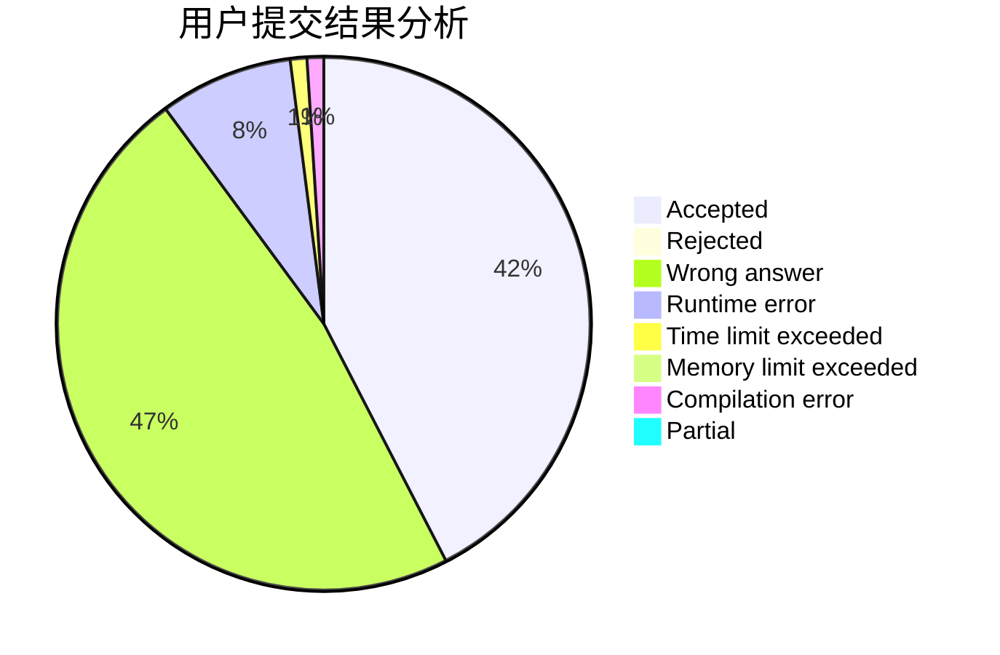
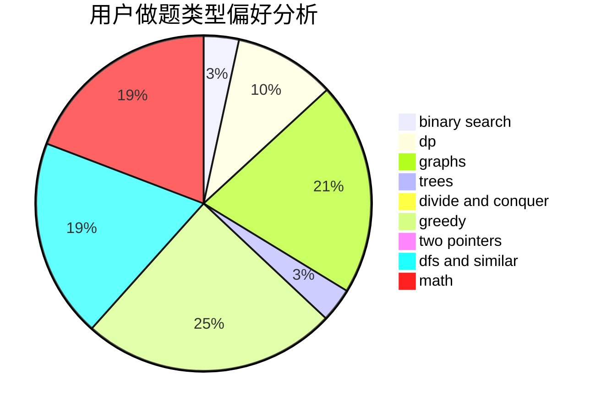

# killer_lsy

<!-- tabs:start -->

#### **用户提交结果分析**

#### **用户做题类型偏好分析**

<!-- tabs:end -->
# 推荐题目
[933B](https://codeforces.com/contest/933/problem/B)
[878A](https://codeforces.com/contest/878/problem/A)
[1340D](https://codeforces.com/contest/1340/problem/D)
[578B](https://codeforces.com/contest/578/problem/B)
[109A](https://codeforces.com/contest/109/problem/A)
[780B](https://codeforces.com/contest/780/problem/B)
[796D](https://codeforces.com/contest/796/problem/D)
[1178B](https://codeforces.com/contest/1178/problem/B)
[345A](https://codeforces.com/contest/345/problem/A)
[73B](https://codeforces.com/contest/73/problem/B)
