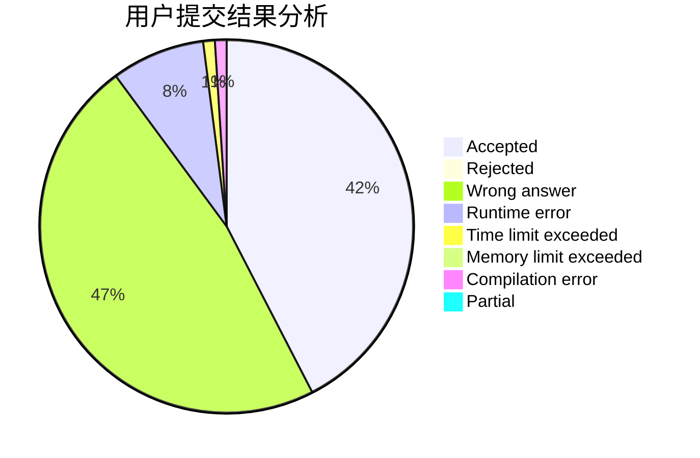
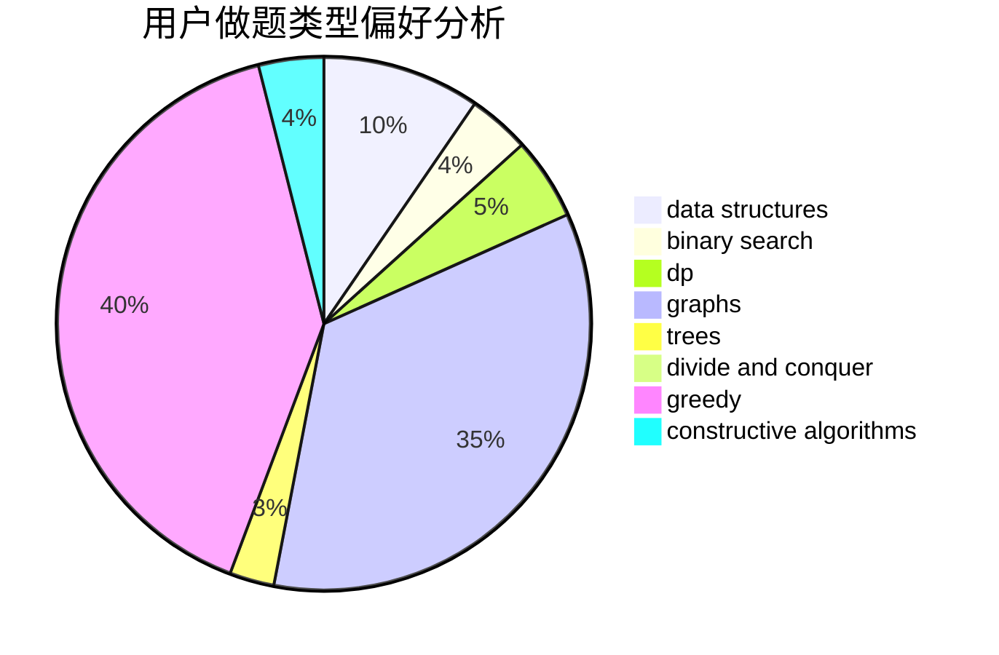
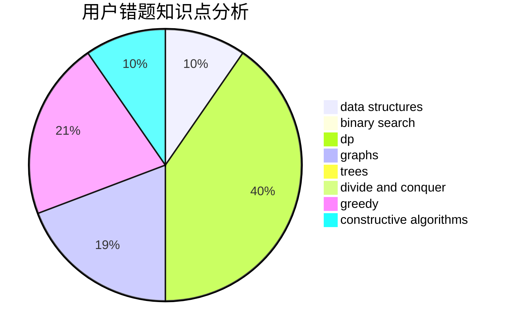

# killer_lsy

<!-- tabs:start -->

#### **用户提交结果分析**

#### **用户做题类型偏好分析**

#### **用户错题知识点分析**

<!-- tabs:end -->
# 推荐题目
[933B](https://codeforces.com/contest/933/problem/B)		math		  
[878A](https://codeforces.com/contest/878/problem/A)		bitmasks,
                        constructive algorithms		  
[1340D](https://codeforces.com/contest/1340/problem/D)		constructive algorithms,
                        dfs and similar,
                        graphs,
                        trees		  
[578B](https://codeforces.com/contest/578/problem/B)		brute force,
                        greedy		  
[109A](https://codeforces.com/contest/109/problem/A)		brute force,
                        implementation		  
[780B](https://codeforces.com/contest/780/problem/B)		binary search		  
[796D](https://codeforces.com/contest/796/problem/D)		constructive algorithms,
                        dfs and similar,
                        dp,
                        graphs,
                        shortest paths,
                        trees		  
[1178B](https://codeforces.com/contest/1178/problem/B)		dp,
                        strings		  
[345A](https://codeforces.com/contest/345/problem/A)		*special problem,
                        probabilities		  
[73B](https://codeforces.com/contest/73/problem/B)		binary search,
                        greedy,
                        sortings		  
