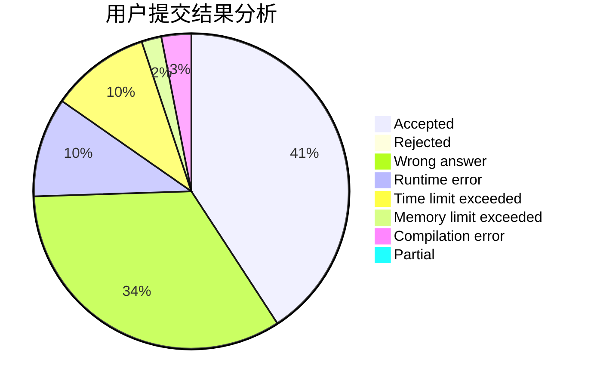
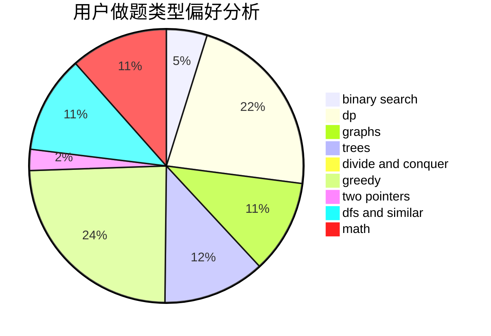

# kimyon

<!-- tabs:start -->

#### **用户提交结果分析**

#### **用户做题类型偏好分析**

<!-- tabs:end -->
# 推荐题目
[920F](https://codeforces.com/contest/920/problem/F)
[1425A](https://codeforces.com/contest/1425/problem/A)
[895B](https://codeforces.com/contest/895/problem/B)
[11302](https://codeforces.com/contest/1130/problem/2)
[1074C](https://codeforces.com/contest/1074/problem/C)
[231E](https://codeforces.com/contest/231/problem/E)
[1238G](https://codeforces.com/contest/1238/problem/G)
[652D](https://codeforces.com/contest/652/problem/D)
[1190E](https://codeforces.com/contest/1190/problem/E)
[994B](https://codeforces.com/contest/994/problem/B)
