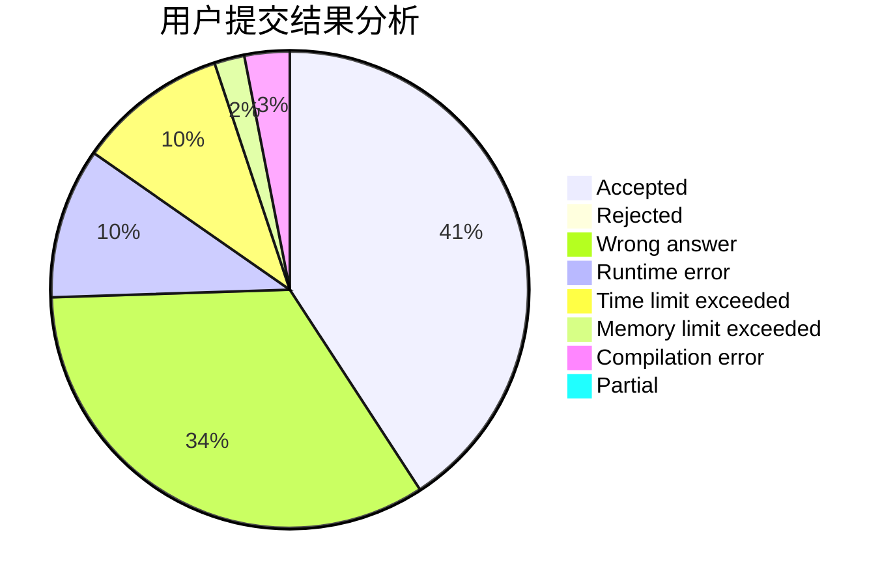
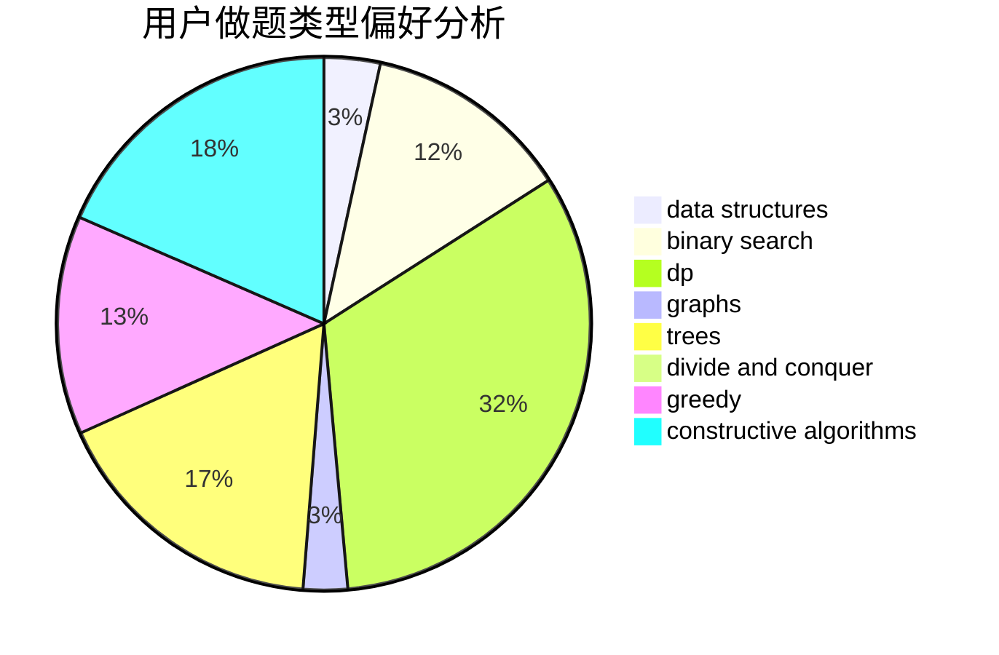
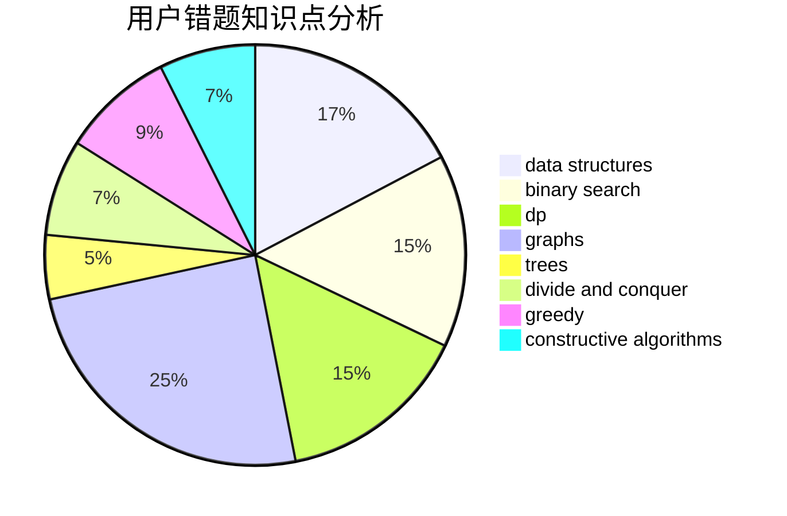

# kimyon

<!-- tabs:start -->

#### **用户提交结果分析**

#### **用户做题类型偏好分析**

#### **用户错题知识点分析**

<!-- tabs:end -->
# 推荐题目
[920F](https://codeforces.com/contest/920/problem/F)		brute force,
                        data structures,
                        dsu,
                        number theory		  
[1425A](https://codeforces.com/contest/1425/problem/A)		games,
                        greedy		  
[895B](https://codeforces.com/contest/895/problem/B)		binary search,
                        math,
                        sortings,
                        two pointers		  
[11302](https://codeforces.com/contest/1130/problem/2)		dsu,graphs,sortings,trees		  
[1074C](https://codeforces.com/contest/1074/problem/C)		dsu,graphs,sortings,trees		  
[231E](https://codeforces.com/contest/231/problem/E)		data structures,
                        dfs and similar,
                        dp,
                        graphs,
                        trees		  
[1238G](https://codeforces.com/contest/1238/problem/G)		data structures,
                        greedy,
                        sortings		  
[652D](https://codeforces.com/contest/652/problem/D)		data structures,
                        sortings		  
[1190E](https://codeforces.com/contest/1190/problem/E)		binary search,
                        greedy		  
[994B](https://codeforces.com/contest/994/problem/B)		greedy,
                        implementation,
                        sortings		  
