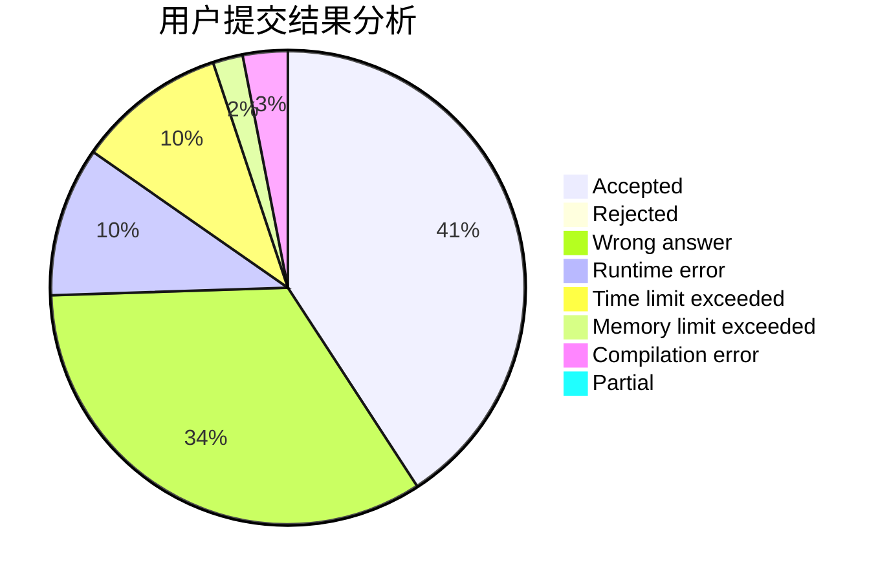
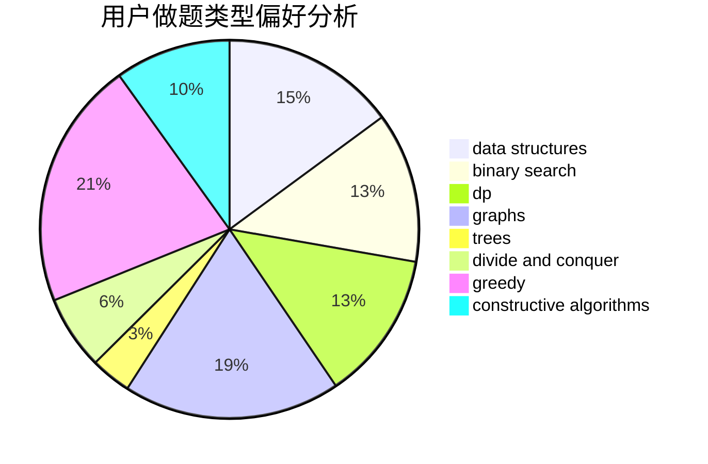
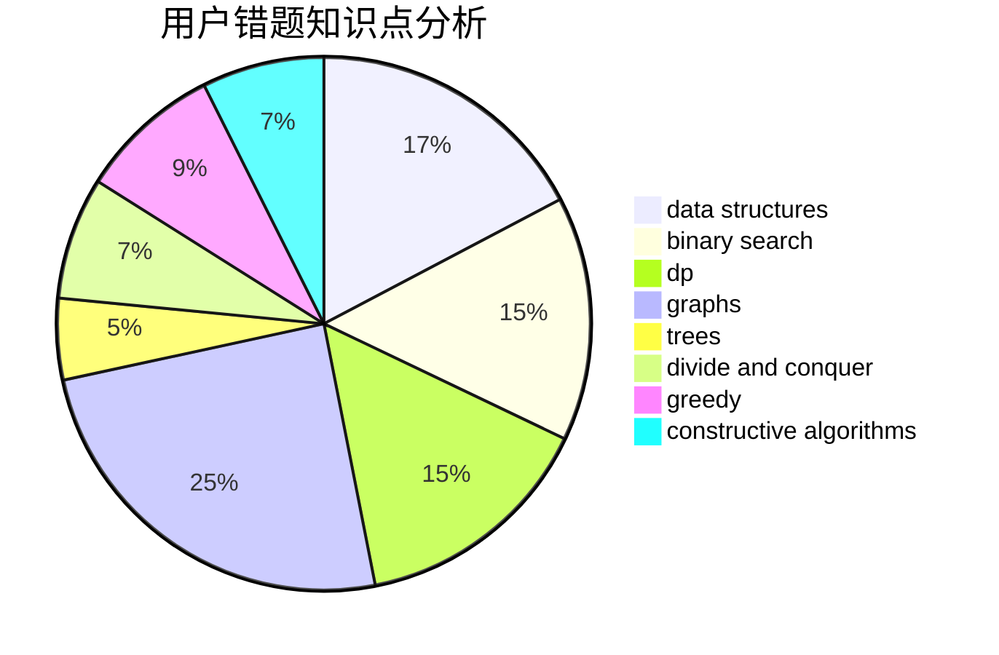

# kimyon
<!-- tabs:start -->
#### **用户提交结果分析**

#### **用户做题类型偏好分析**

#### **用户错题知识点分析**

<!-- tabs:end -->
# 推荐题目
[Sorting the Coins](http://codeforces.com/problemset/problem/875/B)		dsu,
                        implementation,
                        sortings,
                        two pointers		  
[Mixture](http://codeforces.com/problemset/problem/1386/B)		*special problem,
                        data structures,
                        geometry,
                        math,
                        sortings		  
[Make Them Equal](https://codeforces.com/contest/1417/problem/D)		constructive algorithms,
                        greedy,
                        math		  
[Sum of Prefix Sums](http://codeforces.com/problemset/problem/1303/G)		data structures,
                        divide and conquer,
                        geometry,
                        trees		  
[Dijkstra?](http://codeforces.com/problemset/problem/20/C)		graphs,
                        shortest paths		  
[Beautiful Bracket Sequence (easy version)](http://codeforces.com/problemset/problem/1264/D1)		combinatorics,
                        dp,
                        probabilities		  
[Sum of Digits](http://codeforces.com/problemset/problem/1373/E)		brute force,
                        constructive algorithms,
                        dp,
                        greedy		  
[Codeforces World Finals](http://codeforces.com/problemset/problem/30/B)		implementation		  
[Sereja and Contest](https://codeforces.com/contest/315/problem/C)		implementation		  
[Maximum splitting](https://codeforces.com/contest/872/problem/C)		dp,
                        greedy,
                        math,
                        number theory		  
<!-- tabs:start -->
#### **data structures**
[Sorting the Coins](http://codeforces.com/problemset/problem/1386/B)		*special problem,
                        data structures,
                        geometry,
                        math,
                        sortings		  
[Mixture](http://codeforces.com/problemset/problem/1303/G)		data structures,
                        divide and conquer,
                        geometry,
                        trees		  
[Make Them Equal](http://codeforces.com/problemset/problem/625/E)		data structures,
                        greedy		  
[Sum of Prefix Sums](http://codeforces.com/problemset/problem/1120/F)		data structures,
                        dp,
                        greedy		  
[Dijkstra?](http://codeforces.com/problemset/problem/733/D)		data structures,
                        hashing		  
[Beautiful Bracket Sequence (easy version)](http://codeforces.com/problemset/problem/875/E)		binary search,
                        data structures,
                        dp		  
[Sum of Digits](http://codeforces.com/problemset/problem/1132/G)		data structures,
                        dp,
                        trees		  
[Codeforces World Finals](http://codeforces.com/problemset/problem/855/B)		brute force,
                        data structures,
                        dp		  
[Sereja and Contest](https://codeforces.com/contest/397/problem/E)		data structures,
                        graphs,
                        trees		  
[Maximum splitting](http://codeforces.com/problemset/problem/1073/G)		data structures,
                        string suffix structures		  
#### **binary search**
[Sorting the Coins](http://codeforces.com/problemset/problem/875/E)		binary search,
                        data structures,
                        dp		  
[Mixture](http://codeforces.com/problemset/problem/650/B)		binary search,
                        brute force,
                        dp,
                        two pointers		  
[Make Them Equal](http://codeforces.com/problemset/problem/253/B)		binary search,
                        dp,
                        sortings,
                        two pointers		  
[Sum of Prefix Sums](http://codeforces.com/problemset/problem/1492/C)		binary search,
                        data structures,
                        dp,
                        greedy,
                        two pointers		  
[Dijkstra?](http://codeforces.com/problemset/problem/1463/D)		binary search,
                        constructive algorithms,
                        greedy,
                        two pointers		  
[Beautiful Bracket Sequence (easy version)](http://codeforces.com/problemset/problem/1490/G)		binary search,
                        data structures,
                        math		  
[Sum of Digits](http://codeforces.com/problemset/problem/1479/D)		binary search,
                        bitmasks,
                        brute force,
                        data structures,
                        probabilities,
                        trees		  
[Codeforces World Finals](http://codeforces.com/problemset/problem/1436/E)		binary search,
                        data structures,
                        two pointers		  
[Sereja and Contest](http://codeforces.com/problemset/problem/1461/D)		binary search,
                        brute force,
                        data structures,
                        divide and conquer,
                        implementation,
                        sortings		  
[Maximum splitting](http://codeforces.com/problemset/problem/1493/C)		binary search,
                        brute force,
                        constructive algorithms,
                        greedy,
                        strings		  
#### **dp**
[Sorting the Coins](http://codeforces.com/problemset/problem/1264/D1)		combinatorics,
                        dp,
                        probabilities		  
[Mixture](http://codeforces.com/problemset/problem/1373/E)		brute force,
                        constructive algorithms,
                        dp,
                        greedy		  
[Make Them Equal](https://codeforces.com/contest/872/problem/C)		dp,
                        greedy,
                        math,
                        number theory		  
[Sum of Prefix Sums](http://codeforces.com/problemset/problem/1120/F)		data structures,
                        dp,
                        greedy		  
[Dijkstra?](http://codeforces.com/problemset/problem/875/E)		binary search,
                        data structures,
                        dp		  
[Beautiful Bracket Sequence (easy version)](https://codeforces.com/contest/984/problem/D)		dp		  
[Sum of Digits](http://codeforces.com/problemset/problem/148/E)		dp		  
[Codeforces World Finals](http://codeforces.com/problemset/problem/1132/G)		data structures,
                        dp,
                        trees		  
[Sereja and Contest](http://codeforces.com/problemset/problem/855/B)		brute force,
                        data structures,
                        dp		  
[Maximum splitting](http://codeforces.com/problemset/problem/601/C)		dp,
                        math,
                        probabilities		  
#### **graph**
[Sorting the Coins](http://codeforces.com/problemset/problem/20/C)		graphs,
                        shortest paths		  
[Mixture](https://codeforces.com/contest/1230/problem/C)		brute force,
                        graphs		  
[Make Them Equal](https://codeforces.com/contest/1071/problem/D)		brute force,
                        graphs,
                        math		  
[Sum of Prefix Sums](http://codeforces.com/problemset/problem/274/D)		dfs and similar,
                        graphs,
                        greedy,
                        sortings		  
[Dijkstra?](http://codeforces.com/problemset/problem/1210/D)		graphs		  
[Beautiful Bracket Sequence (easy version)](https://codeforces.com/contest/397/problem/E)		data structures,
                        graphs,
                        trees		  
[Sum of Digits](http://codeforces.com/problemset/problem/1268/D)		brute force,
                        divide and conquer,
                        graphs,
                        math		  
[Codeforces World Finals](http://codeforces.com/problemset/problem/819/E)		constructive algorithms,
                        graphs		  
[Sereja and Contest](http://codeforces.com/problemset/problem/1487/C)		brute force,
                        constructive algorithms,
                        dfs and similar,
                        graphs,
                        greedy,
                        implementation,
                        math		  
[Maximum splitting](http://codeforces.com/problemset/problem/1437/C)		dp,
                        flows,
                        graph matchings,
                        greedy,
                        math,
                        sortings		  
#### **trees**
[Sorting the Coins](http://codeforces.com/problemset/problem/1303/G)		data structures,
                        divide and conquer,
                        geometry,
                        trees		  
[Mixture](http://codeforces.com/problemset/problem/1132/G)		data structures,
                        dp,
                        trees		  
[Make Them Equal](https://codeforces.com/contest/397/problem/E)		data structures,
                        graphs,
                        trees		  
[Sum of Prefix Sums](http://codeforces.com/problemset/problem/1479/D)		binary search,
                        bitmasks,
                        brute force,
                        data structures,
                        probabilities,
                        trees		  
[Dijkstra?](http://codeforces.com/problemset/problem/1511/C)		brute force,
                        data structures,
                        implementation,
                        trees		  
[Beautiful Bracket Sequence (easy version)](http://codeforces.com/problemset/problem/1499/F)		combinatorics,
                        dfs and similar,
                        dp,
                        trees		  
[Sum of Digits](http://codeforces.com/problemset/problem/1491/E)		brute force,
                        dfs and similar,
                        divide and conquer,
                        number theory,
                        trees		  
[Codeforces World Finals](http://codeforces.com/problemset/problem/1466/D)		data structures,
                        greedy,
                        sortings,
                        trees		  
[Sereja and Contest](http://codeforces.com/problemset/problem/1495/D)		combinatorics,
                        dfs and similar,
                        graphs,
                        math,
                        shortest paths,
                        trees		  
[Maximum splitting](http://codeforces.com/problemset/problem/1303/G)		data structures,
                        divide and conquer,
                        geometry,
                        trees		  
#### **divide and conquer**
[Sorting the Coins](http://codeforces.com/problemset/problem/1303/G)		data structures,
                        divide and conquer,
                        geometry,
                        trees		  
[Mixture](http://codeforces.com/problemset/problem/97/B)		constructive algorithms,
                        divide and conquer		  
[Make Them Equal](http://codeforces.com/problemset/problem/1268/D)		brute force,
                        divide and conquer,
                        graphs,
                        math		  
[Sum of Prefix Sums](http://codeforces.com/problemset/problem/1461/D)		binary search,
                        brute force,
                        data structures,
                        divide and conquer,
                        implementation,
                        sortings		  
[Dijkstra?](http://codeforces.com/problemset/problem/1466/G)		combinatorics,
                        divide and conquer,
                        hashing,
                        math,
                        string suffix structures,
                        strings		  
[Beautiful Bracket Sequence (easy version)](http://codeforces.com/problemset/problem/1490/D)		dfs and similar,
                        divide and conquer,
                        implementation		  
[Sum of Digits](https://codeforces.com/contest/1483/problem/C)		data structures,
                        divide and conquer,
                        dp		  
[Codeforces World Finals](http://codeforces.com/problemset/problem/1491/E)		brute force,
                        dfs and similar,
                        divide and conquer,
                        number theory,
                        trees		  
[Sereja and Contest](http://codeforces.com/problemset/problem/1303/G)		data structures,
                        divide and conquer,
                        geometry,
                        trees		  
[Maximum splitting](http://codeforces.com/problemset/problem/1494/D)		constructive algorithms,
                        data structures,
                        dfs and similar,
                        divide and conquer,
                        dsu,
                        greedy,
                        sortings,
                        trees		  
#### **greedy**
[Sorting the Coins](https://codeforces.com/contest/1417/problem/D)		constructive algorithms,
                        greedy,
                        math		  
[Mixture](http://codeforces.com/problemset/problem/1373/E)		brute force,
                        constructive algorithms,
                        dp,
                        greedy		  
[Make Them Equal](https://codeforces.com/contest/872/problem/C)		dp,
                        greedy,
                        math,
                        number theory		  
[Sum of Prefix Sums](http://codeforces.com/problemset/problem/625/E)		data structures,
                        greedy		  
[Dijkstra?](http://codeforces.com/problemset/problem/1120/F)		data structures,
                        dp,
                        greedy		  
[Beautiful Bracket Sequence (easy version)](http://codeforces.com/problemset/problem/274/D)		dfs and similar,
                        graphs,
                        greedy,
                        sortings		  
[Sum of Digits](http://codeforces.com/problemset/problem/1187/C)		constructive algorithms,
                        greedy,
                        implementation		  
[Codeforces World Finals](http://codeforces.com/problemset/problem/1266/C)		constructive algorithms,
                        greedy,
                        math,
                        number theory		  
[Sereja and Contest](http://codeforces.com/problemset/problem/815/A)		brute force,
                        greedy,
                        implementation		  
[Maximum splitting](http://codeforces.com/problemset/problem/1153/C)		greedy,
                        strings		  
#### **constructive algorithms**
[Sorting the Coins](https://codeforces.com/contest/1417/problem/D)		constructive algorithms,
                        greedy,
                        math		  
[Mixture](http://codeforces.com/problemset/problem/1373/E)		brute force,
                        constructive algorithms,
                        dp,
                        greedy		  
[Make Them Equal](https://codeforces.com/contest/902/problem/D)		constructive algorithms,
                        math		  
[Sum of Prefix Sums](http://codeforces.com/problemset/problem/1187/C)		constructive algorithms,
                        greedy,
                        implementation		  
[Dijkstra?](http://codeforces.com/problemset/problem/97/B)		constructive algorithms,
                        divide and conquer		  
[Beautiful Bracket Sequence (easy version)](http://codeforces.com/problemset/problem/819/E)		constructive algorithms,
                        graphs		  
[Sum of Digits](http://codeforces.com/problemset/problem/1266/C)		constructive algorithms,
                        greedy,
                        math,
                        number theory		  
[Codeforces World Finals](http://codeforces.com/problemset/problem/538/B)		constructive algorithms,
                        dp,
                        greedy,
                        implementation		  
[Sereja and Contest](http://codeforces.com/problemset/problem/1493/A)		constructive algorithms,
                        greedy		  
[Maximum splitting](http://codeforces.com/problemset/problem/1463/D)		binary search,
                        constructive algorithms,
                        greedy,
                        two pointers		  
#### **sortings**
[Sorting the Coins](http://codeforces.com/problemset/problem/875/B)		dsu,
                        implementation,
                        sortings,
                        two pointers		  
[Mixture](http://codeforces.com/problemset/problem/1386/B)		*special problem,
                        data structures,
                        geometry,
                        math,
                        sortings		  
[Make Them Equal](http://codeforces.com/problemset/problem/274/D)		dfs and similar,
                        graphs,
                        greedy,
                        sortings		  
[Sum of Prefix Sums](http://codeforces.com/problemset/problem/253/B)		binary search,
                        dp,
                        sortings,
                        two pointers		  
[Dijkstra?](https://codeforces.com/contest/1496/problem/C)		geometry,
                        greedy,
                        math,
                        sortings		  
[Beautiful Bracket Sequence (easy version)](http://codeforces.com/problemset/problem/1495/A)		geometry,
                        greedy,
                        math,
                        sortings		  
[Sum of Digits](http://codeforces.com/problemset/problem/1497/A)		brute force,
                        data structures,
                        greedy,
                        sortings		  
[Codeforces World Finals](http://codeforces.com/problemset/problem/1427/A)		math,
                        sortings		  
[Sereja and Contest](http://codeforces.com/problemset/problem/1461/D)		binary search,
                        brute force,
                        data structures,
                        divide and conquer,
                        implementation,
                        sortings		  
[Maximum splitting](http://codeforces.com/problemset/problem/1437/C)		dp,
                        flows,
                        graph matchings,
                        greedy,
                        math,
                        sortings		  
<!-- tabs:end -->
