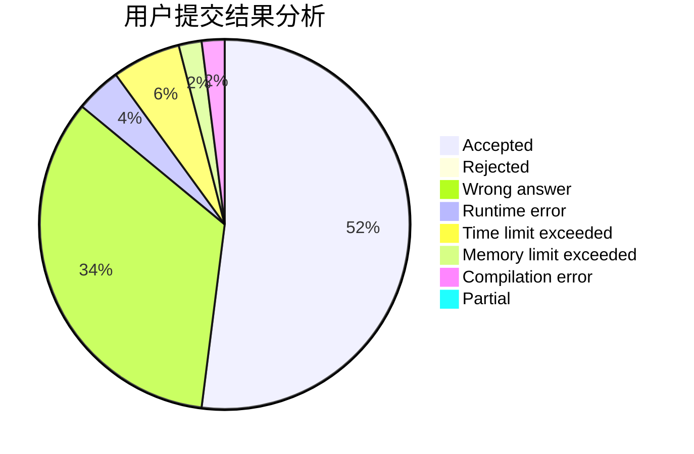
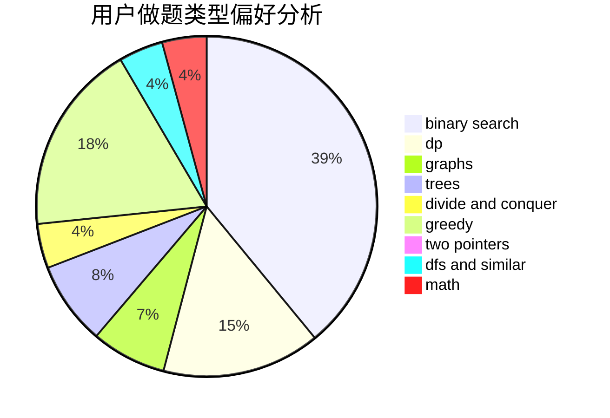

# kkktl01

<!-- tabs:start -->

#### **用户提交结果分析**

#### **用户做题类型偏好分析**

<!-- tabs:end -->
# 推荐题目
[1181B](https://codeforces.com/contest/1181/problem/B)
[865G](https://codeforces.com/contest/865/problem/G)
[174B](https://codeforces.com/contest/174/problem/B)
[689A](https://codeforces.com/contest/689/problem/A)
[128C](https://codeforces.com/contest/128/problem/C)
[802D](https://codeforces.com/contest/802/problem/D)
[803B](https://codeforces.com/contest/803/problem/B)
[938A](https://codeforces.com/contest/938/problem/A)
[1169A](https://codeforces.com/contest/1169/problem/A)
[801C](https://codeforces.com/contest/801/problem/C)
