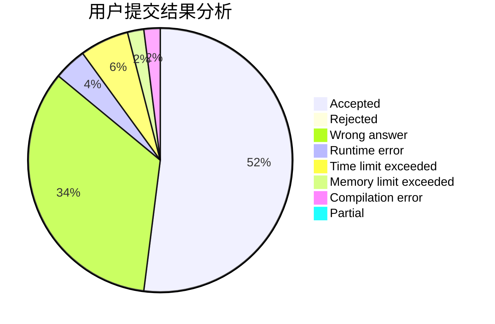
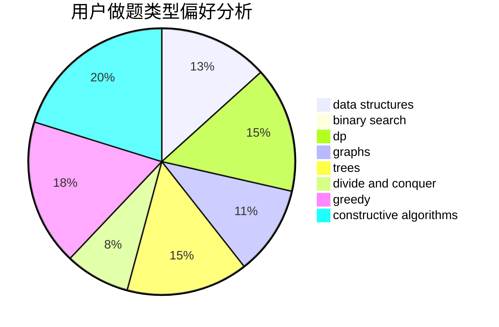
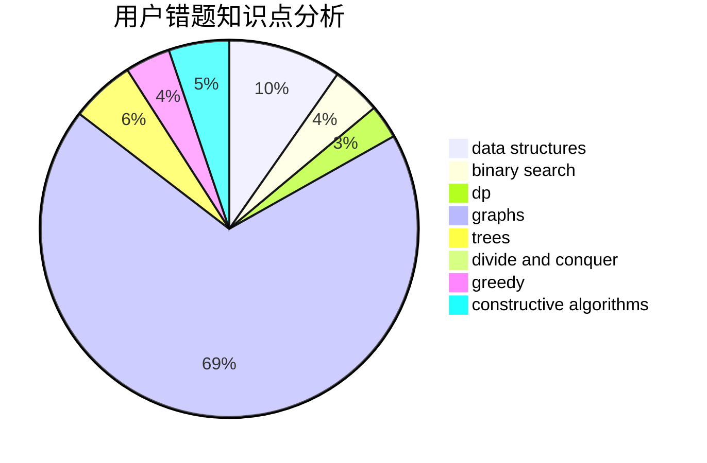

# kkktl01

<!-- tabs:start -->

#### **用户提交结果分析**

#### **用户做题类型偏好分析**

#### **用户错题知识点分析**

<!-- tabs:end -->
# 推荐题目
[1181B](https://codeforces.com/contest/1181/problem/B)		greedy,
                        implementation,
                        strings		  
[865G](https://codeforces.com/contest/865/problem/G)		combinatorics,
                        math,
                        matrices		  
[174B](https://codeforces.com/contest/174/problem/B)		dp,
                        greedy,
                        implementation		  
[689A](https://codeforces.com/contest/689/problem/A)		brute force,
                        constructive algorithms,
                        implementation		  
[128C](https://codeforces.com/contest/128/problem/C)		combinatorics,
                        dp		  
[802D](https://codeforces.com/contest/802/problem/D)		math		  
[803B](https://codeforces.com/contest/803/problem/B)		constructive algorithms		  
[938A](https://codeforces.com/contest/938/problem/A)		implementation		  
[1169A](https://codeforces.com/contest/1169/problem/A)		implementation,
                        math		  
[801C](https://codeforces.com/contest/801/problem/C)		dsu,graphs,sortings,trees		  
