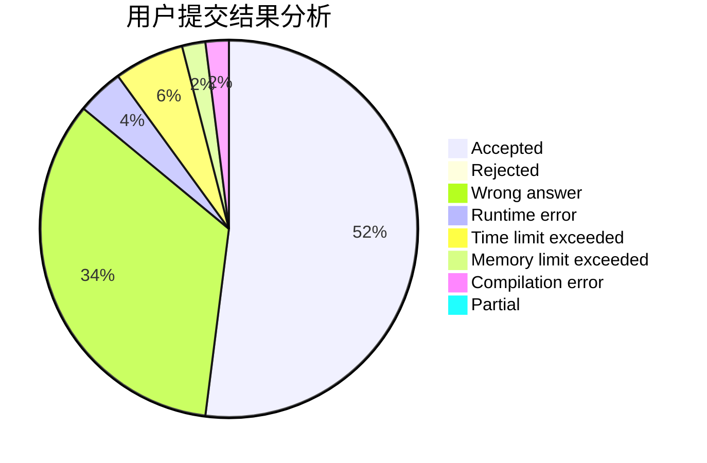
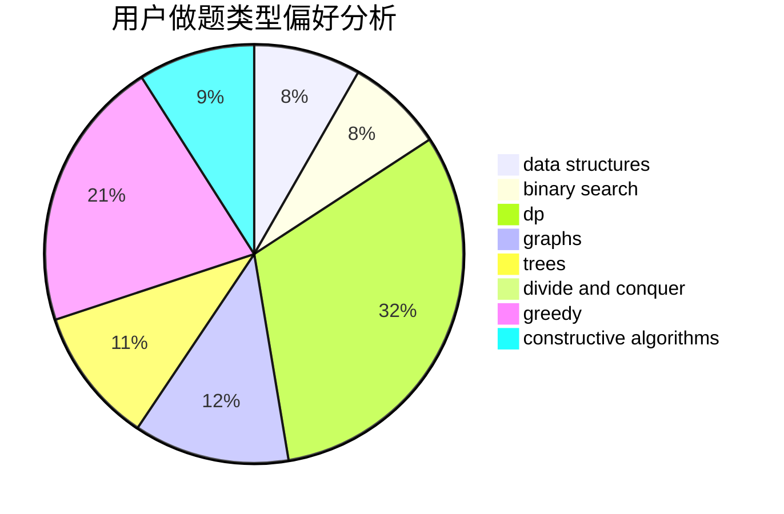
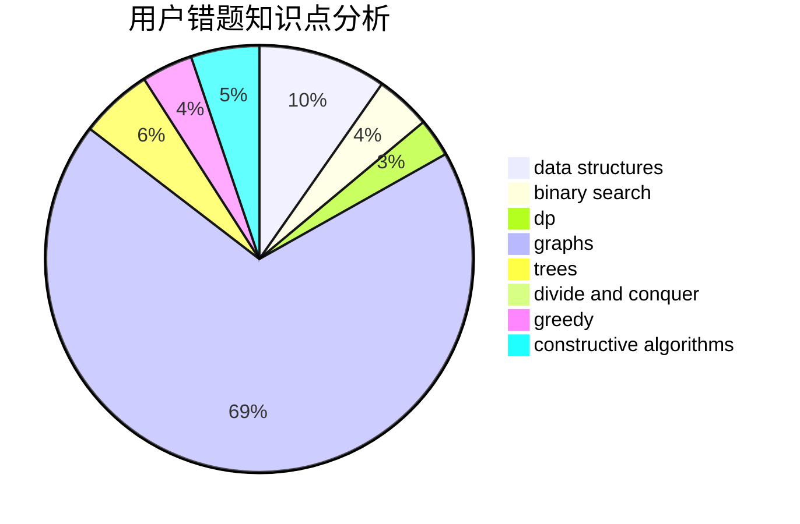

# kkktl01

<!-- tabs:start -->

#### **用户提交结果分析**

#### **用户做题类型偏好分析**

#### **用户错题知识点分析**

<!-- tabs:end -->
# 推荐题目
[1178F2](https://codeforces.com/contest/1178F/problem/2)		dp		  
[847F](https://codeforces.com/contest/847/problem/F)		greedy,
                        sortings		  
[1513F](https://codeforces.com/contest/1513/problem/F)		brute force,
                        constructive algorithms,
                        data structures,
                        sortings		  
[667A](https://codeforces.com/contest/667/problem/A)		geometry,
                        math		  
[1282E](https://codeforces.com/contest/1282/problem/E)		constructive algorithms,
                        data structures,
                        dfs and similar,
                        graphs		  
[785A](https://codeforces.com/contest/785/problem/A)		implementation,
                        strings		  
[787A](https://codeforces.com/contest/787/problem/A)		brute force,
                        math,
                        number theory		  
[917C](https://codeforces.com/contest/917/problem/C)		combinatorics,
                        dp,
                        matrices		  
[1166B](https://codeforces.com/contest/1166/problem/B)		constructive algorithms,
                        math,
                        number theory		  
[784C](https://codeforces.com/contest/784/problem/C)		*special problem,
                        implementation		  
