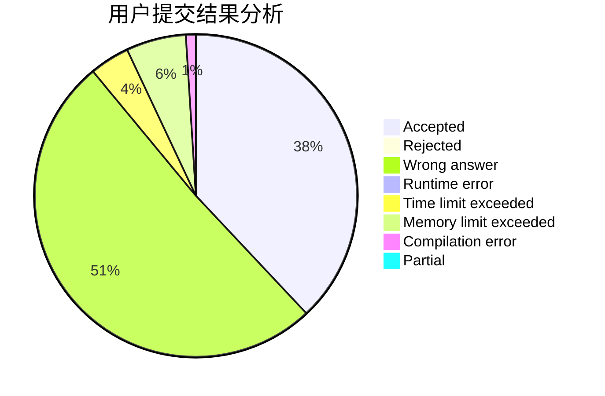
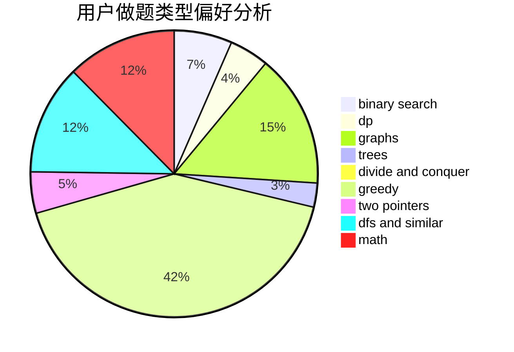

# kli

<!-- tabs:start -->

#### **用户提交结果分析**

#### **用户做题类型偏好分析**

<!-- tabs:end -->
# 推荐题目
[722D](https://codeforces.com/contest/722/problem/D)
[396C](https://codeforces.com/contest/396/problem/C)
[1321A](https://codeforces.com/contest/1321/problem/A)
[1344A](https://codeforces.com/contest/1344/problem/A)
[370A](https://codeforces.com/contest/370/problem/A)
[456B](https://codeforces.com/contest/456/problem/B)
[701F](https://codeforces.com/contest/701/problem/F)
[1256F](https://codeforces.com/contest/1256/problem/F)
[938A](https://codeforces.com/contest/938/problem/A)
[76D](https://codeforces.com/contest/76/problem/D)
