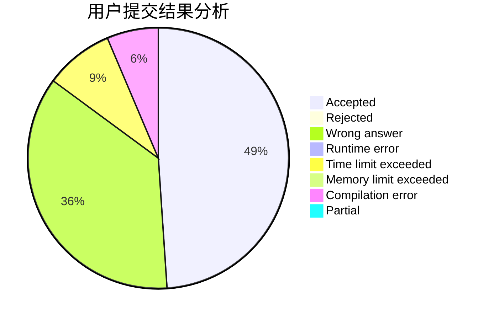
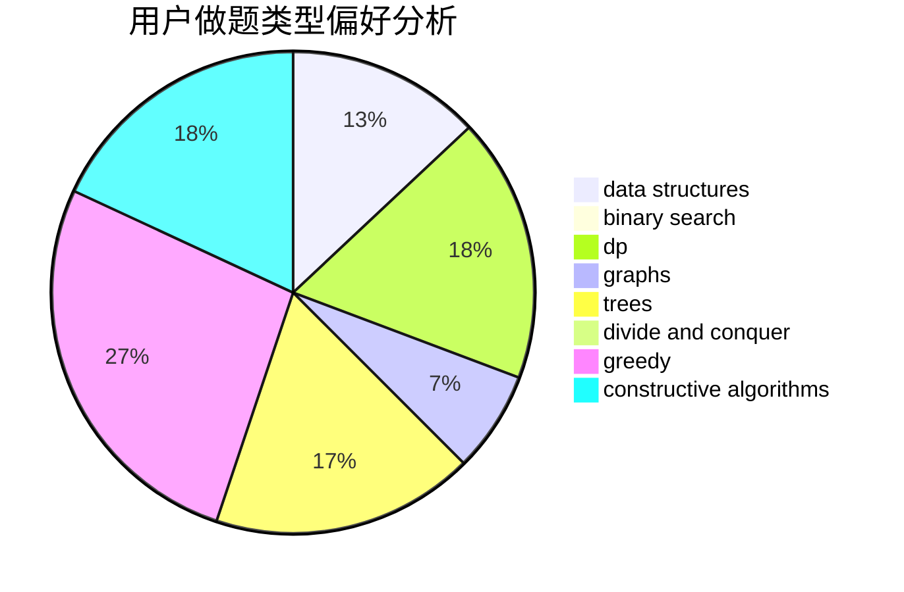

# konjac_FYY

<!-- tabs:start -->

#### **用户提交结果分析**

#### **用户做题类型偏好分析**

#### **用户错题知识点分析**

<!-- tabs:end -->
# 推荐题目
[1506E](https://codeforces.com/contest/1506/problem/E)		constructive algorithms,
                        implementation		  
[1420D](https://codeforces.com/contest/1420/problem/D)		combinatorics,
                        data structures,
                        sortings		  
[1283D](https://codeforces.com/contest/1283/problem/D)		graphs,
                        greedy,
                        shortest paths		  
[1108A](https://codeforces.com/contest/1108/problem/A)		implementation		  
[1220E](https://codeforces.com/contest/1220/problem/E)		dfs and similar,
                        dp,
                        dsu,
                        graphs,
                        greedy,
                        trees		  
[883A](https://codeforces.com/contest/883/problem/A)		implementation		  
[601A](https://codeforces.com/contest/601/problem/A)		graphs,
                        shortest paths		  
[822D](https://codeforces.com/contest/822/problem/D)		brute force,
                        dp,
                        greedy,
                        math,
                        number theory		  
[1362E](https://codeforces.com/contest/1362/problem/E)		dsu,graphs,sortings,trees		  
[402A](https://codeforces.com/contest/402/problem/A)		greedy,
                        math		  
