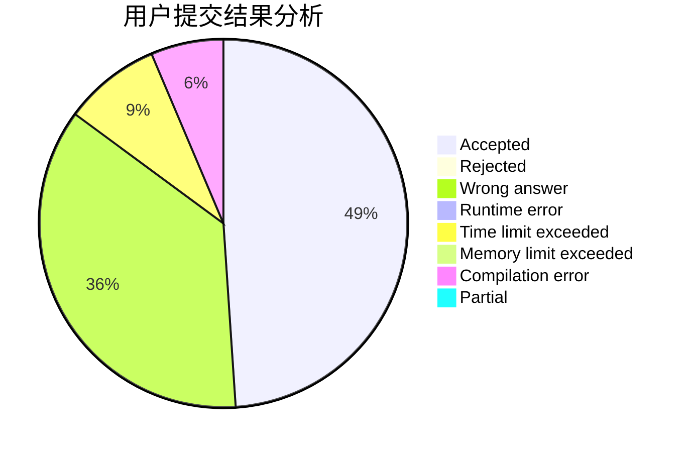
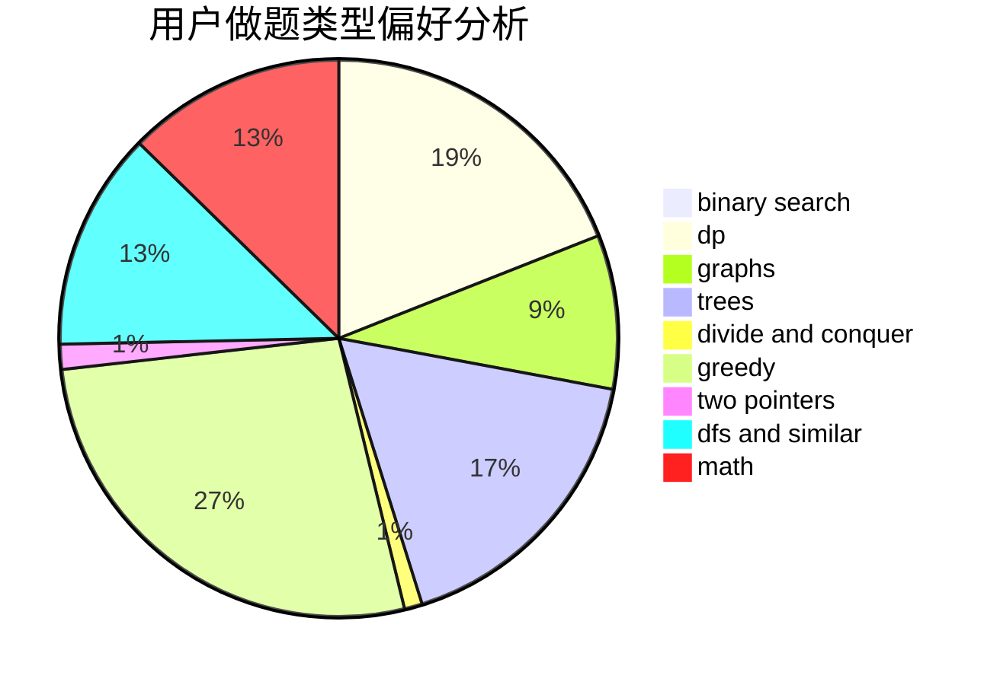

# konjac_FYY

<!-- tabs:start -->

#### **用户提交结果分析**

#### **用户做题类型偏好分析**

<!-- tabs:end -->
# 推荐题目
[1506E](https://codeforces.com/contest/1506/problem/E)
[1420D](https://codeforces.com/contest/1420/problem/D)
[1283D](https://codeforces.com/contest/1283/problem/D)
[1108A](https://codeforces.com/contest/1108/problem/A)
[1220E](https://codeforces.com/contest/1220/problem/E)
[883A](https://codeforces.com/contest/883/problem/A)
[601A](https://codeforces.com/contest/601/problem/A)
[822D](https://codeforces.com/contest/822/problem/D)
[1362E](https://codeforces.com/contest/1362/problem/E)
[402A](https://codeforces.com/contest/402/problem/A)
