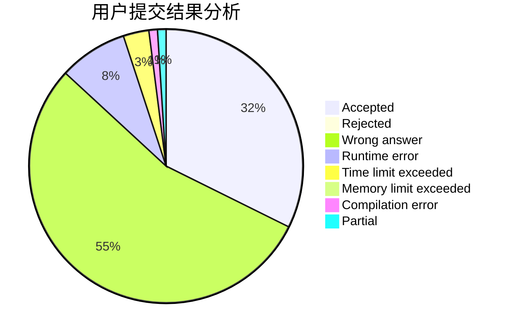
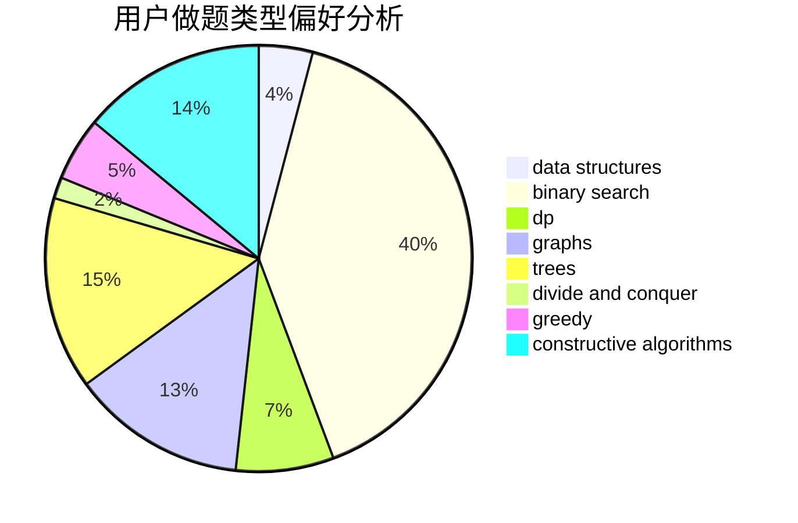
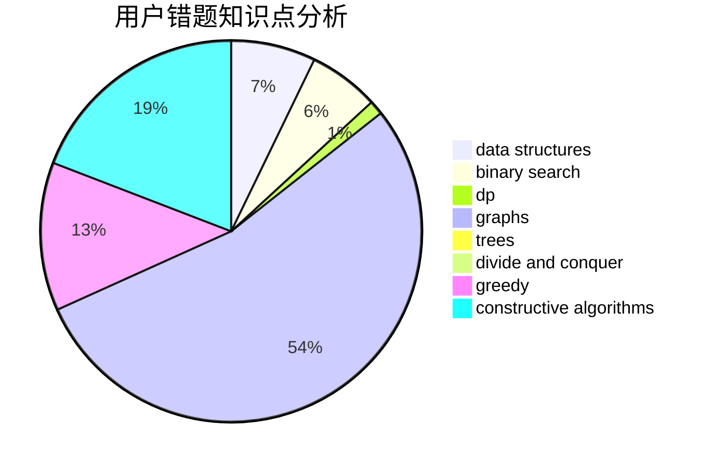

# konjacq

<!-- tabs:start -->

#### **用户提交结果分析**

#### **用户做题类型偏好分析**

#### **用户错题知识点分析**

<!-- tabs:end -->
# 推荐题目
[1466F](https://codeforces.com/contest/1466/problem/F)		bitmasks,
                        dfs and similar,
                        dsu,
                        graphs,
                        greedy,
                        math,
                        sortings		  
[538B](https://codeforces.com/contest/538/problem/B)		constructive algorithms,
                        dp,
                        greedy,
                        implementation		  
[736D](https://codeforces.com/contest/736/problem/D)		math,
                        matrices		  
[1100A](https://codeforces.com/contest/1100/problem/A)		implementation		  
[849B](https://codeforces.com/contest/849/problem/B)		brute force,
                        geometry		  
[1408B](https://codeforces.com/contest/1408/problem/B)		constructive algorithms,
                        greedy,
                        math		  
[868E](https://codeforces.com/contest/868/problem/E)		dp,
                        graphs,
                        trees		  
[1063F](https://codeforces.com/contest/1063/problem/F)		data structures,
                        dp,
                        string suffix structures		  
[591B](https://codeforces.com/contest/591/problem/B)		implementation,
                        strings		  
[1092E](https://codeforces.com/contest/1092/problem/E)		constructive algorithms,
                        dfs and similar,
                        greedy,
                        trees		  
