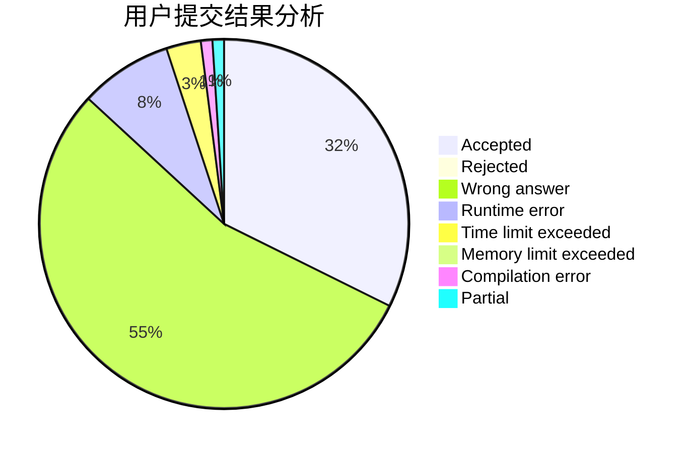
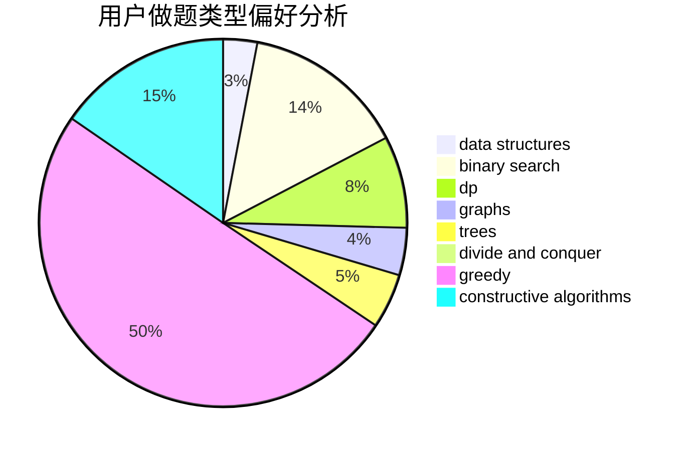

# konjacq

<!-- tabs:start -->

#### **用户提交结果分析**

#### **用户做题类型偏好分析**

#### **用户错题知识点分析**

<!-- tabs:end -->
# 推荐题目
[1457C](https://codeforces.com/contest/1457/problem/C)		dsu,graphs,sortings,trees		  
[513B2](https://codeforces.com/contest/513B/problem/2)		bitmasks,
                        divide and conquer,
                        math		  
[719C](https://codeforces.com/contest/719/problem/C)		dsu,graphs,sortings,trees		  
[10C](https://codeforces.com/contest/10/problem/C)		number theory		  
[831B](https://codeforces.com/contest/831/problem/B)		implementation,
                        strings		  
[1399A](https://codeforces.com/contest/1399/problem/A)		greedy,
                        sortings		  
[84A](https://codeforces.com/contest/84/problem/A)		math,
                        number theory		  
[1063C](https://codeforces.com/contest/1063/problem/C)		binary search,
                        constructive algorithms,
                        geometry,
                        interactive		  
[570E](https://codeforces.com/contest/570/problem/E)		combinatorics,
                        dp		  
[1092B](https://codeforces.com/contest/1092/problem/B)		sortings		  
