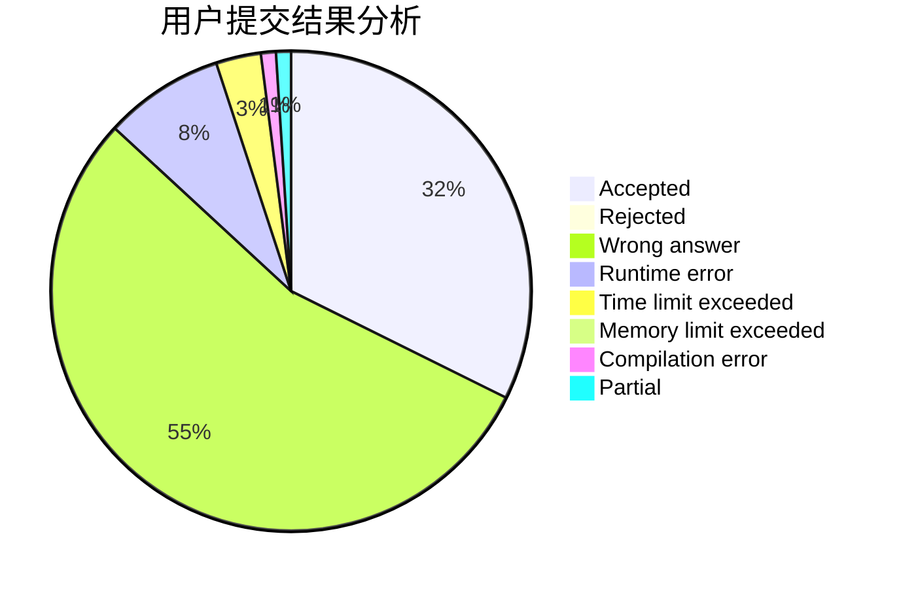
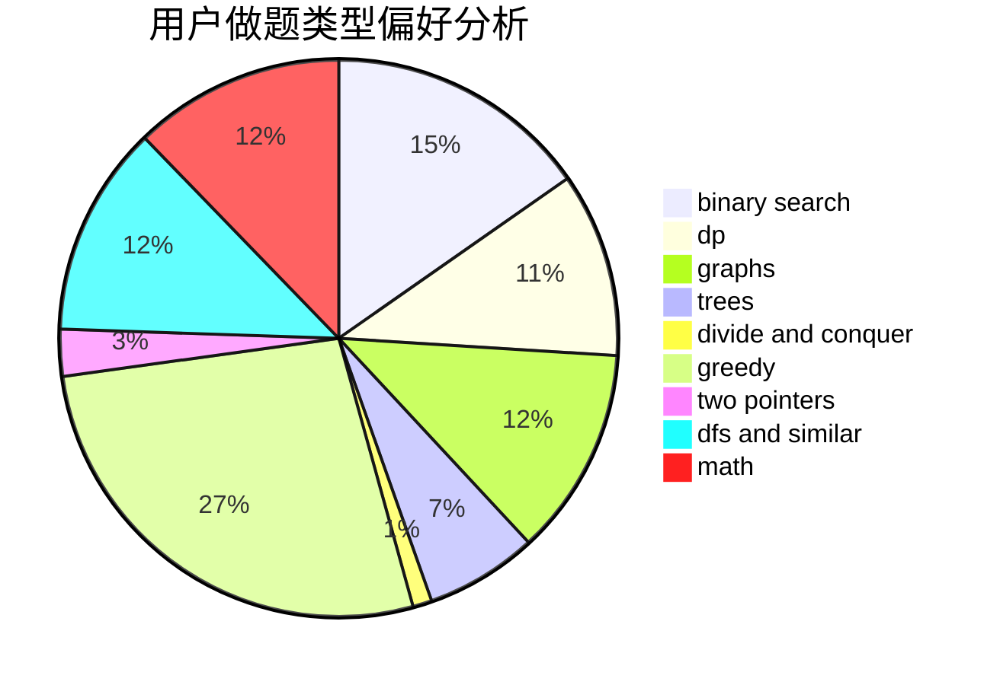

# konjacq

<!-- tabs:start -->

#### **用户提交结果分析**

#### **用户做题类型偏好分析**

<!-- tabs:end -->
# 推荐题目
[1466F](https://codeforces.com/contest/1466/problem/F)
[538B](https://codeforces.com/contest/538/problem/B)
[736D](https://codeforces.com/contest/736/problem/D)
[1100A](https://codeforces.com/contest/1100/problem/A)
[849B](https://codeforces.com/contest/849/problem/B)
[1408B](https://codeforces.com/contest/1408/problem/B)
[868E](https://codeforces.com/contest/868/problem/E)
[1063F](https://codeforces.com/contest/1063/problem/F)
[591B](https://codeforces.com/contest/591/problem/B)
[1092E](https://codeforces.com/contest/1092/problem/E)
