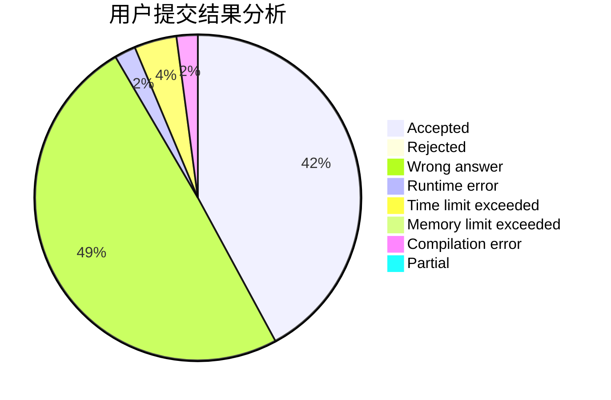
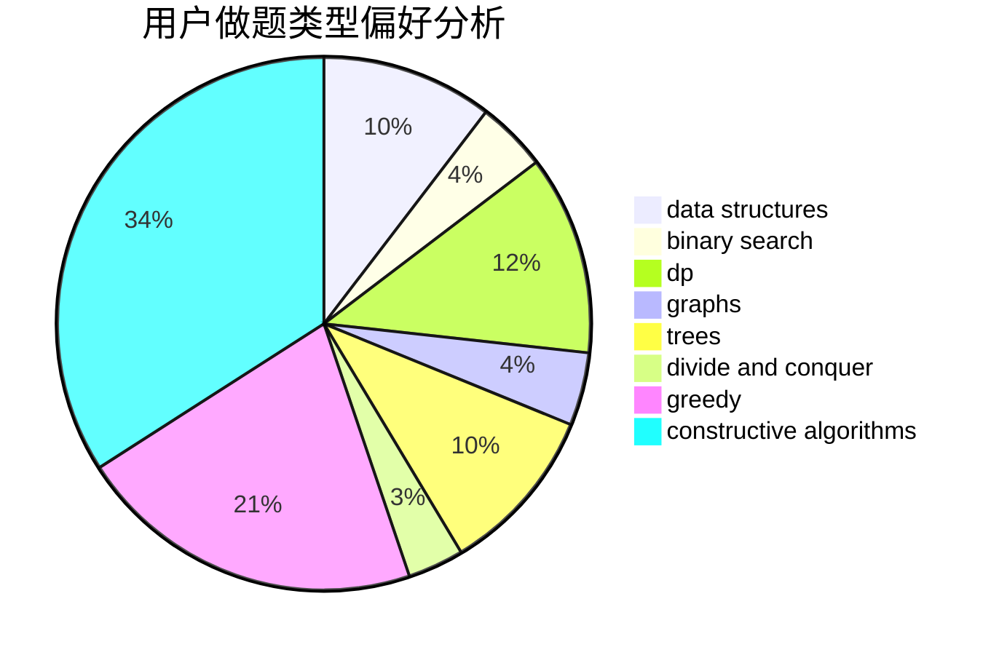

# kosf

<!-- tabs:start -->

#### **用户提交结果分析**

#### **用户做题类型偏好分析**

#### **用户错题知识点分析**

<!-- tabs:end -->
# 推荐题目
[788D](https://codeforces.com/contest/788/problem/D)		constructive algorithms,
                        divide and conquer,
                        interactive		  
[782E](https://codeforces.com/contest/782/problem/E)		dsu,graphs,sortings,trees		  
[388B](https://codeforces.com/contest/388/problem/B)		bitmasks,
                        constructive algorithms,
                        graphs,
                        implementation,
                        math		  
[612A](https://codeforces.com/contest/612/problem/A)		brute force,
                        implementation,
                        strings		  
[25E](https://codeforces.com/contest/25/problem/E)		hashing,
                        strings		  
[747A](https://codeforces.com/contest/747/problem/A)		brute force,
                        math		  
[618B](https://codeforces.com/contest/618/problem/B)		constructive algorithms		  
[605A](https://codeforces.com/contest/605/problem/A)		constructive algorithms,
                        greedy		  
[1013B](https://codeforces.com/contest/1013/problem/B)		greedy		  
[936B](https://codeforces.com/contest/936/problem/B)		dfs and similar,
                        dp,
                        games,
                        graphs		  
