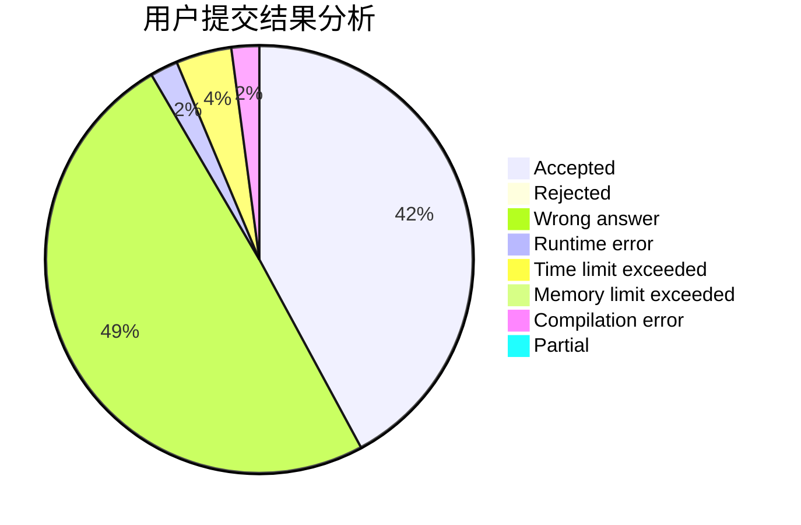
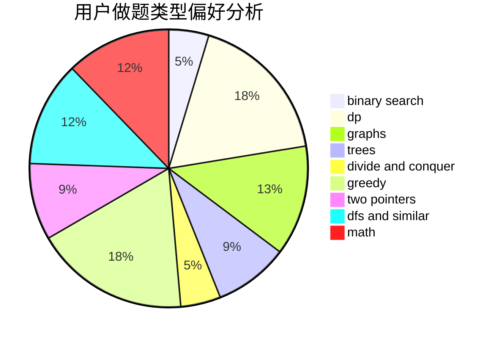

# kosf

<!-- tabs:start -->

#### **用户提交结果分析**

#### **用户做题类型偏好分析**

<!-- tabs:end -->
# 推荐题目
[788D](https://codeforces.com/contest/788/problem/D)
[782E](https://codeforces.com/contest/782/problem/E)
[388B](https://codeforces.com/contest/388/problem/B)
[612A](https://codeforces.com/contest/612/problem/A)
[25E](https://codeforces.com/contest/25/problem/E)
[747A](https://codeforces.com/contest/747/problem/A)
[618B](https://codeforces.com/contest/618/problem/B)
[605A](https://codeforces.com/contest/605/problem/A)
[1013B](https://codeforces.com/contest/1013/problem/B)
[936B](https://codeforces.com/contest/936/problem/B)
